# 基于无人机影像与 YOLOv12n-RCL 的向日葵成熟期盘腐病危害程度检测

Paper Reading 是从个人角度进行的一些总结分享，受到个人关注点的侧重和实力所限，可能有理解不到位的地方。具体的细节还需要以原文的内容为准，博客中的图表若未另外说明则均来自原文。

| 论文概况 | 详细 |
| --- | --- |
| 标题 | 《基于无人机影像与 YOLOv12n-RCL 的向日葵成熟期盘腐病危害程度检测》 |
| 作者 | 李京谦，韩国涛，赵静，张帅领，谢欣妤，付姗姗，鲁力群，兰玉彬 |
| 发表期刊 | 《农业工程学报》 |
| 期刊等级 | 未获取 |
| 发表年份 | 2026 |
| 论文代码 | 未获取 |

作者单位：

1. 山东理工大学农业工程与食品科学学院，淄博 255000
2. 山东省农业航空智能装备工程技术研究中心，淄博 255000
3. 山东理工大学现代农业装备研究院，淄博 255000
4. 山东理工大学交通与车辆工程学院，淄博 255000

## 研究动机

向日葵盘腐病危害程度检测是智慧农业病害监测中的重要问题，表现为由核盘菌侵染引起的病斑在花盘上持续扩展，导致空籽率上升、产量降低、籽仁含油量与蛋白质含量下降，直接影响籽粒的食用价值和商品价值。目前，盘腐病监测主要依赖人工田间调查，该方法效率低、主观性强、时效性差。近年来，以 Faster R-CNN 为代表的双阶段算法和以 YOLO 系列为代表的单阶段算法已被广泛用于作物病害检测，然而相关研究在构建数据集时多采用地面手持相机采集叶部图像，面向植株较高的向日葵花盘时存在数据采集困难、图像覆盖不全、细节捕捉不足的问题。无人机航拍缓解了采集难题，但盘腐病等级检测仍有三类难点：**病斑形态多变**，不同等级病斑的尺度与形状差异大，特征提取困难；**叶片遮挡**等复杂背景因素增加了漏检风险；**病斑特征差异细微、边界模糊**，相邻等级之间容易误判。暂未有工作在无人机影像上同时兼顾盘腐病等级判别精度与边缘设备轻量化部署的需求。

## 文章贡献

针对向日葵盘腐病检测中病斑形态多变、特征差异细微、边界模糊及目标遮挡等问题，本文提出了基于改进 YOLOv12n 的轻量化检测模型 YOLOv12n-RCL。其核心是 C3K2-RC 模块、CARAFE 上采样算子与 LSCSBD 轻量化检测头的协同优化。首先，本文将主干和颈部网络的 C3K2 模块替换为融合感受野注意力卷积 RFAConv 与坐标注意力机制 CA 的 C3K2-RC 模块，通过扩大感受野并建立空间坐标依赖，增强复杂环境下对不同等级病斑的特征提取能力；其次，在颈部网络集成轻量级上采样算子 CARAFE，利用内容感知的特征重组机制提高病斑边缘信息与纹理特征的恢复能力；最后，引入分离批量归一化的轻量级共享卷积检测头 LSCSBD，在减少参数量的同时提升小尺度病斑的检测精度与速度。试验结果表明，YOLOv12n-RCL 的精确率、召回率、mAP0.5 与 mAP0.5-0.95 分别达到 83.4%、81.2%、84.8% 与 50.2%，较基准模型 YOLOv12n 提高 3.8、3.2、3.4 与 4.0 个百分点，参数量、计算量与模型大小分别压缩至 2.11 M、5.7 G 与 4.5 MB，可为向日葵成熟期盘腐病智能防治装备的研发提供算法参考。

## 本文方法

### 盘腐病危害程度分级与数据集构建

方法的第一步是把花盘受害程度量化为可分级的标签，为此本文先定义病斑占花盘面积的比例。病斑比例的计算方法如下：

$$P_b = P_t / P_h$$

其中，该式涉及的符号含义如下表所示：

| 符号 | 含义 |
| --- | --- |
| $P_b$ | 病斑占花盘面积的比例 |
| $P_t$ | 图像中病斑区域像素数量 |
| $P_h$ | 图像中花盘区域的总像素数量 |

直观上，该式把肉眼可见的病斑范围换算为像素占比，配合脚本统计即可自动判定等级。参照已有研究，本文将危害程度划分为 5 类：无病斑为 0 级，病斑占比 25% 以下为 1 级，26%～50% 为 2 级，51%～75% 为 3 级，76% 以上为 4 级。不同等级的盘腐病样本实例如下图所示。

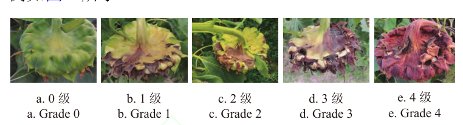

由图可见，随等级升高病斑在花盘上的占比逐渐扩大，4 级样本的花盘已大面积腐烂变色。数据采集使用大疆 M300 多旋翼无人机搭载禅思 P1 可见光相机，在 30 m 航高下共获取 700 幅 8 192×5 460 像素的原始影像；裁剪分幅并剔除无效样本后筛选出 1 300 幅图像，按 8:1:1 划分为训练集 1 040 幅、验证集 130 幅与测试集 130 幅，再对训练集做平移、旋转、色彩变换与亮度调整，扩充至 4 160 幅。各等级数据增强前后的标签数量如下表所示。

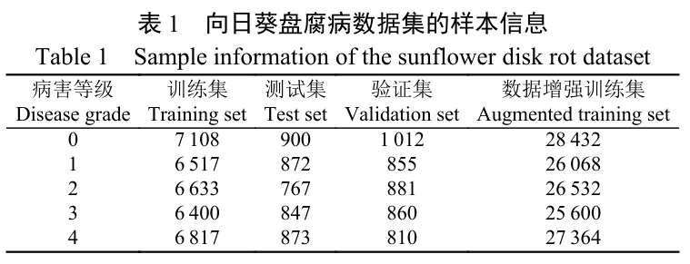

由表可见，5 个等级的标签数量基本均衡，增强后各等级样本量处于同一量级。这一分级标准与数据集口径为后续所有模块实验提供统一的训练与评测基础。

### YOLOv12n 基线模型与整体结构

本文选用 YOLOv12 系列中综合性能最优的 YOLOv12n 作为基础模型。YOLOv12 由输入端、主干、颈部、检测头与输出端 5 个部分组成，其 A2 区域注意力模块通过空间分组卷积与通道重标定联合划分区域，residual-elan 结构重构特征聚合路径以缓解梯度阻塞，配合去除位置编码、优化 MLP 比例与引入大型可分离卷积等设计兼顾检测精度与推理速度。改进后 YOLOv12n-RCL 的整体结构如下图所示。

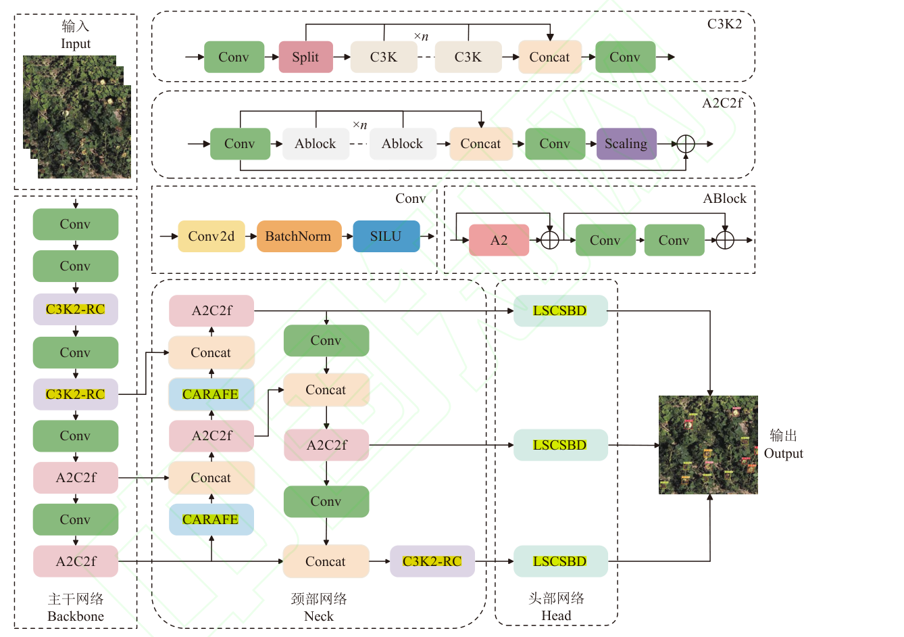

由图可见，主干网络中的 C3K2 被替换为 C3K2-RC，颈部网络的上采样位置嵌入 CARAFE，三个尺度的检测头均替换为 LSCSBD。数据流上，主干提取多尺度特征后经颈部融合，再由检测头输出边界框与危害等级；三个改进模块分别作用于特征提取、特征融合与预测输出三个阶段，后续小节按此数据流逐一展开。

### RFAConv 感受野注意力卷积

RFAConv 的目标是用感受野注意力替换 Bottleneck 中的 3×3 卷积，扩大卷积核的有效感受野。其输出特征的计算式如下：

$$\begin{aligned} f_w &= \mathrm{Softmax}\left(g_{Conv}^{1\times1}\left(\mathrm{Avgpool}(X)\right)\right) \\ f_e &= \mathrm{ReLU}\left(\mathrm{BatchNorm}\left(g_{conv}^{3\times3}(X)\right)\right) \\ f_x &= f_w \times f_e \end{aligned}$$

其中，该式涉及的符号含义如下表所示：

| 符号 | 含义 |
| --- | --- |
| $X$ | 输入特征图 |
| $g_{Conv}^{1\times1}$、$g_{conv}^{3\times3}$ | 尺寸为 1×1 与 3×3 的分组卷积运算 |
| $f_w$ | 为 3×3 感受野内每个位置分配的归一化权重（注意力图） |
| $f_e$ | 与注意力图同尺寸的感受野空间特征 |
| $f_x$ | 增强后的输出特征 |

直观上，上分支为感受野内每个位置分配重要性权重，下分支提供对应的空间特征，逐元素相乘即得按重要性加权的输出。RFAConv 的双分支工作流程如下图所示。

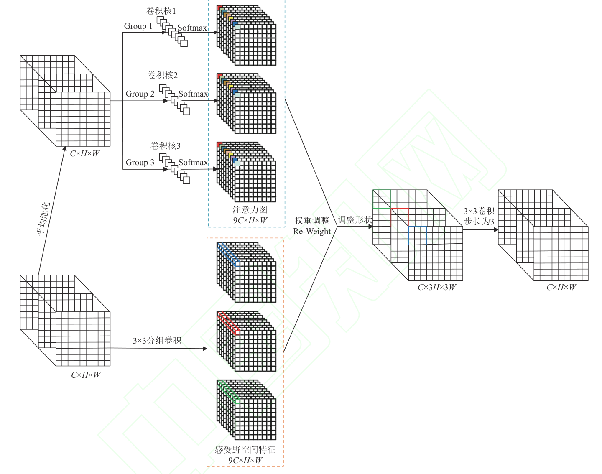

由图可见，上分支先对输入做平均池化与 1×1 分组卷积，经维度重组与 Softmax 生成注意力图，下分支以 3×3 分组卷积配合归一化与激活生成感受野空间特征，最终经权重调整与步长为 3 的 3×3 卷积重组输出。RFAConv 的输出随后送入 RFAConv-Bottleneck，与 CA 注意力共同构成下一节的 C3K2-RC。

### CA 坐标注意力机制

CA 注意力机制用于在通道注意力中嵌入位置信息，抑制土壤、杂草等背景干扰。其工作流程如下图所示。

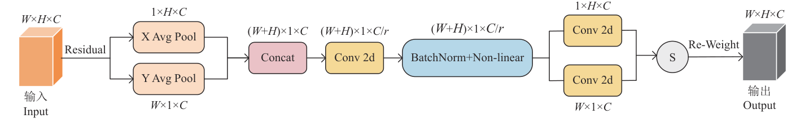

由图可见，输入特征图先沿宽度与高度方向分别做全局平均池化，拼接后经 1×1 卷积降维与标准化、非线性处理，再分解回两个方向并经 1×1 卷积与 Sigmoid 生成带有空间位置信息的双向注意力权重。与纯空间注意力相比，这种设计让通道信息与位置信息协同建模，帮助模型精准聚焦病斑关键特征。CA 被嵌入重构后的 RFAConv-Bottleneck 之后，其输出进入 C3K2-RC 的堆叠结构。

### C3K2-RC 结构

C3K2-RC 的目标是把 RFAConv 与 CA 组合成可直接替换 C3K2 的特征提取单元。其结构如下图所示。

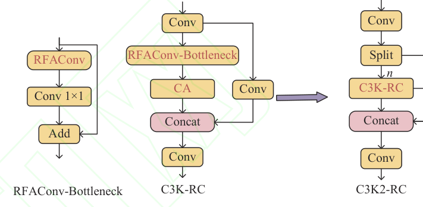

由图可见，RFAConv-Bottleneck 用 RFAConv 替换 Bottleneck 中的 3×3 卷积层并配合 1×1 卷积与残差相加，改进的 C3K-RC 在其后拼接 CA 注意力再经卷积输出，多个 C3K-RC 经 Split 与 Concat 堆叠为 C3K2-RC。该结构先以 RFAConv-Bottleneck 增强全局感知，再由 CA 筛选关键特征，抑制无关背景对多尺度病斑的干扰。C3K2-RC 负责替换主干与颈部的 C3K2，向颈部融合与检测头输送更具判别力的特征。

### CARAFE 上采样算子

CARAFE 用于替换颈部网络的最近邻插值上采样，以内容感知的特征重组恢复病斑边缘细节。其工作流程如下图所示。

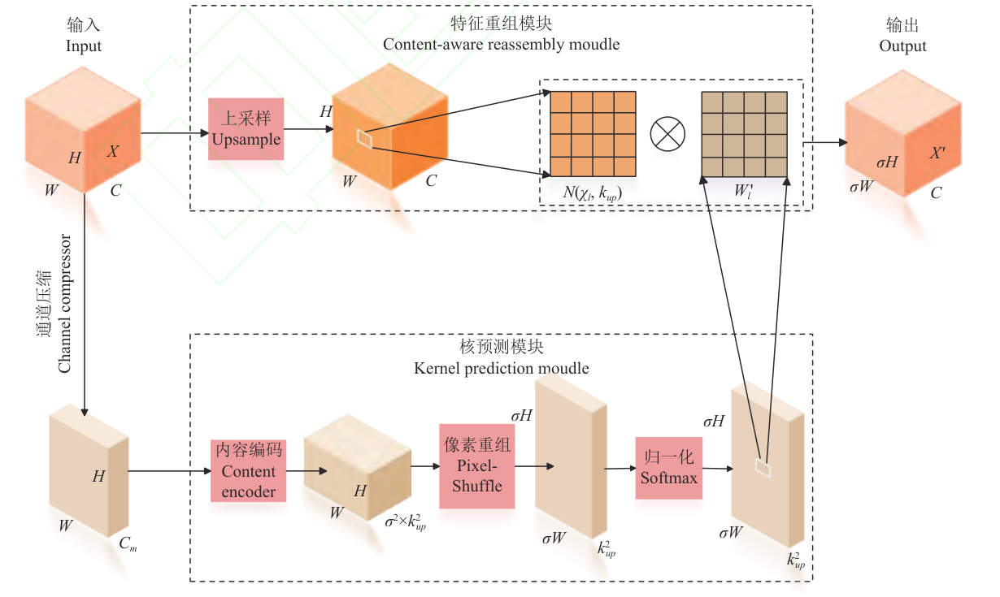

由图可见，CARAFE 由核预测模块与特征重组模块组成：核预测分支先做通道压缩，再经内容编码、像素重组与 Softmax 归一化动态生成上采样核；特征重组分支则以每个位置为中心取局部邻域，按预测核加权重组出放大后的特征图。这种内容感知的重建方式能在上采样过程中增强病斑边缘与纹理表达，并抑制背景噪声。CARAFE 安装在颈部网络的上采样位置，其输出与主干侧特征拼接后进入后续的 A2C2f 模块与检测头。

### LSCSBD 轻量化检测头

LSCSBD 检测头以共享卷积与分离批量归一化替代原有的解耦头，在压缩参数量的同时增强对小尺度病斑的检测能力。其结构如下图所示。

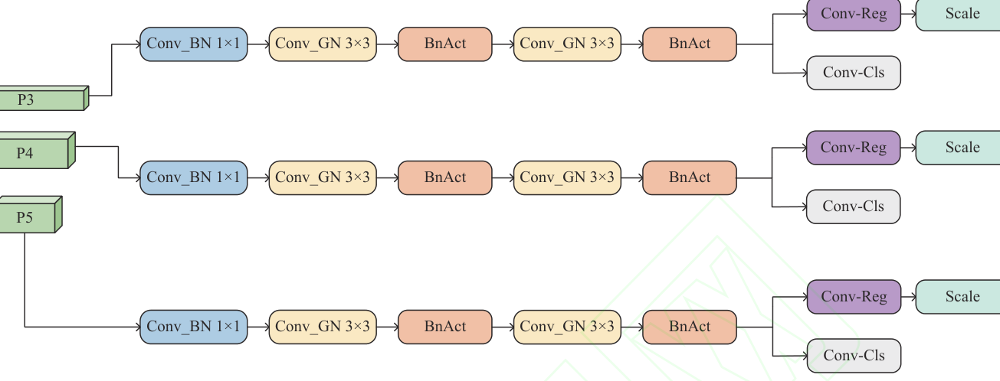

由图可见，P3、P4、P5 三个尺度的特征图先经 Conv_BN 1×1 调整通道维度，再由 Conv_GN 3×3 共享卷积实现跨层级特征融合，经 BnAct 完成分布校准与非线性变换后，并行的 Conv-Reg 与 Conv-Cls 分支分别处理边界框回归与类别预测，最后由 Scale 模块按各层目标尺度分布缩放输出。共享卷积减少了分支堆叠带来的计算开销，批量归一化激活模块则保留了对小目标的敏感度。LSCSBD 作为输出端接收颈部融合后的多尺度特征，直接输出花盘边界框与危害等级。

## 实验结果

### 实验设置

所有对比试验均在同一软硬件环境下完成，配置如下表所示。

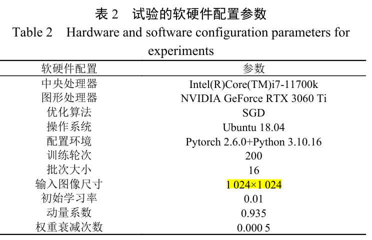

由表可见，训练采用 SGD 优化器与 0.01 的初始学习率，在 RTX 3060 Ti 上训练 200 轮，输入尺寸为 1 024×1 024。评价指标包括精确率 P、召回率 R、mAP0.5、mAP0.5-0.95、FPS、参数量、计算量与模型大小，覆盖精度与轻量化两端。

### 对比实验

为验证改进效果，本文先将 YOLOv12n-RCL 与基线 YOLOv12n 在自制数据集上共同训练 200 轮，训练曲线如下图所示。

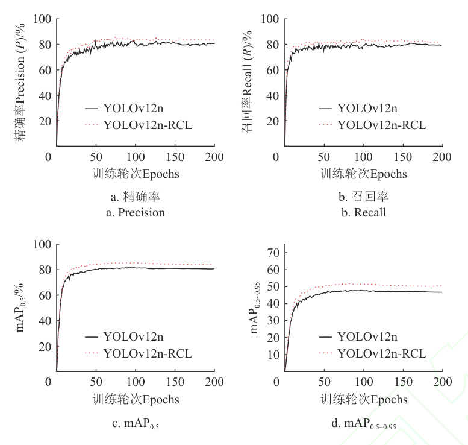

由图可见，YOLOv12n-RCL 的精确率收敛后波动范围明显缩小，召回率全程领先并在 180 轮左右趋于稳定，两条 mAP 曲线均高于基线，表明改进模型在不同交并比阈值下的检测性能与定位精度更优。进一步将本文模型与 11 种主流检测模型对比如下表所示。

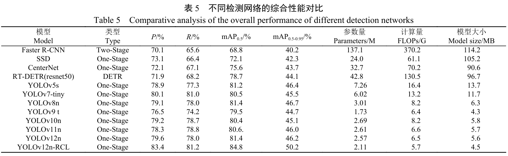

从表中可以看出，YOLOv12n-RCL 的 mAP0.5 较 YOLOv5s 至 YOLOv12n 七种模型提升 3.4～5.3 个百分点，mAP0.5-0.95 提升 3.5～5.5 个百分点，同时参数量、计算量与模型大小较基线降低 17.9%、12.3% 与 19.6%，说明检测精度的提升并未以模型复杂度为代价，特征提取收益与计算效率收益可以兼得。

### 消融实验

为定位各模块的贡献，本文先考察 C3K2-RC 的引入位置，结果如下表所示。

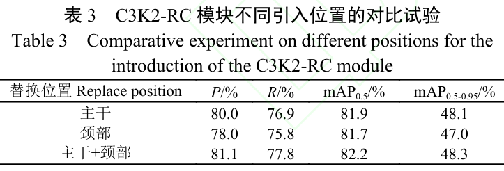

由表可见，同时替换主干与颈部的 C3K2 时四项指标均为最高，mAP0.5 达 82.2%，说明 C3K2-RC 协同作用于特征提取与特征融合两个阶段更有效。在此基础上的多模块消融结果如下表所示。

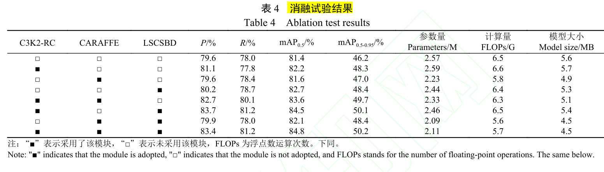

由表可见，单独引入 C3K2-RC 使 mAP0.5-0.95 提升 2.1 个百分点，单独引入 CARAFE 使参数量、计算量与权重大小分别下降 13.2%、10.8% 与 12.5%，LSCSBD 则在四项精度指标全部提升的同时令模型参数略微下降；三模块组合的 YOLOv12n-RCL 以 2.11 M 参数量取得 84.8% 与 50.2% 的最优 mAP，表明各模块在精度与轻量化之间形成协同。消融模型的热力图可视化结果如下图所示。

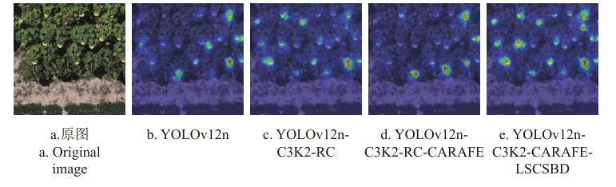

由图可见，随模块逐步叠加，高响应区域愈加集中于花盘，漏检与误检激活明显减少，验证了消融表中的精度增益来自对目标区域聚焦能力的增强。

### 速度-精度权衡与边缘部署

为检验轻量化带来的部署收益，本文将模型部署于 Jetson Orin Nano 开发板，经 TensorRT 的 INT8 量化加速后进行测试，并基于 PyQt5 开发了盘腐病检测系统，界面如下图所示。

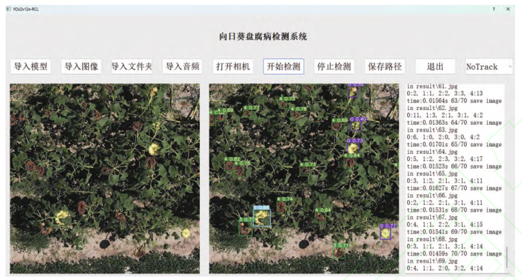

由图可见，系统集成了模型导入、单张图像检测、多图检测、视频检测与结果保存等功能，并可统计图像中盘腐病的等级与数量。测试结果显示，YOLOv12n-RCL 的检测速度达到 27.5 帧/s，较基线 YOLOv12n 的 18.7 帧/s 提升 47.1%；在包含 1 298 个盘腐病样本的 70 幅测试图像上仅出现 10 例漏检与 8 例错检，远少于基线的 35 例与 30 例，说明模型在边缘设备上已基本满足盘腐病实时检测需求，轻量化设计与部署效率取得了良好平衡。

### 可视化分析

本文再从感受野、特征响应与检测效果三个层面对模型做可视化分析。C3K2 引入不同模块后的有效感受野如下图所示。

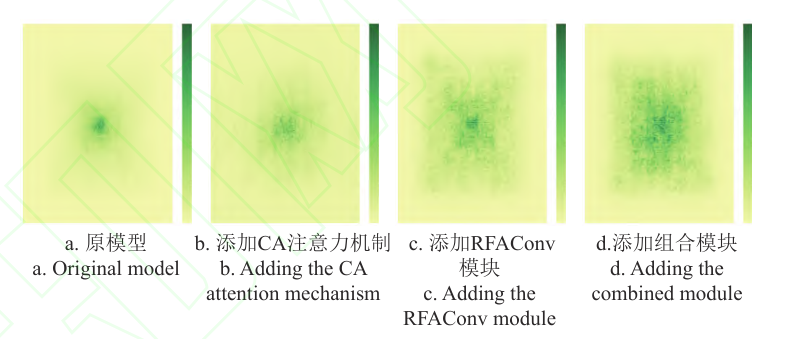

由图可见，集成 RFAConv 与 CA 的组合模块使感受野由高度集中的中心点扩展为更广泛且结构化的空间分布，表明 C3K2-RC 实现了感受野的系统性扩展。添加 CARAFE 前后的输入输出特征对比如下图所示。

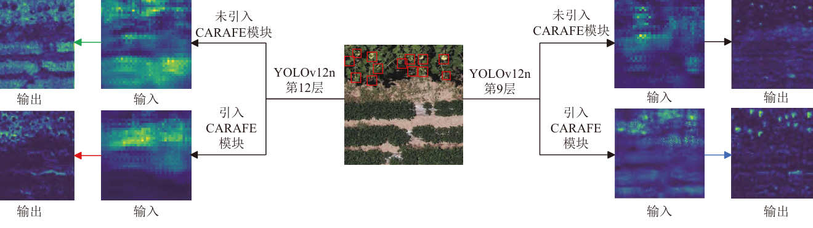

由图可见，引入 CARAFE 后特征图的高亮区域更集中于向日葵目标，土壤与杂草等背景响应被削弱，表明特征重构质量与病斑纹理表达均有提升。各主流模型在测试样本上的检测效果对比如下图所示。

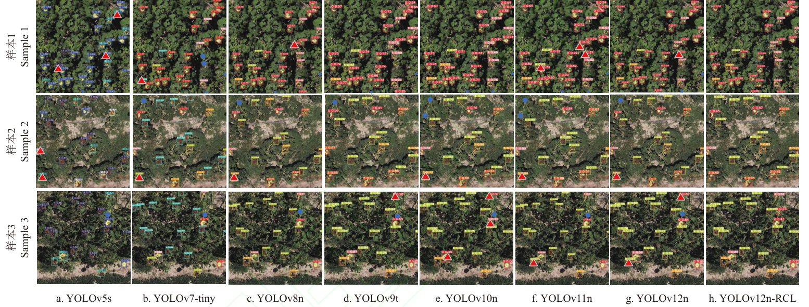

由图可见，YOLOv5s 至 YOLOv12n 在边缘目标与叶片遮挡场景下普遍出现漏检（蓝色圆）与错检（红色三角），而 YOLOv12n-RCL 在 3 种场景下均保持完整检出与正确分级，可以看出其对复杂田间场景的适应性更强。不同等级病害的混淆矩阵如下图所示。

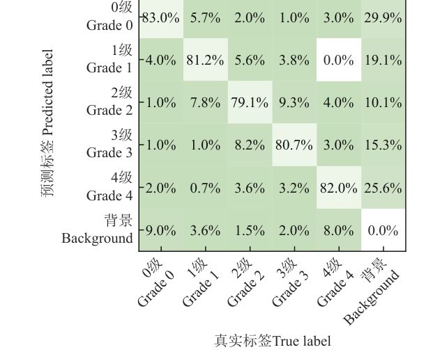

由图可见，0 级至 4 级的召回率分别为 83.0%、81.2%、79.1%、80.7% 与 82.0%，混淆主要发生在 2 级与 3 级之间（8.2% 与 9.3%），其余等级的误判率均在 10% 以内，表明模型对不同危害程度的盘腐病具备良好的区分性能。

### 大田监测验证

最后，本文基于分块检测与拼接重组策略把模型用于无人机原始影像的整田监测：先用 ArcGIS 将研究区域裁剪为符合输入尺寸的图像序列，经检测系统完成识别与分级后，由 Pix4D 依据坐标信息拼接重构出病害空间分布影像，结果如下图所示。

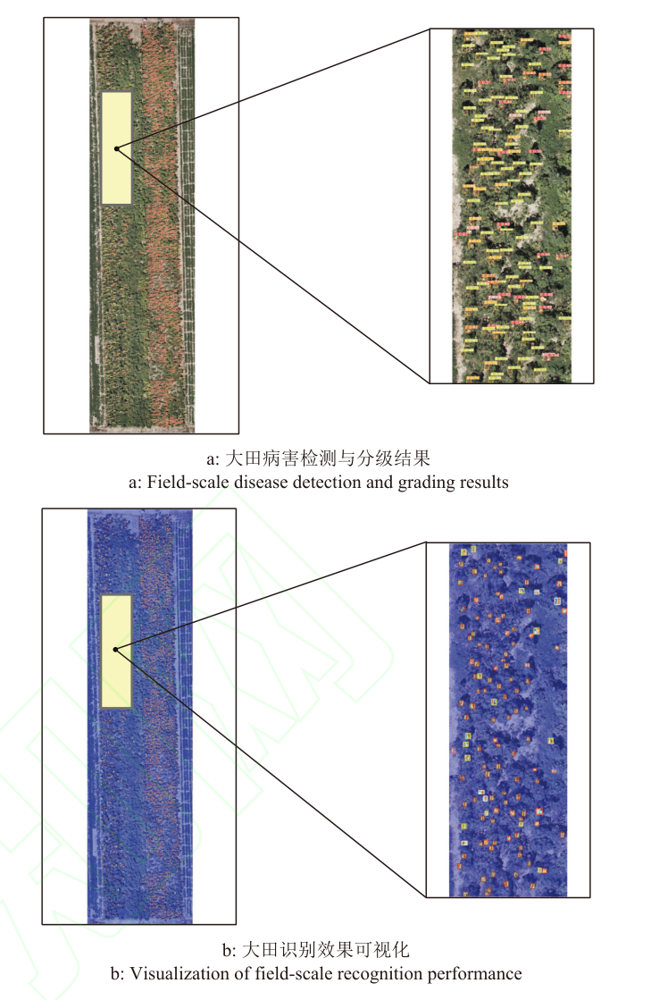

由图可见，在目标分布密集、叶片遮挡的大田场景下模型仍保持稳定的检出与分级，局部放大未见明显漏检或误检，大田识别效果可视化进一步印证了模型对病斑关键特征的提取能力。输出的病害等级分布矢量还可转换为田间作业处方图，为植保无人机的变量施药提供地理坐标与决策依据，表明模型具备从算法走向田间装备的应用可靠性。

## 优点和创新点

个人认为，本文有如下一些优点和创新点可供参考学习：

1. 将 RFAConv 的感受野注意力与 CA 的坐标注意力融合进 C3K2-RC 一个模块，同步扩大感受野并建立空间坐标依赖，对多尺度病斑的特征提取与定位效果提升明显，设计巧妙。
2. 用 CARAFE 内容感知上采样与 LSCSBD 共享卷积检测头协同推进轻量化，在四项精度指标全部提升的同时把参数量、计算量与模型大小分别压缩 17.9%、12.3% 与 19.6%，计算效率上的改造可供参考。
3. 实验数据丰富有力，涵盖 11 种主流模型对比、引入位置与多模块消融、感受野与特征图可视化、混淆矩阵误检分析以及边缘部署实测，从多个不同方面验证了改进效果，说服力强。
4. 工程可用性考虑充分，完成了 TensorRT 边缘部署、PyQt5 检测系统与基于拼接影像的大田监测流程，形成从算法到装备的完整链条，具备直接落地的参考价值。
