# 基于改进 YOLOv12n 的 VD 炉真空下钢水液面高度检测

Paper Reading 是从个人角度进行的一些总结分享，受到个人关注点的侧重和实力所限，可能有理解不到位的地方。具体的细节还需要以原文的内容为准，博客中的图表若未另外说明则均来自原文。

| 论文概况 | 详细 |
| --- | --- |
| 标题 | 《基于改进 YOLOv12n 的 VD 炉真空下钢水液面高度检测》 |
| 作者 | 东鹏涛，史利民，李枫，孔令种，李世森，臧喜民，杨杰 |
| 发表期刊 | 《钢铁》（Iron & Steel） |
| 期刊等级 | 未获取 |
| 发表年份 | 2026 |
| 论文代码 | 未获取 |

作者单位：

1. 辽宁科技大学材料与冶金学院，辽宁 鞍山 114051
2. 中国科学院自动化研究所，北京 100190
3. 天津钢管制造有限公司二炼钢厂，天津 300301
4. 沈阳工业大学，辽宁 沈阳 110870

## 研究动机

VD 炉真空下钢水液面高度的实时检测是炼钢精炼过程的重要问题，表现为液面在抽真空、保压、破空各阶段持续起伏，观测窗口又常被烟雾与粉尘充斥，导致喷溅、搅拌不足等冶金风险，也使制造执行系统缺少可靠的多参数联动输入。传统人工估算依赖经验，误差与滞后显著；红外测距法易受高温粉尘干扰，鲁棒性不足。然而基于工业相机与 YOLO 系列模型的图像路线虽能端到端定位渣-金界面，在 VD 炉真空环境下依旧受制于一条因果链：烟雾与粉尘散射先削弱通道层面的判别信息，液面反光继而造成局部过曝与边缘模糊，最终暴露出基线模型感受野有限、多尺度特征捕捉能力弱的短板，复杂工况下液面边界难以稳定输出。暂未有工作同时围绕通道干扰、液面尺度动态变化与深层融合衰减三方面对 YOLOv12n 做定向改造，本文即切入这一空白。

## 文章贡献

针对 VD 炉真空下液面特征易被烟雾掩盖、目标尺度随工况动态变化、深层特征融合效率欠佳三类局限，本文提出了改进 YOLOv12n 的 EMD-YOLO 检测模型。其核心是「通道增强-区域定位-融合提效」的分层改进。首先集成高效通道注意力 ECA 构建 ECAConv 卷积块，在降低计算量的同时自适应强化关键通道特征；接着嵌入多尺度动态区域注意力 MRA 模块，精准聚焦液面区域的多尺度特征响应；最终将 R-ELAN 改进为 DElan 模块，增强深层特征的关联性与梯度传播效率。实验表明，EMD-YOLO 在 16 000 张 VD 炉液面图像数据集上的 mAP@50% 与综合置信度较 YOLOv12n 分别提升 4.7 和 6.9 个百分点，较 YOLOv12n-seg 分别提升 3.1 和 9.1 个百分点。

## 本文方法

### 基线模型 YOLOv12n

YOLOv12n 是本文全部改进的起点，也是 YOLO 系列中以注意力机制为核心的实时检测模型。其网络结构如下图所示。

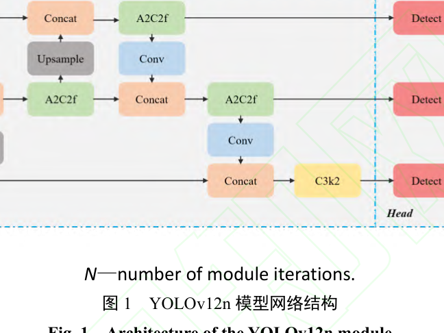

从结构图可以看出，骨干沿用 CSPNet 思路逐层下采样并保留关键特征，颈部由 FPN 与 PAN 双向聚合多尺度特征，检测头在三个尺度上输出结果；区域注意力模块负责特征建模，R-ELAN 负责训练稳定性。本文的三处改进分别落在这条链路的通道注意力、区域注意力与特征融合环节，以下逐节展开。

### EMD-YOLO 总体结构

EMD-YOLO 的目标是在保持 YOLOv12n 实时性的前提下，补齐其在 VD 炉工况下的三块短板。改进后的整体结构如下图所示。

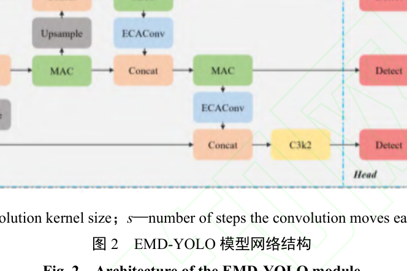

结构图中 ECAConv 出现在骨干与颈部的卷积连接处，MRA 插入多尺度特征路径以动态聚焦液面区域，DElan 接管深层特征聚合，三者串联构成「通道增强-区域定位-融合提效」的数据流。该结构接收炉口相机采集的图像，输出钢包与钢水的检测框和掩码，供后文的高度换算方案使用。

### 高效通道注意力卷积块 ECAConv

ECAConv 用于在卷积阶段完成通道级特征筛选，解决有效特征被噪声掩盖的问题。ECA 模块与 ECAConv 的结构如下图所示。

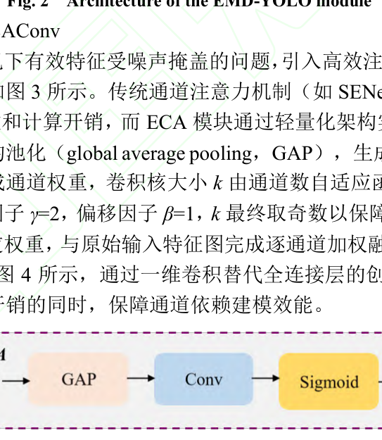

图中全局平均池化、自适应核尺寸一维卷积与 Sigmoid 归一化三段串联，构成 ECA 的通道校准流程。把 ECA 嵌入标准卷积层即得到 ECAConv，其结构如下图所示。

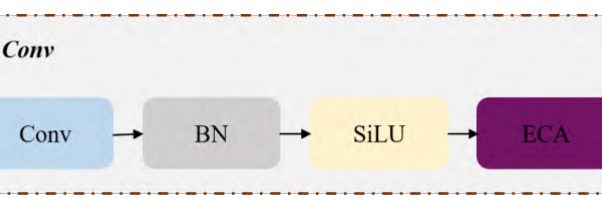

与 SENet 依赖双全连接层建模通道依赖不同，ECA 先对输入特征做全局平均池化，得到各通道的全局语义表征，再用自适应核尺寸的一维卷积生成通道权重。卷积核大小 k 由通道数自适应函数确定：

$$k = \left| \frac{\log_2 C}{\gamma} + \frac{\beta}{\gamma} \right|$$

其中 C 为特征图的通道数，缩放因子 γ=2，偏移因子 β=1，k 最终取奇数以保障卷积对称性。直观上，核尺寸只随通道数按对数速度增长，高维通道也只需一个很小的局部跨通道窗口即可完成依赖建模。权重经 Sigmoid 归一化到 [0,1] 区间后与原始特征逐通道加权融合；在 VD 炉场景中，被强化的是液面-炉壁交界的边缘结构与高温辐射灰度梯度通道，被抑制的是粉尘散射与光斑噪声通道。ECAConv 即把 ECA 嵌入标准卷积层，其输出送入后续骨干与颈部层，为 MRA 提供更干净的特征输入。

### 多尺度动态区域注意力模块 MRA

MRA 用于适配钢水注入抬升、脱气震荡等液面尺度与位置的动态变化，其模块结构如下图所示。

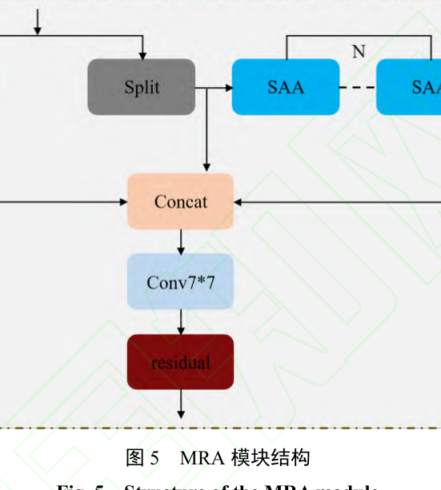

图中特征先被均匀划分为若干区域，在区域内独立执行自注意力，再由大核可分离卷积补足位置信息。负责动态区域选择的 DRS 机制如下图所示。

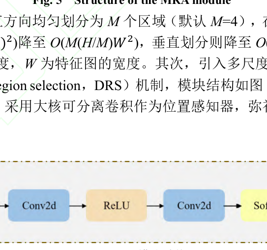

MRA 先把特征图沿水平或垂直方向均匀划分为 M 个区域（默认 M=4），在各区域内独立执行自注意力，使计算复杂度由全局的 $O((HW)^2)$ 降为：

$$O(M(H/M)W^2)$$

垂直划分则降至 $O(MH(W/M)^2)$，其中 H 为特征图的高度，W 为特征图的宽度，M 为区域数。这等价于把全局注意力的二次复杂度关进 M 个独立子区域，空间开销随区域划分被线性压缩。在此基础上，模块引入尺度集 {2,4,8,16} 的多尺度区域划分与动态区域选择 DRS 机制，按输入特征自适应选择最优划分尺度，并用大核可分离卷积作为位置感知器弥补传统注意力对位置信息的敏感性缺失。MRA 接收 ECAConv 强化后的特征，输出的多尺度区域响应汇入 DElan 做进一步融合。

### 改进 R-ELAN 的融合模块 DElan

DElan 用于修复原生 R-ELAN 在高噪声、低对比度液面特征上融合效率欠佳、梯度传播衰减的问题，其两个子模块结构如下图所示。

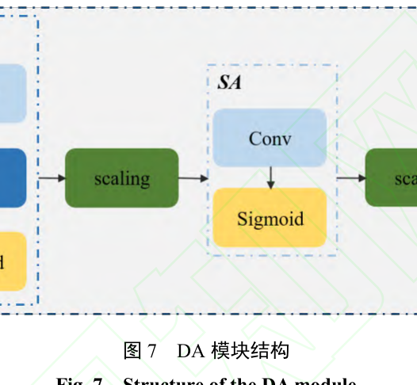

图中 DA 模块沿通道与空间两个维度并行完成特征重要性建模。与之配合的 MSF 模块如下图所示。

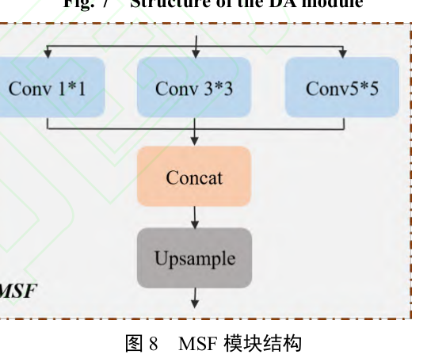

DElan 的三重机制分别是：在深层分支嵌入双重注意力 DA 模块，同步建模通道与空间维度的特征重要性；集成多尺度融合 MSF 模块，用包含空洞卷积在内的 1×1、3×3、5×5、7×7 多尺寸卷积核构建差异化感受野；设计可学习残差缩放因子，自适应调节残差连接强度以缓解训练不稳定与梯度衰减。在 VD 炉场景中，DA 的通道分支抑制反光与烟雾对应的冗余通道，空间分支聚焦液面潜在区域并突出边缘轮廓；MSF 则同步捕获局部细节与全局上下文，适配模糊边缘液面的表征需求。DElan 位于颈部深层，其输出直接送检测头，决定最终检测框与掩码的质量。

### 液面高度量化方案

检测之外，本文还给出由检测结果换算钢水物理高度的两条路径，二者的对应关系如下表所示。

| 方案 | 依赖能力 | 计量依据 | 换算方式 |
| --- | --- | --- | --- |
| 相对高度比 | 目标检测 | 钢包与钢水的高度参数 | 比值结合钢包实际高度尺寸直接换算 |
| 相对面积比 | 实例分割 | 像素数量、掩码像素数量、物理实际面积 | 面积比值结合钢包已知结构参数反推 |

高度比方案只需检测钢水液面的关键边界，对轮廓完整性要求较低；面积比方案借助实例分割获取像素级轮廓，信息更完整但边缘易受钢渣附着与粉尘散射影响。两方案的输出经加权平均融合后，作为消融试验与对比试验统一的检测结果口径，同一帧的结果示例见实验节的可视化分析。

## 实验结果

### 实验设置

试验平台为 Windows 11 操作系统、Intel Core i7-13700K 处理器与 NVIDIA GeForce RTX 4060 GPU，模型基于 Python 3.13.5 的 PyTorch 2.8.0 搭建并使用 CUDA 12.6 加速。数据集来自某钢厂精炼生产视频，15 组视频转出 20 000 张图像，人工筛选 8 000 张覆盖不同轮次钢液颜色、液面高度与真空度（真空度梯度为 100 KPa-30 KPa-2 400 Pa-0 三阶段），再经翻转、平移、旋转、裁剪与亮度调整扩充至 16 000 张，按 8∶1∶1 划分训练集、验证集与测试集，并用 Labelme 全人工标注钢包与钢水两类目标。数据集样例如下图所示。

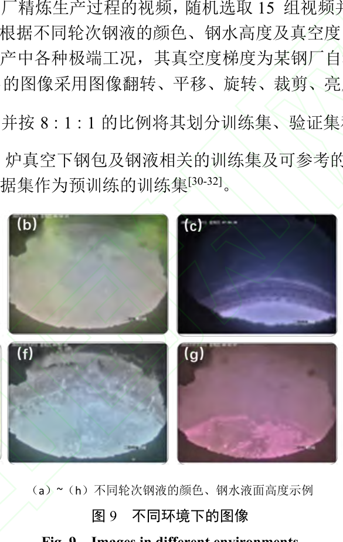

样例覆盖了不同轮次钢液颜色的差异（浅绿、暗蓝、粉红等）与不同液面高度，是后文鲁棒性结论的来源。训练采用 SGD 优化器、学习率 0.001 25、批大小 16、训练 300 轮、输入尺寸 640×640，完整参数如下表所示。

评价指标包括精确率 P、召回率 R、平均精度均值 mAP@50% 与综合置信度 CC，并以参数量和 GFLOPs 衡量轻量化程度。精确率与召回率的计算公式如下：

$$P = \frac{PT}{PT+PF}$$

$$R = \frac{PT}{PT+NF}$$

其中 PT 为实际为正类且正确预测为正类的样本数，PF 为实际为负类但误判为正类的样本数；召回率式中的 NF 原文未单独展开定义。直观上，精确率衡量报出的框有多少可信，召回率衡量该报的框报出了多少。平均精度与平均精度均值的定义为：

$$P_A = \int_0^1 P(R)\,dR$$

$$P_{mA} = \frac{\sum_{m=1}^{M} P_A}{M}$$

其中 PA 为精确率与召回率曲线下纵轴为精度、横轴为召回率所围成的面积，M 为数据集中类别的总数。这等价于先对单个类别的 PR 曲线积分得到类内精度，再跨类别取平均，避免个别类别的样本规模主导总指标。综合置信度 CC 由四项指标加权平均得到：

$$CC = \omega_1 \times H + \omega_2 \times S + \omega_3 \times T + \omega_4 \times D$$

| 符号 | 含义 |
| --- | --- |
| H | 物理合理性指标 |
| S | 统计一致性指标 |
| T | 时间一致性指标 |
| D | 工艺关联数据指标 |
| ω1~ω4 | 分别为 H、S、T、D 对应的加权系数，且 ω1+ω2+ω3+ω4=1 |

直观上，CC 把检测结果重新放回物理规律、统计分布、时间序列与工艺数据四个口径下复核，是液面高度最终输出的裁决指标。

### 可视化分析

同一帧图像在原图、目标检测相对高度比与实例分割相对面积比三种视角下的定性结果如下图所示。

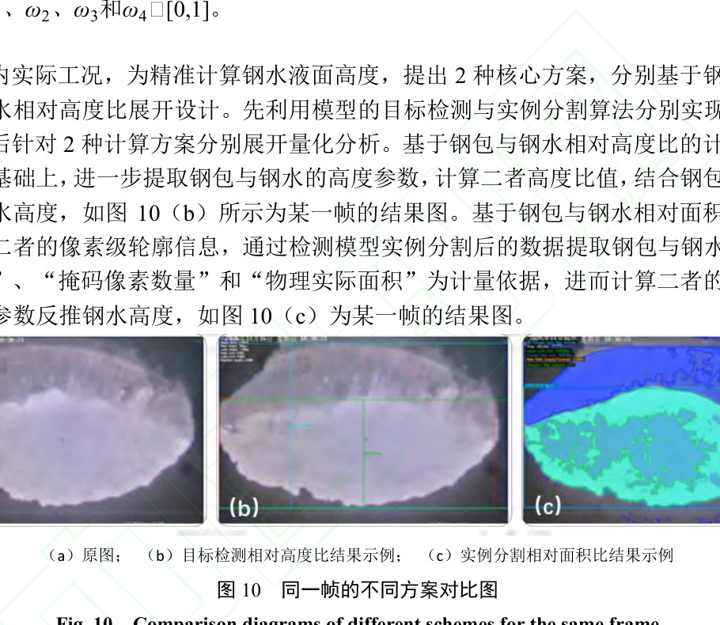

原图中液面被烟雾与反光部分遮蔽，(b) 的检测框仍稳定框出钢包轮廓与液面关键边界，(c) 的分割掩码进一步给出钢水区域的像素级轮廓，但掩码在钢渣附着处出现边缘碎裂。结合后文面积比方案 mAP 更高但 CC 偏低的现象可以看出，像素级轮廓对边缘干扰更敏感，而只依赖关键边界的高度比方案输出更稳定。

### 对比试验

对比试验在同一数据集上覆盖 YOLOv5n、YOLOv8n、YOLOv10n、YOLOv11n、YOLOv12n 五个检测模型与 YOLOv5n-seg、YOLOv8n-seg、YOLOv11n-seg、YOLOv12n-seg 四个分割模型，结果如下表所示。

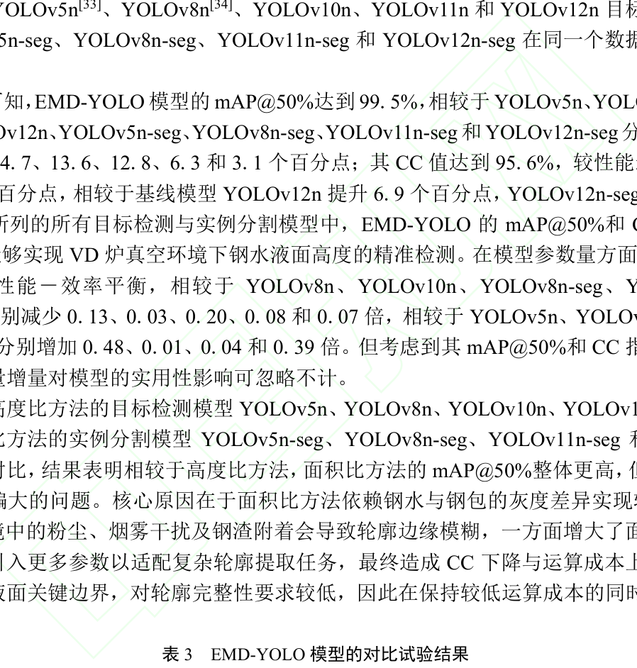

EMD-YOLO 的 mAP@50% 达到 99.5%、CC 达到 95.6%，较 YOLOv12n 分别提升 4.7 和 6.9 个百分点，较 YOLOv12n-seg 分别提升 3.1 和 9.1 个百分点；参数量 2 621 211 较 YOLOv8n、YOLOv10n、YOLOv8n-seg、YOLOv11n-seg 与 YOLOv12n-seg 分别减少 0.13、0.03、0.20、0.08 和 0.07 倍。精度大幅跃升而计算量仅由 6.0 GB 增至 6.1 GB，表明增益来自注意力与融合结构本身而非模型扩容。

### 消融试验

消融试验按 ECAConv、MRA、DElan 的顺序逐项叠加，检测结果由相对面积比与相对高度比加权平均融合得到，结果如下表所示。

仅加入 ECAConv 时参数量与计算量不升反降，召回率提升 2.6 个百分点；叠加 MRA 后精确率、召回率、mAP@50% 与 CC 较基线提升 4.1、4.4、3.0 和 4.5 个百分点；三者齐备时四项指标达到 99.2%、98.9%、99.5% 与 95.6%，较基线提升 5.8、7.2、4.7 和 6.9 个百分点。三个模块的增益逐级叠加且各自可归因，可见分层改进策略与冶金工况的检测难点一一对应。

## 优点和创新点

个人认为，本文有如下一些优点和创新点可供参考学习：

1. 把通道、区域、融合三个层面的改进与冶金工况难点一一对应，ECAConv 抑制烟雾粉尘干扰、MRA 适配液面尺度波动、DElan 缓解梯度衰减，并由消融试验逐项验证增益。
2. 设计了相对高度比与相对面积比两种液面高度换算方案，并用综合置信度 CC 融合物理合理性、统计一致性、时间一致性与工艺数据，使检测结果可被工艺口径复核。
3. 构建了覆盖抽真空、保压、破空全阶段、含多种遮挡工况的 16 000 张工业数据集，对比试验覆盖五个检测模型与四个分割模型，实验说服力强。
