# YOLOv13: Real-Time Object Detection with Hypergraph-Enhanced Adaptive Visual Perception

Paper Reading 是从个人角度进行的一些总结分享，受到个人关注点的侧重和实力所限，可能有理解不到位的地方。具体的细节还需要以原文的内容为准，博客中的图表若未另外说明则均来自原文。

| 论文概况 | 详细 |
| --- | --- |
| 标题 | 《YOLOv13: Real-Time Object Detection with Hypergraph-Enhanced Adaptive Visual Perception》 |
| 作者 | Mengqi Lei、Siqi Li、Yihong Wu、Han Hu、You Zhou、Xinhu Zheng、Guiguang Ding、Shaoyi Du、Zongze Wu、Yue Gao |
| 发表会议 | 未获取（arXiv 预印本，编号 arXiv:2506.17733） |
| 会议等级 | 未获取 |
| 发表年份 | 2025 |
| 论文代码 | github.com/iMoonLab/yolov13 |

作者单位：

1. Tsinghua University（清华大学，软件学院，BN-Rist、THUIBCS、BLBCI）
2. Taiyuan University of Technology（太原理工大学，机械工程学院）
3. Beijing Institute of Technology（北京理工大学，信息与电子学院）
4. Shenzhen University（深圳大学，机电与控制工程学院、广东省人工智能与数字经济实验室）
5. The Hong Kong University of Science and Technology (Guangzhou)（香港科技大学（广州））
6. Xi'an Jiaotong University（西安交通大学，人工智能与机器人研究所）

## 研究动机

实时目标检测是计算机视觉的前沿核心问题，表现为以极低的时延对图像中的目标进行定位与分类，直接决定工业异常检测、自动驾驶与视频监控等下游系统能否落地。YOLO 系列凭借速度与精度的平衡长期主导这一方向，但是其架构的建模能力始终被限制在低阶关联之内。从早期版本到 YOLO11 的卷积架构只在固定感受野内做局部信息聚合，建模容量受核大小与网络深度约束；YOLOv12 引入面积自注意力扩大感受野，却因计算代价被迫退化为局部区域计算，且自注意力本质上是在全连接语义图上做像素间的成对关联建模，只能捕获二元关联，无法表达多对多的高阶关联。另一条线索上，超图凭借一条超边连接多个顶点的特性天然适合高阶关联建模，已有工作也证明了高序关联对检测任务的必要性，但是这些方法用人工设定的特征距离阈值判定像素是否相关，手工建模范式难以应对复杂场景，还带来额外的冗余建模。暂未有工作把可学习的高阶关联建模装进实时检测架构，并同时保持参数与计算量的轻量水平。

## 文章贡献

针对上述局限，本文提出了 YOLOv13，把 YOLO 系列的成对关联建模扩展为全局高阶关联建模。其核心是基于超图的自适应关联增强机制 HyperACE，以多尺度特征图的像素为顶点，用可学习的超边构造模块自适应探索顶点间的高阶关联，再以线性复杂度的消息传递模块聚合多尺度特征。本文首先基于 HyperACE 提出 FullPAD 范式，把关联增强特征分发到骨干-颈部连接、颈部内部与颈部-头部连接三类位置，实现全网络的细粒度信息流与表示协同；接着以大核深度可分离卷积替换大核普通卷积，设计一系列轻量块显著压缩参数量与计算复杂度；最终在 MS COCO 基准上完成验证。实验表明，YOLOv13-N/S 相比 YOLO11-N/S 提升 3.0%/2.2% mAP，相比 YOLOv12-N/S 提升 1.5%/0.9% mAP，同时保持更少的参数量与 FLOPs。

## 本文方法

YOLOv13 的整体思路是：在保留三段式检测流水线的同时，把高阶关联增强特征注入全网络的数据流。网络总体架构如下图所示。

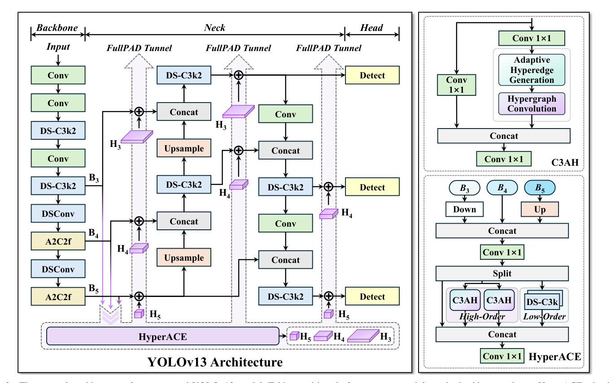

图中骨干提取多尺度特征 B1 到 B5，其中大核卷积被替换为本文的 DS-C3k2 块；与传统 YOLO 把 B3、B4、B5 直接送入颈部不同，本文先把这三层特征汇入 HyperACE 做跨尺度跨位置的高阶关联建模与特征增强，再由 FullPAD 的三条隧道把增强特征分发到骨干-颈部连接、颈部内部层与颈部-头部连接，最后颈部输出送入检测头完成多尺度检测。下面按模块展开 HyperACE 内部的超边生成、超图卷积、三分支结构，以及 FullPAD 与轻量块。

### 自适应超边生成

自适应超边生成阶段的目标是从输入视觉特征动态建模关联，生成超边并估计每个顶点对每条超边的参与程度。本文首先对顶点特征做全局平均池化与最大池化，得到两个上下文向量并拼接为全局顶点上下文：

$$f_{ctx} = [\,f_{avg};\ f_{max}\,] \in \mathbb{R}^{2C}$$

| 符号 | 含义 |
| --- | --- |
| $f_{ctx}$ | 全局顶点上下文 |
| $f_{avg}$、$f_{max}$ | 平均池化与最大池化得到的上下文向量 |
| $C$ | 特征通道数 |

这等价于把场景的两种全局统计口径压缩进同一个向量，为后续生成超边原型提供输入。随后映射层 $\phi: \mathbb{R}^{2C} \to \mathbb{R}^{M\times C}$ 由顶点上下文生成全局偏移 $\Delta P = \phi(f_{ctx})$，与可学习的全局原型 $P_0$ 相加得到 $M$ 个动态超边原型 $P = P_0 + \Delta P$，这些原型代表场景中潜在的视觉关联；另一投影层由顶点特征生成顶点查询向量 $z_i = W_{pre} x_i \in \mathbb{R}^C$，其中 $W_{pre}$ 为投影权重矩阵。为增加特征多样性，$z_i$ 与每个原型沿特征维切分为 $h$ 个子空间，在第 $\tau$ 个子空间内计算相似度 $s^{\tau}_{i,m} = \langle \hat{z}^{\tau}_i, \hat{p}^{\tau}_m \rangle / \sqrt{d_h}$，其中 $d_h = C/h$ 为子空间维度。总体相似度取所有子空间的平均 $\bar{s}_{i,m} = \frac{1}{h}\sum_{\tau=1}^{h} s^{\tau}_{i,m}$，再跨顶点归一化得到连续参与矩阵：

$$A_{i,m} = \frac{\exp(\bar{s}_{i,m})}{\sum_{j=1}^{N} \exp(\bar{s}_{j,m})}$$

其中 $N$ 为顶点数，$A_{i,m}$ 为顶点 $i$ 对超边 $m$ 的参与程度；传统超图使用 0/1 关联矩阵 $H \in \{0,1\}^{N\times M}$，而此处 $A \in [0,1]^{N\times M}$ 连续且可微。给出一个简单的例子，假设 $N=4$、$M=1$，四个顶点对该超边的总体相似度为 $\bar{s} = (2, 1, 0, 1)$，则指数值约为 7.39、2.72、1.00、2.72，和约为 13.83，归一化后参与程度约为 (0.53, 0.20, 0.07, 0.20)。可以看到，每个顶点以连续权重参与超边，同一条超边的参与程度跨顶点归一，人工阈值的硬判定被替换为可学习的软分配。生成阶段的两步流程如下图所示。

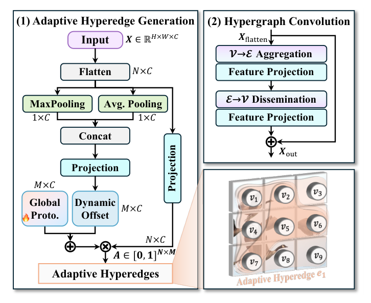

图左半为超边生成：池化上下文经投影得到动态偏移，叠加全局原型后与顶点查询计算相似度并归一化；图右半为超图卷积的聚合与广播两个投影方向。参与矩阵 $A$ 随后被送入超图卷积阶段消费。

### 超图卷积与 C3AH 块

超图卷积用于在超边引导下完成特征聚合与增强，C3AH 则把这一计算嵌入 CSP 风格的块中。自适应超边生成后，每条超边先收集所有顶点的特征并线性投影形成超边特征，再把超边特征广播回顶点更新其表示，定义为：

$$f_m = \sigma\Big(W_e \sum_{i=1}^{N} A_{i,m} x_i\Big), \quad x'_i = \sigma\Big(W_v \sum_{m=1}^{M} A_{i,m} f_m\Big)$$

| 符号 | 含义 |
| --- | --- |
| $f_m$ | 第 $m$ 条超边的特征 |
| $x'_i$ | 更新后的顶点 $i$ 表示 |
| $W_e$、$W_v$ | 超边投影权重与顶点投影权重 |
| $\sigma$ | 激活函数 |

聚合与广播两阶段的计算量都只与顶点数、超边数呈线性关系，这是 HyperACE 保持线性复杂度的来源；直观上，每条超边充当一个「软区域中心」，先汇总参与顶点的信息再反哺给全体顶点。在此基础上，C3AH 块保留 CSP 的瓶颈分支-切分机制：设输入特征图为 $X_{in} \in \mathbb{R}^{C_{in}\times H\times W}$，先用两个 1×1 卷积投影到同一隐藏维度，即 $X = Conv_{1\times1}(X_{in})$ 与 $X_{lateral} = Conv_{1\times1}(X_{in})$，其中 $C = \lfloor e C_{in} \rfloor$，$e$ 为瓶颈压缩比，两路分别用于自适应超图计算与侧路连接。$X$ 被展平为顶点特征送入自适应超图计算模块 AHC，得到 $X_h = AHC(X)$，再与 $X_{lateral}$ 沿通道维拼接并经 1×1 卷积融合输出。C3AH 是构成 HyperACE 高阶分支的基本单元。

### HyperACE 的三分支结构

HyperACE 以多尺度特征为输入，用高阶、低阶与捷径三条并联分支实现全局-局部、高序-低序的互补感知。HyperACE 先取骨干最后三阶段的 B3、B4、B5，把 B3 与 B5 缩放到 B4 的空间尺寸后经 1×1 卷积聚合为 $X_b$，再沿通道维切分为 $X^h_b$、$X^l_b$、$X^s_b$ 三组，分别用于全局高阶建模、局部低阶建模与捷径连接。高阶分支把 $X^h_b$ 送入 $K$ 个并联的 C3AH 块探索不同的潜在高阶关联，并沿通道维拼接：

$$X_h = Concat\big(X^{(1)}_h, X^{(2)}_h, \dots, X^{(K)}_h\big), \quad X^{(k)}_h = C3AH_k(X^h_b)$$

其中 $K$ 为并联 C3AH 块的数量，$X^{(k)}_h$ 为第 $k$ 个块的增强特征。并联结构让不同超边组同时关注不同的关联模式，避免单一超图容量不足。低阶分支使用 $L$ 个堆叠的 DS-C3k 模块捕获细粒度局部信息，即 $X_l = DS\text{-}C3k(X^l_b)$；捷径分支直接保留原始视觉信息，即 $X_s = X^s_b$。三分支输出沿通道维拼接后经 1×1 卷积融合为 HyperACE 的最终输出：

$$Y = Conv_{1\times1}\big(Concat(X_h, X_l, X_s)\big)$$

其中 $Y$ 即关联增强特征。至此 HyperACE 同时持有全局高阶、局部低阶与原始捷径三个层级的信息，$Y$ 被交给 FullPAD 做全网络分发。

### FullPAD 聚合-分发范式

FullPAD 的目标是把 HyperACE 得到的关联增强特征重新分配到流水线各处，打破「Backbone → Neck → Head」范式对信息流的固有限制。拿到 $Y$ 后，FullPAD 先将其 resize 到各阶段的空间分辨率并用 1×1 卷积调整通道：

$$H_i = Conv_{1\times1}\big(Resize(Y \leftarrow size(B_i))\big), \quad i \in \{3, 4, 5\}$$

其中 $B_i$ 为骨干第 $i$ 阶段特征，$H_i$ 为与该阶段分辨率对齐的增强特征。对第 $i$ 阶段的任意特征图 $F_i$，使用门控融合实现信息流与融合：

$$\tilde{F}_i = F_i + \gamma H_i$$

其中 $\gamma$ 为可学习的标量参数，自适应平衡关联增强特征与原始特征的贡献。这等价于在原有流水线的每个阶段上叠加一个来自全局增强特征的残差修正，修正强度由网络自己学习。实践中 FullPAD 通过三条隧道把增强特征传送到七个不同目的地，分别对应架构图中的骨干-颈部连接、颈部内部层与颈部-头部连接，融合后的特征继续进入颈部与检测头，完成全网络的信息闭环。

### DS 系列轻量块

DS 系列块以大核深度可分离卷积 DSConv 为基本单元替换大核普通卷积，在不牺牲性能的前提下压缩参数量与计算复杂度，结构如下图所示。

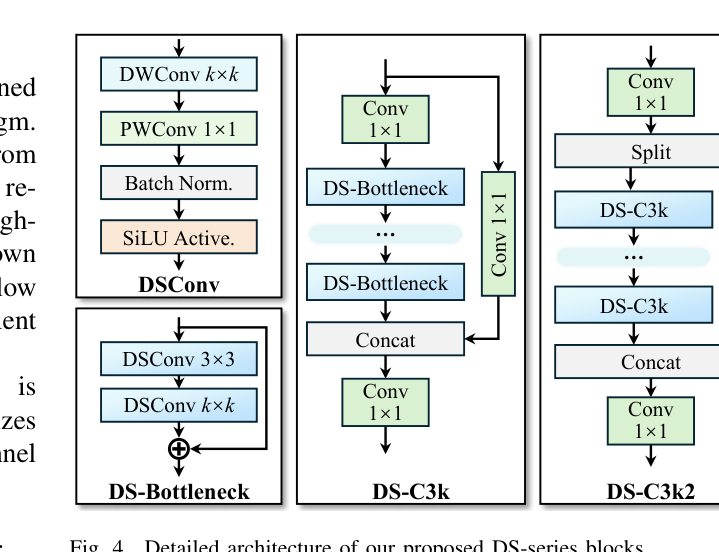

图中自底向上给出 DSConv、DS-Bottleneck、DS-C3k 与 DS-C3k2 四级结构。DSConv 块的输出定义为：

$$X_{DS} = SiLU\big(BN(DSConv(X_{in}))\big)$$

其中 $X_{in}$ 为输入特征，$BN(\cdot)$ 为批归一化后接 SiLU 激活。DS-Bottleneck 级联两个 DSConv 块：

$$X_{DS2} = DSConv_{k\times k}\big(DSConv_{3\times3}(X_{in})\big)$$

其中内层为固定 3×3 深度可分离卷积，外层为大核 $k\times k$ 深度可分离卷积；当输入输出通道数相同时加入残差跳连以保留低频信息。DS-C3k 继承 CSP-C3 结构，先 1×1 卷积降通道再经 $n$ 个级联 DS-Bottleneck，并与侧路 1×1 卷积分支拼接后恢复通道；DS-C3k2 派生自 C3k2，先统一通道再切分两路，一路经多个 DS-C3k、一路走捷径，最终拼接融合。这一设计在 YOLOv13 全部模型规模上实现最高 30% 的参数削减与最高 28% 的 GFLOPs 削减；DS-C3k2 被广泛用于骨干与颈部，DS-C3k 则作为 HyperACE 内部的低阶特征提取器，与前文各模块形成闭环。

## 实验结果

### 实验设置

实验在 MS COCO 与 Pascal VOC 2007 两个数据集上进行，口径如下表所示。

| 数据集 | 训练集 | 测试集 | 类别数 |
| --- | --- | --- | --- |
| MS COCO | Train2017 约 118,000 图 | Val2017 约 5,000 图 | 80 |
| Pascal VOC 2007 | trainval 共 5,011 图 | test 4,952 图 | 20 |

指标为 AP50:95、AP50、AP75、参数量、FLOPs 与推理延迟，延迟统一在单张 Tesla T4 上以 TensorRT FP16 测量；VOC 实验用 COCO 训练的模型直接在 VOC test 上评估以检验跨域泛化。训练 600 epochs、batch size 256、初始学习率 0.01、SGD 优化器、输入 640×640，数据增强含 Mosaic 与 Mixup；N/S/L/X 四个变体的超边数 M 分别设为 4、8、8、12。为保证公平，YOLO11 与 YOLOv12 均用官方设置在同一硬件平台复现。

### 对比实验

MS COCO 上的定性对比如下图所示，从左到右依次为 YOLOv10-N/S、YOLO11-N/S、YOLOv12-N/S 与 YOLOv13-N/S 的检测结果。

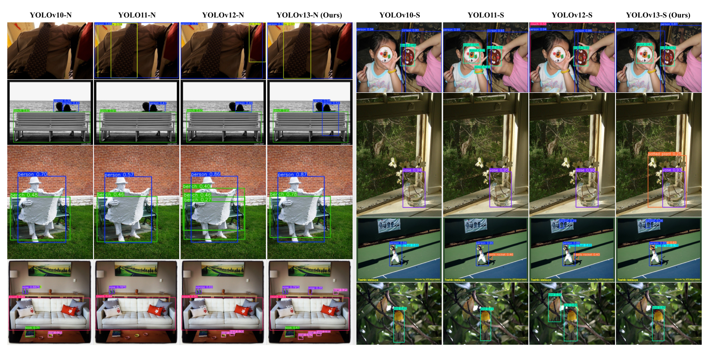

左下多目标场景中，先前模型漏检碗、花瓶等小物体，YOLOv13-N 能完整检出；右侧第二行只有本文方法检出花瓶后的植物；右侧第三行本文准确检出运动员手中的网球拍，而先前方法漏检或误检阴影。可见高阶关联建模在目标相互关联、遮挡的复杂场景中带来了实质性收益。定量主对比如下表所示。

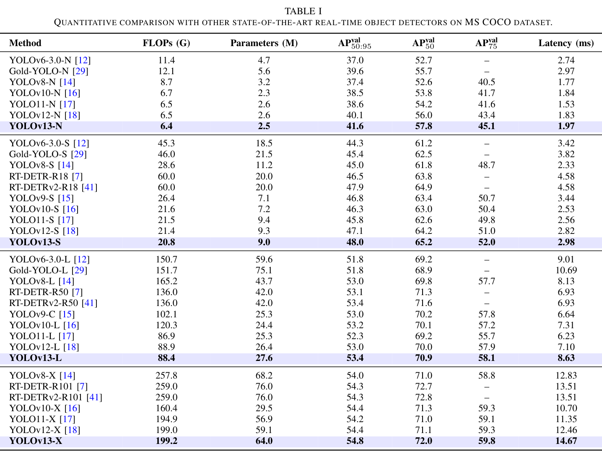

表中 YOLOv13-N/S/L/X 的 AP50:95 达到 41.6/48.0/53.4/54.8，全面超过同规模 YOLO 系列与 RT-DETR 系列；相比 YOLOv12 提升 1.5%、0.9%、0.4%、0.4%，相比 RT-DETRv2-R18，YOLOv13-S 在 AP50:95 提升 0.1% 的同时参数量减少 55.0%、FLOPs 减少 65.3%。可见优势在轻量变体上最为显著，与 YOLO 系列「更准、更快、更轻」的目标一致，各模型在 mAP-FLOPs 平面上的位置如下图所示。

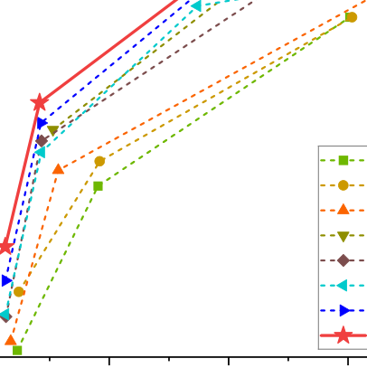

跨域泛化结果如下表所示，所有模型在 COCO 上训练、直接在 VOC 2007 test 上测试。

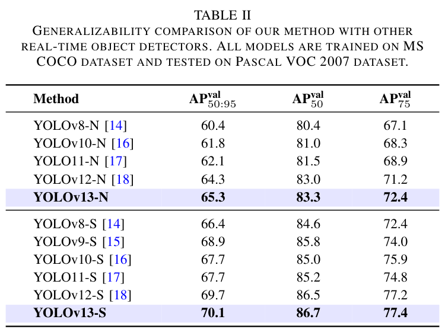

YOLOv13-N/S 的 AP50:95 达到 65.3/70.1，相比 YOLOv12-N/S 提升 1.0% 与 0.4%，相比更早模型提升更大，表明增益并非来自对 COCO 的过拟合。

### 消融实验

FullPAD 分发位置的消融如下表所示，基于 YOLOv13-S。

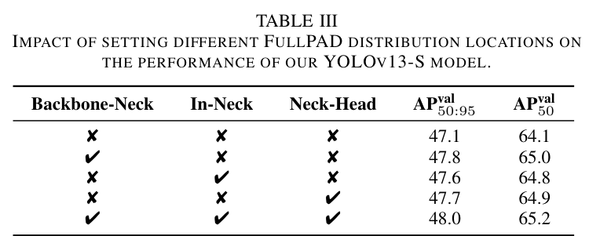

完全不分发增强特征（等价于移除 HyperACE）时 AP50:95 与 AP50 下降 0.9% 与 1.1%；只保留骨干-颈部、颈部内部、颈部-头部单条隧道时 AP50:95 分别下降 0.2%、0.4%、0.3%。可见自适应关联增强与全流水线分发二者缺一不可。超边数 M 的敏感性如下表所示。

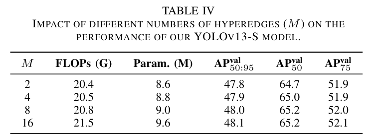

M 从 2 增到 16 时 AP50:95 从 47.8 升到 48.1，FLOPs 与参数量同步上升，且 M=16 时收益已趋于饱和，表明超边数需要在性能与开销之间折中，故 N/S/L/X 分别取 4、8、8、12。DS 块的替换消融如下表所示。

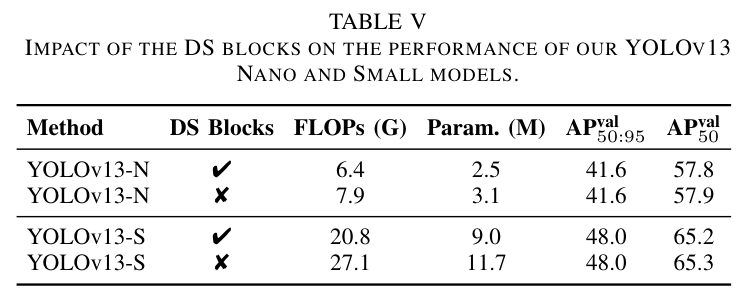

把 DS 系列块换回普通卷积后，N 与 S 的 FLOPs 从 6.4 G、20.8 G 升到 7.9 G、27.1 G，参数量从 2.5 M、9.0 M 升到 3.1 M、11.7 M，而 AP50:95 不变、AP50 仅降 0.1%，表明 DS 系列块几乎无损地压缩了计算。训练轮数的影响如下表所示。

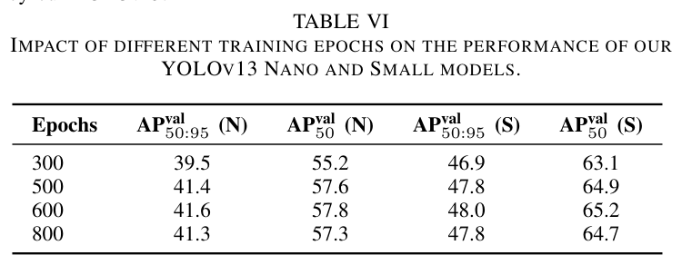

600 epochs 时 N/S 的 AP50:95 达到最佳的 41.6/48.0，继续训练到 800 epochs 反而回落到 41.3/47.8，表明过长训练会带来过拟合。

### 效率与延迟

各变体在不同硬件上的 FP16 推理延迟如下表所示。

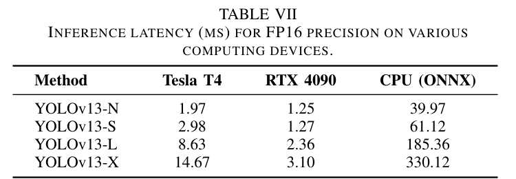

YOLOv13-N 在 RTX 4090 与 Tesla T4 上的延迟为 1.25 ms 与 1.97 ms，在无 GPU 的 CPU（Intel Xeon Platinum 8352V，ONNX）上也能达到 25 FPS（39.97 ms）；S 模型在 T4 上延迟仍小于 3 ms，X 模型在 4090 上仅 3.1 ms。可见引入高阶关联建模后 YOLOv13 仍保持实时推理能力。

### 可视化分析

自适应超边的可视化如下图所示。

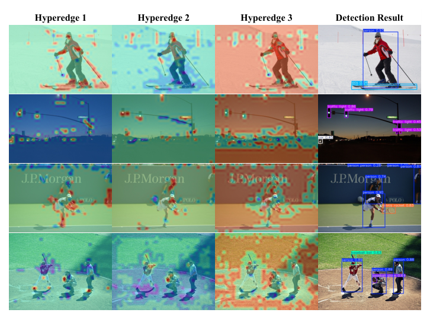

第一、二列的超边聚焦前景物体间的高阶交互，如第一行的滑雪板与雪杖、第二行的车辆与多个交通灯；第三列聚焦背景与前景目标之间的交互，如网球拍与网球场、棒球手套与棒球场。可见学习到的超边确实圈定了语义上相互关联的目标组，为 HyperACE 的高阶关联建模提供了直观的可解释性证据。

## 优点和创新点

个人认为，本文有如下一些优点和创新点可供参考学习：

1. 把人工阈值的超图构造改造成端到端可学习的自适应超图计算，用连续参与矩阵替代 0/1 关联矩阵，在消除手工超参鲁棒性瓶颈的同时保持线性复杂度。
2. 从信息流视角提出 FullPAD 全流水线聚合-分发范式，用单个可学习门控标量平衡增强特征与原特征，结构简洁，并以分发位置消融逐条验证三条隧道的必要性。
3. 实验丰富、说服力强：除 COCO 主对比与 VOC 跨域泛化外，给出分发位置、超边数、DS 块、训练轮数四组消融与多硬件延迟测量，并附超边可视化支撑可解释性。
