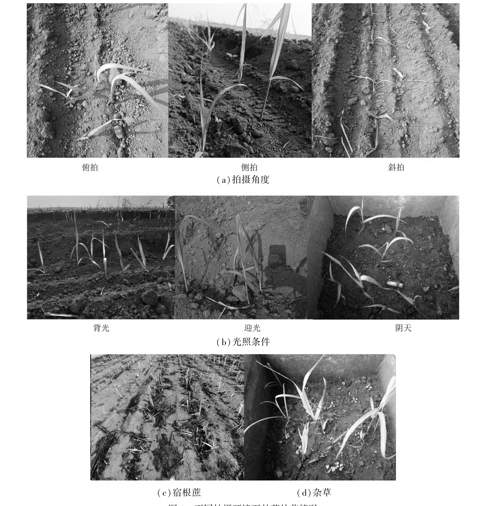
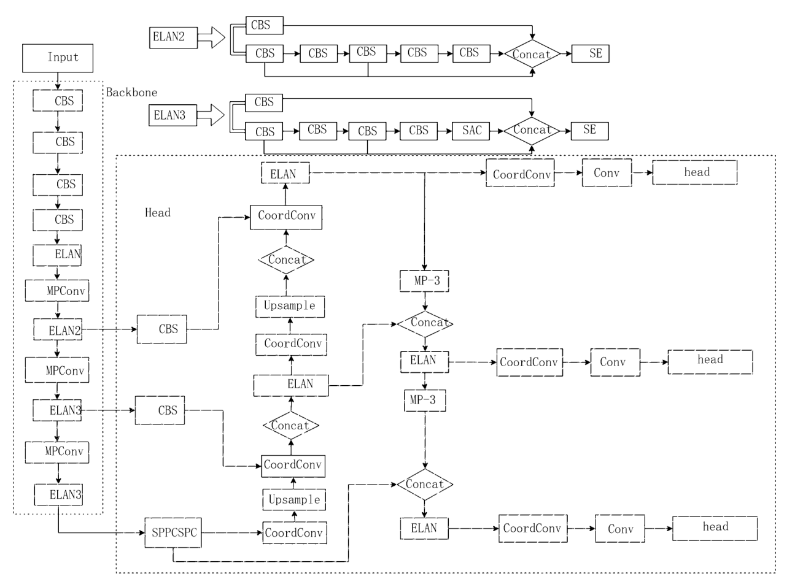
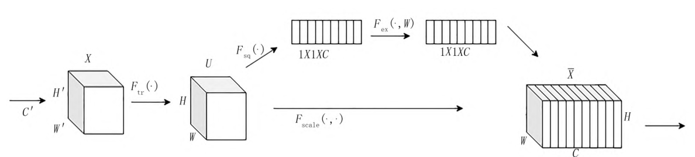
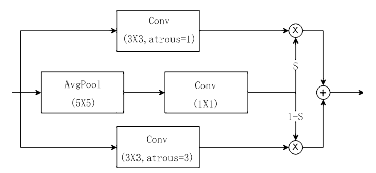
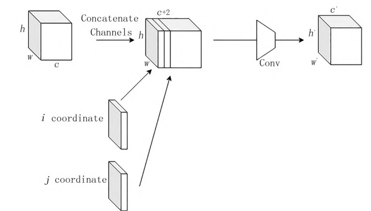
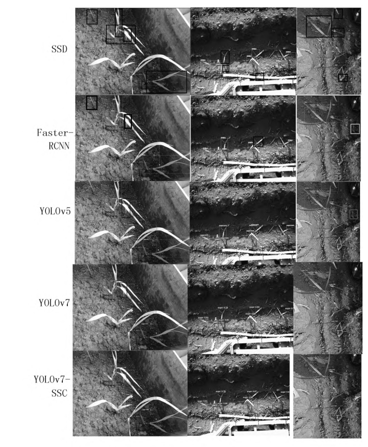
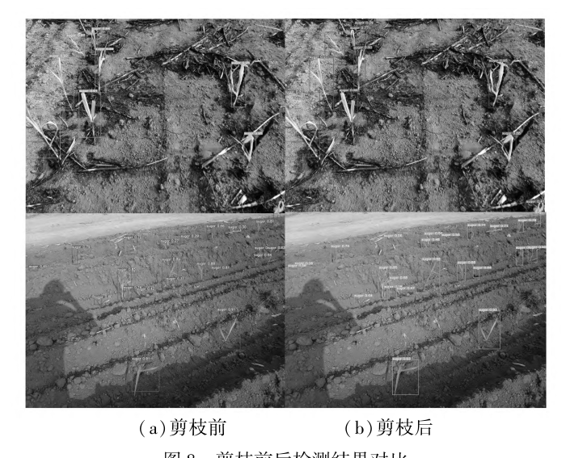
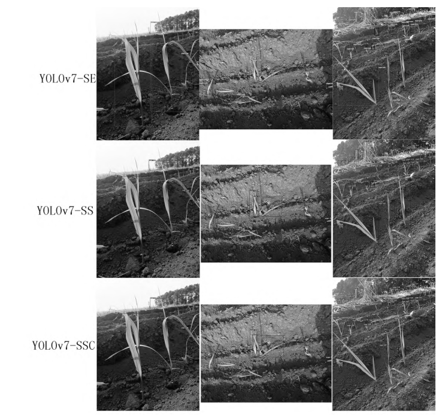

# 基于改进 YOLOv7 的甘蔗幼苗检测方法试验研究

Paper Reading 是从个人角度进行的一些总结分享，受到个人关注点的侧重和实力所限，可能有理解不到位的地方。具体的细节还需要以原文的内容为准，博客中的图表若未另外说明则均来自原文。

| 论文概况 | 详细 |
| --- | --- |
| 标题 | 《基于改进 YOLOv7 的甘蔗幼苗检测方法试验研究》 |
| 作者 | 李会, 郭家文, 黄世醒, 郑丁科, 安星宇, 郑健林, 杨丹彤 |
| 发表期刊 | 农机化研究 |
| 期刊等级 | 未获取 |
| 发表年份 | 2025 |
| 论文代码 | 未获取 |

作者单位：

1. 华南农业大学 南方农业机械与装备关键技术省部共建教育部重点实验室, 广州 510642
2. 云南省农业科学院甘蔗研究所, 云南 开远 661699

## 研究动机

甘蔗缺苗点查找是甘蔗补苗作业的重要环节，表现为漏播与种子不发芽造成的行内缺株，导致产量与经济效益下降。然而人工下田逐行查苗效率低、劳动强度大，难以支撑边检测边补苗的作业节奏。随着深度学习的发展，单阶段与两阶段目标检测器已被引入田间幼苗检测，精度普遍高于传统图像处理方法，但直接套用到甘蔗田仍存在层层递进的局限：田间光照、拍摄角度、杂草与遮挡等干扰因素叠加，使检测器的背景混淆严重；甘蔗幼苗处于真叶数不断变化的苗期，叶片尺寸与株高波动大，目标大小不一直接放大了漏检风险；遮挡与拍摄距离进一步造成远处蔗苗与非完整蔗苗的漏检；即便检测精度达标，模型体积与推理速度也往往难以满足田间移动设备的部署条件。针对甘蔗缺苗识别这一场景，暂未有工作同时兼顾复杂田间干扰下的漏检抑制与轻量化部署，本文旨在同时解决这两个瓶颈。

## 文章贡献

针对上述局限，本文提出了改进 YOLOv7 的甘蔗幼苗检测模型 YOLOv7-SSC。其核心是在特征提取层注入通道注意力与可切换空洞卷积、在特征融合层引入坐标卷积，并以通道剪枝完成轻量化。首先在 backbone 的 ELAN 结构中引入 SE 注意力机制，通过通道级权重重标定加强通道特征，缓解幼苗大小不一导致的漏检；接着以 SAConv 对不同空间采样率的卷积结果做开关聚合，增强网络对图像中不同位置特征的感知能力；再在 head 中引入 CoordConv，将坐标信息编码进特征图，提高对蔗苗位置与多尺度目标的检测能力；最终通过基于重要性度量的通道剪枝与微调压缩模型。实验表明，YOLOv7-SSC 在自建甘蔗幼苗数据集上准确率达 95.1%、召回率为 96%、mAP 达 94.4%，剪枝后推理速度为 8.79 帧/s、内存占用 53.8 MB，性能优于 SSD、Faster-RCNN、YOLOv5 与 YOLOv7。

## 本文方法

### 数据集构建与增强

本节的目标是提供覆盖田间主要干扰因素的训练与评测数据。不同拍摄环境下甘蔗幼苗情况如下图所示。

图 1 给出拍摄角度、光照条件、宿根蔗与杂草四类典型场景。本文在广东省湛江市雷州市徐闻县曲界镇的甘蔗种植基地采集数据，使用海康威视 MV-CS050-10GC 型彩色相机与手机结合拍摄，相机像素为 500 万，视野范围 1.5 m×1.3 m，拍摄距离距幼苗 120 cm；针对光照做迎光与背光拍摄，针对形状做侧拍、俯拍、斜拍结合，并覆盖杂草、新植蔗与宿根蔗的单行与多行拍摄。形态统计上，1 至 5 片真叶幼苗的叶长标准差为 6.03、株高标准差为 11.09，说明苗期目标大小差异显著。原始 1506 张图像经 mosaic 数据增强扩充到 4507 张，使用 LabelImg 以 sugar 为标签标注，按 VOC 格式转 YOLO 格式后以 8∶1∶1 划分为训练集 3605 张、验证集 450 张、测试集 452 张。该数据集作为后续所有训练与对比实验的统一输入。

### YOLOv7-SSC 总体结构

总体结构一节用于交代三类改进模块在网络中的插入位置。YOLOv7-SSC 网络结构示意图如下图所示。

基线 YOLOv7 由 Input 层、Backbone 层与 head 层构成，backbone 通过 CBS、ELAN、MPConv 逐层下采样，head 通过 SPPCSPC、Upsample 与 Concat 完成多尺度特征融合。本文在 backbone 的 ELAN 分支 Concat 之后接入 SE 注意力，在 ELAN3 分支中以 SAC 卷积替换普通卷积，在 head 的 SPPCSPC 之后、Upsample 之后以及各检测头 Conv 之前插入 CoordConv。各组件的分工如下表所示。

| 位置 | 模块 | 功能 |
| --- | --- | --- |
| Backbone | SE 注意力 | 通道权重重标定，缓解大小不一导致的漏检 |
| Backbone | SAConv | 开关聚合多感受野特征，增强位置特征感知 |
| Head | CoordConv | 编码坐标信息，提升位置感知与多尺度检测 |
| 全网络 | 通道剪枝 | 去除低重要性通道，实现轻量化 |

总体结构将上述模块的输出逐级传递至三个检测头，完成分类与定位预测。

### SE 注意力机制

SE 注意力机制的目标是解决甘蔗幼苗大小不一进而引发的漏检问题，其网络结构如下图所示。

将 SE 引入 ELAN 后，提取的特征图先经 FC 全连接层学习通道注意力信息，再与输入特征图逐通道乘以权重系数，从而加强通道特征；SE 模块在计算上是轻量级的，只略微增加模型的复杂性和计算负担。特征图、压缩与激励三步的计算公式依次给出。卷积得到特征图的表达式为：

$$u_c = v_c * X = \sum_{s=1}^{c} v_c^s * x^s$$

其中各符号含义如下表。

| 符号 | 含义 |
| --- | --- |
| $v_c$ | 第 c 个滤波器 |
| $v_c^s$ | 二维空间核 |
| $x^s$ | 第 s 个输出 |
| $*$ | 卷积操作 |

这等价于把标准卷积按通道展开，为后续通道统计提供输入。压缩过程的计算为：

$$z_c = F_{sq}(u_c) = \frac{1}{H \times W} \sum_{i=1}^{H} \sum_{j=1}^{W} u_c(i,j)$$

其中各符号含义如下表。

| 符号 | 含义 |
| --- | --- |
| $z_c$ | 压缩后的通道统计量 |
| $u_c$ | 第 c 个通道特征图 |
| $H$、$W$ | 特征图的空间高度与宽度 |

直观上，全局平均池化把每个通道压缩为一个标量，将空间分布信息聚集为通道描述子。激励操作的计算为：

$$s = F_{ex}(z, W) = \sigma(W_2 \delta(W_1 z))$$

其中各符号含义如下表。

| 符号 | 含义 |
| --- | --- |
| $\sigma$ | sigmoid 激活函数 |
| $\delta$ | ReLU 激活函数 |
| $z$ | 压缩后的实数 |
| $W_1$ | 降维参数 |
| $W_2$ | 升维参数 |

这等价于用瓶颈式两层全连接学习一组通道权重，再回乘到原特征图上。加权后的特征图继续送入 backbone 后续层与特征融合部分。

### SAConv 可切换空洞卷积

SAConv 模块的目标是以不同空间采样率感知同一输入特征，并自适应地学习图像中不同位置特征之间的关系，其网络结构如下图所示。

SAConv 使用切换函数对不同空洞率的卷积结果进行聚合，用更少的参数表示特征之间的关系，从而降低模型计算的复杂度。在对卷积层转换为 SAC 的过程中，使用带权重 $w$ 和空洞率 $r$ 的卷积 $y = Conv(x,w,r)$，具体转换为：

$$Conv(x,w,1) \xrightarrow[toSAC]{Convert} S(x) \cdot Conv(x,w,1) + [1 - S(x)] \cdot Conv(x,w+\Delta w, r)$$

其中各符号含义如下表。

| 符号 | 含义 |
| --- | --- |
| $r$ | 超参数，即空洞率 |
| $S(x)$ | 开关函数 |
| $x$ | 特征图 |
| $w$ | 5×5 的卷积核 |

直观上，开关函数在标准卷积与空洞卷积之间按位置做软选择，使感受野随内容自适应变化。本文将该模块置于 backbone 的 ELAN3 分支，其输出进入特征融合部分。

### CoordConv 坐标卷积

CoordConv 的目标是把蔗苗的位置信息编码到模型中，提高网络对蔗苗位置的感知能力与多尺度检测能力，其网络结构如下图所示。

CoordConv 通过额外的通道填充坐标信息 $i$、$j$，之后按通道进行串联，是对标准卷积层的简单扩展；图 5 中 $h$、$w$、$c$ 为卷积层的形状，$h'$、$w'$、$c'$ 为新的卷积层的形状。坐标通道的加入使网络能够感知特征所处的位置，本文将最终的特征图传递给 CoordConv 后，能够更加准确地检测不同大小的蔗苗。该模块的输出送入各检测头的 Conv 层完成预测。

### 通道剪枝轻量化

剪枝一节的目标是在精度损失可控的前提下压缩模型并提升推理速度。改进后的模型推理速度仅从 1.44 帧/s 提升到 2.46 帧/s，推理能力不满足本研究的要求，因此本文采用基于重要性度量的通道剪枝策略，以每个通道参数的绝对值大小度量通道的重要性，将重要性较小的通道进行剪枝，剪枝比例设置为 0.3。剪枝后模型精度下降，需对模型微调 50 个 epoch 恢复。经剪枝，模型推理速度提高 6.33 帧/s、模型减小 23.1 MB，在精度与速度之间取得平衡。剪枝处于整条改进流水线的末端，输出最终可部署的轻量模型。

## 实验结果

### 实验设置

试验在 Windows 10 专业版 64 位系统上开展，处理器为 Intel Silver 4216 CPU，CUDA 版本为 10.2、PyTorch 为 1.7。训练与评价的口径汇总如下表所示。

| 项目 | 设置 |
| --- | --- |
| 输入尺寸 | 640×640 |
| epoch / batch size | 100 / 10 |
| 初始学习率 / 动量因子 | 0.01 / 0.937 |
| 权重衰减系数 | 0.0005 |
| 优化方法 | 随机梯度下降 |
| 评价指标 | P、R、mAP、F1、FPS、模型大小 |

### 对比实验

在甘蔗幼苗数据集上，本文对 SSD、Faster-RCNN、YOLOv5、YOLOv7 与改进模型进行对比，各个模型的检测结果如下图所示，图中黑色框标记的是漏检的蔗苗、浅色框标记的是杂草。

SSD 与 Faster-RCNN 的漏检框明显多于 YOLO 系列；YOLOv5 与 YOLOv7 均能准确地辨别杂草，但对于有遮挡部分易出现漏检；YOLOv7-SSC 在遮挡与拍摄距离两类干扰下的检测框最完整。定量结果如下表所示，可见改进模型在精度与 mAP 上均为最优。

| 模型 | P / % | mAP / % | 模型大小 / MB |
| --- | --- | --- | --- |
| YOLOv5 | 90.1 | 91.2 | 14.4 |
| SSD | 74.2 | 75.2 | 101 |
| Faster-RCNN | 85.3 | 81.2 | 315 |
| YOLOv7 | 91.1 | 93.0 | 74.8 |
| YOLOv7-SSC | 95.1 | 94.4 | 73.3 |

相较原模型，YOLOv7-SSC 精度提升 4 个百分点、mAP 提升 1.4 个百分点，其中精度提升效果最好，说明在特征提取层加入 SE 与 SAConv、在特征融合层加入 CoordConv 的方式可以有效改善幼苗识别的准确度。

### 消融实验

为验证添加模块对模型改进的影响，本文在相同平台设置相同参数的情况下依次叠加 SE、SAConv 与 CoordConv，消融实验的对比结果如下表所示。

| 模型 | P / % | R / % | mAP / % | F1 / % | 模型大小 / MB |
| --- | --- | --- | --- | --- | --- |
| YOLOv7 | 91.1 | 95 | 93.0 | 90 | 74.8 |
| YOLOv7-SE | 92.2 | 96 | 93.2 | 91 | 75.4 |
| YOLOv7-SE-SAC | 94.8 | 95 | 93.1 | 91 | 78.3 |
| YOLOv7-SSC | 95.1 | 96 | 94.4 | 91 | 73.3 |

添加 SE 后精度提升 1.1 个百分点、mAP 提升 0.2 个百分点、召回率提升 1 个百分点；继续添加 SAConv 后精度提升 2.6 个百分点而 mAP 下降 0.1 个百分点；最后添加 CoordConv 后精度提升 0.3 个百分点、召回率提升 1 个百分点、mAP 提升 1.3 个百分点。三个模块叠加后精度和 mAP 都得到提升，且模型整体计算量没有太大增加，表明模块组合对检测准确性的提升是稳定的。

### 剪枝与推理速度

剪枝前后结果对比如下表所示。

| 模型 | P / % | R / % | mAP / % | F1 / % | FPS | 模型大小 / MB |
| --- | --- | --- | --- | --- | --- | --- |
| YOLOv7-SSC | 95.1 | 96 | 94.4 | 91 | 2.46 | 76.9 |
| YOLOv7-SSCprun | 94.5 | 96 | 92.6 | 90 | 8.79 | 53.8 |

剪枝后精度和 mAP 有所下降，但推理速度提高 6.33 帧/s、模型减小 23.1 MB，剪枝前后的检测结果如下图所示。

剪枝后模型对蔗苗的框选位置与剪枝前基本一致，总体效果仍符合预期结果，可以看出通道剪枝以少量精度为代价换来了可用的推理速度。

### 可视化分析

消融实验的检测结果如下图所示，覆盖迎光、背光、俯拍、侧拍四种条件。

拍摄角度和光照对于检测的影响极小，影响检测的主要因素是苗的大小、遮挡和拍摄距离。仅添加 SE 与 SAConv 时，检测远处的幼苗均会出现漏检；在此基础上添加 CoordConv 后，针对远处的幼苗检测更为准确。针对有遮挡的部分与非完整的宿根苗，原模型识别准确率较低，改进后模型相较原模型并未出现上述情况。可以看出，坐标信息的引入是改善远处与遮挡目标检测的关键，改进模型在本次试验 120 cm 拍摄距离下可达到较优的检测效果。

## 优点和创新点

个人认为，本文有如下一些优点和创新点可供参考学习：

1. 针对蔗苗大小不一引发的漏检问题，在 backbone 的 ELAN 模块中引入 SE 通道注意力，以极小的计算开销重标定通道权重，为田间小目标检测的特征增强提供了可供参考的做法。
2. 在特征提取层与特征融合层分别组合 SAConv 与 CoordConv，用可切换空洞卷积和坐标编码同时增强位置感知与多尺度检测能力，消融实验中各模块增益归属清晰、说服力强。
3. 以通道重要性度量的剪枝配合二次微调，把推理速度提升到 8.79 帧/s 并将模型压缩到 53.8 MB，兼顾检测精度与移动端部署需求，对农业检测模型的工程落地可供参考。
