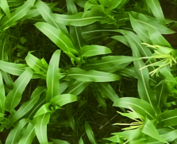
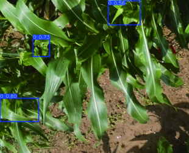

# 基于 CBP-YOLO 的玉米田间草地贪夜蛾侵染痕迹检测与试验

Paper Reading 是从个人角度进行的一些总结分享，受到个人关注点的侧重和实力所限，可能有理解不到位的地方。具体的细节还需要以原文的内容为准，博客中的图表若未另外说明则均来自原文。

| 论文概况 | 详细 |
| --- | --- |
| 标题 | 《基于 CBP-YOLO 的玉米田间草地贪夜蛾侵染痕迹检测与试验》 |
| 作者 | 齐江涛，王硕，熊悦凇，高芳芳，王发赢，邹宗峰，刘英智，刘慧力 |
| 发表期刊 | 农业工程学报 |
| 期刊等级 | 未获取 |
| 发表年份 | 2026 |
| 论文代码 | 未获取 |

作者单位：

1. 吉林大学工程仿生教育部重点实验室，长春 130022
2. 吉林大学生物与农业工程学院，长春 130022
3. 吉林省智慧农业装备与技术重点实验室，长春 130022
4. 烟台市农业技术推广中心，烟台 264001

## 研究动机

低空无人机航拍视角下的玉米田间草地贪夜蛾（Spodoptera frugiperda）侵染痕迹检测是智慧农业病虫害监测的重要问题，表现为叶片上不规则孔洞、锯齿状缺刻和小面积啃食区域等微小目标，导致识别精度低、漏检率高，难以实现早期精准防治。现有基于 YOLO 系列的目标检测方法在应对农田复杂场景时存在明显局限：小目标因尺度变化大、特征对比度低而容易被忽略；多尺度飞行高度采集的图像中目标像素尺寸差异显著，单一特征层级难以兼顾；背景噪声如土壤裸露区、杂草、阴影等干扰严重，影响损伤区域的纹理细节提取。尽管已有研究引入注意力机制或超分辨率增强技术，但在跨尺度特征融合效率、小目标检测头扩展等方面仍存在不足，特别是在 GSD 从 0.22 到 0.53 cm/像素的宽范围变化下，模型鲁棒性有待提升。然而如何在保持实时性的同时提升无人机多尺度图像中小尺度虫害痕迹的检测精度，仍是当前亟待解决的技术瓶颈。

## 文章贡献

针对上述局限，本文提出了面向无人机多尺度图像的草地贪夜蛾侵染痕迹检测模型 CBP-YOLO（Coordinated-BiFPN-P2-YOLO）。其核心是通过真实增强超分辨率重建、协调注意力机制嵌入和双向特征金字塔网络引入，系统提升小目标感知与多尺度特征表达能力。首先采用 Real-ESRGAN 对低分辨率图像进行超分辨率预处理，恢复叶片损伤区域的纹理细节；接着在 YOLOv8 主干网络的 C2f 模块中嵌入协调注意力（Coordinated Attention, CA）机制，增强局部细节提取与全局位置信息感知能力；然后在颈部网络用 BiFPN 替代原有 PANet，通过可学习权重动态调节不同尺度特征融合；最后新增尺寸为 160×160×64 的 P2 浅层检测头，拓展对小尺度目标的特征感知。实验表明，CBP-YOLO 在自建无人机多尺度叶片数据集上 mAP@0.5 达到 76.5%，较原 YOLOv8m 提升 3.4 个百分点，较 YOLOv9m、YOLOv10m、YOLOv11m、Faster R-CNN 和 RetinaNet 分别提升 10.1、7.2、5.1、9.3 和 17.9 个百分点，验证了其对玉米田间草地贪夜蛾侵染痕迹的有效检测能力。

## 本文方法

### 超分辨率图像预处理

Real-ESRGAN 作为超分辨率重建核心算法，用于缓解低分辨率图像带来的信息损失。该算法结合残差密集块（RRDBs）生成器与 U-Net 判别器，在恢复高频细节的同时有效抑制伪影，并引入多次模糊、下采样、噪声和 JPEG 压缩等高阶退化过程合成更贴近实际的训练数据，计算式如下：

$$
I_b = \text{Blur}(I; k, \sigma)
$$

其中 $I$ 表示输入图像，$\text{Blur}$ 表示模糊操作，$k$ 为模糊核大小，$\sigma$ 为核参数。

$$
I_n = \text{Noise}(I)
$$

其中 $\text{Noise}$ 表示添加加性高斯白噪声。

$$
I_s = \text{Down}(I_n; r_k)
$$

其中 $\text{Down}$ 表示按比例 $r_k$ 进行下采样。

$$
I_{LR} = \text{JPEG}(I_x; Q)
$$

其中 $\text{JPEG}$ 表示质量因子为 $Q$ 的 JPEG 压缩操作。

这等价于通过正向退化建模逆向重建，使生成器能够学习真实世界退化的逆过程。Real-ESRGAN 支持×2 放大倍率，在输入送入 ESRGAN 主干前引入 Pixel Unshuffle 操作，将空间分辨率降低为原来的 1/2 同时将通道数扩展为 4 倍，减少 GPU 显存占用与计算成本。对 GSD=0.53 cm/像素的图像处理后，图像尺寸由 800×650 提升至 1600×1300，对应 GSD 减小为 0.26 cm/像素，形成新的高分辨率数据子集。

### C2f-CA 特征提取模块

协调注意力机制（CA）将通道注意力分解为两个独立的一维特征编码过程，一条路径沿空间维度捕捉长程依赖，另一条路径保留精确位置信息，弥补传统 SE 模块因全局平均池化导致的空间细节丢失问题。设输入特征图尺寸为 $C \times H \times W$，在水平方向和垂直方向分别进行特征聚合，生成两个独立的特征图 $Z_c^h$ 和 $Z_c^w$：

$$
z_c^h = \frac{1}{W} \sum_{i=0}^{W-1} X_c(h, i)
$$

其中 $X_c(h, i)$ 表示通道 $c$ 在空间坐标 $(h, i)$ 处的取值，$W$ 为特征图宽度，$z_c^h$ 为沿高度维度聚合得到的上下文描述子。

$$
z_c^w = \frac{1}{H} \sum_{j=0}^{H-1} X_c(j, w)
$$

其中 $X_c(j, w)$ 表示通道 $c$ 在空间坐标 $(j, w)$ 处的取值，$H$ 为特征图高度，$z_c^w$ 为沿宽度维度聚合得到的上下文描述子。

将聚合后的特征图拼接后输入共享的 1×1 卷积层 $F_1$ 进行变换，并经非线性激活函数处理，得到中间特征矩阵 $f \in \mathbb{R}^{(C/r \times (H+W))}$，其中 $r$ 为压缩比例系数：

$$
f = \delta(F_1([z_h, z_w]))
$$

其中 $\delta$ 表示 ReLU 激活函数。将中间特征矩阵 $f$ 沿空间维度分解为两个张量 $f_h$ 和 $f_w$，分别通过不同的 1×1 卷积变换 $F_h$ 和 $F_w$，并经 Sigmoid 激活函数处理，得到水平与垂直方向的注意力权重 $g_h$ 和 $g_w$：

$$
g_h = \sigma(F_h(f_h)), \quad g_w = \sigma(F_w(f_w))
$$

其中 $\sigma$ 表示 Sigmoid 函数。最后，CA 注意力模块的输出表示为：

$$
y_c(i, j) = x_c(i, j) \times g_c^h(i) \times g_c^w(j)
$$

其中 $y_c(i, j)$ 表示经过 CA 加权后输出特征图在 $(i, j)$ 的特征值，$x_c(i, j)$ 表示输入特征图在 $(i, j)$ 处的特征值。该机制被嵌入 YOLOv8 的 C2f 模块形成 C2f-CA 结构，有效削弱背景噪声干扰，突出叶片损伤痕迹等关键区域特征。

### BiFPN 架构

双向特征金字塔网络（BiFPN）采用加权双向融合机制强化深浅层特征的信息互补，解决原有 PANet 主要依赖简单拼接导致的融合效果有限问题。BiFPN 的计算过程形式化为：

$$
\hat{P}_i = \frac{\sum_j w_j \cdot P_j}{\sum_j w_j + \epsilon}
$$

其中 $\hat{P}_i$ 为第 $i$ 层融合后的特征图，$P_j$ 为第 $j$ 层的输入特征图，$w_j$ 为对应的非负可学习权重，$\epsilon$ 是为避免除零而加入的常数。

可学习权重通过归一化 softmax 获得，确保数值稳定性。该设计实现了高层语义信息与低层细节信息的高效融合，支持跨尺度连接的多级交互。本研究在 Neck 部分引入 BiFPN 构建 4 层特征金字塔，分别对应 P2(160×160×64)、P3(80×80×128)、P4(40×40×256) 和 P5(20×20×512) 的特征图，适应无人机图像中目标尺度差异显著的检测需求。

### 面向小目标的检测头扩展

原始 YOLOv8 模型仅包含 3 个检测头：P3(80×80×128)、P4(40×40×256) 和 P5(20×20×512)，对小尺寸目标检测存在局限。为提高检测能力，在 Neck 部分新增尺寸为 160×160×64 的 P2 浅层检测头，该检测头可检测对应于 640×640 图像中 4×4 像素感受野的小目标。浅层特征图具有较高分辨率和较小感受野，更适合小目标检测，可减少因多次下采样导致的细节丢失。新增检测头后，模型在 4 个尺度上并行输出检测结果，显著提升对小尺度草地贪夜蛾侵染痕迹的感知能力。

## 实验结果

### 实验设置

本研究实验硬件平台配置 Intel Core i9-13900K CPU、128 GB 内存和 NVIDIA GeForce RTX 4090 显卡，深度学习框架采用 PyTorch 2.2.1 结合 cuDNN 12.1 加速。模型输入图像大小设置为 640×640 像素，训练轮数 100，Batch size 为 8，优化器为 AdamW，初始学习率 0.01，动量 0.937，权重衰减系数 0.0005。评价指标包括精确率（Precision）、召回率（Recall）、平均精度（AP@0.5、AP@0.5:0.5:0.95）及 F1-score。

数据集方面，本研究于 2024 年 7 月 20 日在山东省烟台市烟台农业科学院采集数据，使用 DJI P4 多光谱无人机搭载固定焦距相机（分辨率 1600×1300 像素，水平视场角 62.7°，焦距 5.74 mm），在 3 m、5 m 和 7 m 三个飞行高度采集图像，对应 GSD 分别为 0.22、0.38 和 0.53 cm/像素。原始图像共 879 张有效标注图像，按 8:1:1 划分为训练集、验证集和测试集。此外，通过 Real-ESRGAN 重建生成 GSD=0.26 cm/像素的新数据集，最终训练集扩展至 12,792 张图像（含数据增强）。

### 不同地面采样距离对比

表 3 展示了 CBP-YOLO 在不同 GSD 图像上的检测结果：

**图 8 不同 GSD 检测结果可视化对比**

表 3 结果表明，模型的检测性能随 GSD 的变化呈现显著差异。在 GSD=0.38 cm/像素的数据集上，模型取得最佳检测效果，AP@0.5 和 F1-score 分别达到 79.8% 和 74.3%，该分辨率在空间覆盖范围与局部细节表达能力之间达到有效平衡。相比之下，GSD=0.22 cm/像素虽然包含更细致纹理，但高分辨率引入更多噪声和无关信息，整体 AP@0.5 和 F1-score 均低于 0.38 cm/像素水平。而在 GSD=0.53 cm/像素的数据集上，由于采样距离较大、分辨率较低，图像细节丢失并伴随背景噪声增加，导致整体检测性能明显下降，AP@0.5 和 F1-score 分别只有 56.8% 和 55.9%。对 GSD=0.53 数据集应用 Real-ESRGAN 算法提升分辨率后，GSD 为 0.26 cm/像素数据集的 AP@0.5 提高 7.3 个百分点，F1-score 提高 8.6 个百分点，可见超分辨率算法能够有效改善图像质量，特别在纹理与边缘特征方面的增强，使模型对草地贪夜蛾啃咬叶片痕迹的检测能力得到提升。

### 消融实验

表 4 展示了不同模块组合对模型检测性能的影响：

**图 9 YOLOv8m 与 CBP-YOLOv8 检测效果对比**

表 4 结果显示，在未引入任何模块时，模型表现为基准性能（AP@0.5=73.1%）。P2 模块的引入对模型提升最大，AP@0.5 提高到 75.1%，这是因为引入了更高分辨率的特征图，增加了对小尺度目标损伤区域的感知能力。仅使用 CA 模块时，AP@0.5 提升了约 1 个百分点，表明 CA 能够引导模型关注与虫害损伤相关的关键信息通道，抑制冗余特征。当仅使用 BiFPN 时，模型达到 73.8% 的 AP@0.5，表明 BiFPN 实现了不同尺度特征的高效融合。当同时启用所有三个模块时，模型取得最佳综合性能，精确率为 74.7%，AP@0.5 提升至 76.5%，AP@0.5:0.95 为 43.2%，F1 为 73.5%，分别提升了 3.4、1.7、3.6 个百分点，可见多模块协同优化能够在增强特征表达能力的同时，实现精确率与召回率之间的有效平衡。

### 不同模型对比实验

表 5 展示了 CBP-YOLO 与其他主流目标检测模型的对比结果：

| 模型 | Precision/% | Recall/% | AP@0.5/% | AP@0.5:0.95/% | F1-score/% |
| --- | --- | --- | --- | --- | --- |
| YOLOv8-m | 71.4 | 69.2 | 73.1 | 41.5 | 69.9 |
| YOLOv9-m | 66.3 | 67.9 | 66.4 | 34.8 | 67.1 |
| YOLOv10-m | 67.7 | 65.6 | 69.3 | 37.7 | 66.6 |
| YOLOv11-m | 73.1 | 60.4 | 71.4 | 38.8 | 66.1 |
| Faster R-CNN | 65.1 | 62.3 | 67.2 | 35.5 | 63.7 |
| RetinaNet | 58.8 | 66.1 | 58.6 | 32.7 | 62.2 |
| **CBP-YOLO** | **74.7** | **72.4** | **76.5** | **43.2** | **73.5** |

表 5 结果表明，CBP-YOLO 在各项指标上均优于其他模型，AP@0.5 相较于 YOLOv9m、YOLOv10m、YOLOv11m、Faster R-CNN 和 RetinaNet 分别提升了 10.1、7.2、5.1、9.3 和 17.9 个百分点。YOLOv11m 的精确率接近 YOLOv8-m，但其召回率较低且 AP@0.5 也低于 CBP-YOLO，说明该模型在精确性与召回率之间尚未实现良好平衡。总体来看，CBP-YOLO 在所有关键检测指标上均取得最优表现，体现了其在细节特征建模和精确定位方面的优势。

### 可视化分析

图 9 直观展示了 YOLOv8m 与 CBP-YOLO 在不同 GSD 条件下的检测效果对比。红色框表示真实标注框，蓝色框表示模型检测框，黄色框表示漏检区域，粉色框表示误检区域。从可视化结果可以看出，CBP-YOLO 在多个尺度下均能更准确地定位草地贪夜蛾侵染痕迹，漏检和误检数量明显减少，特别是在 GSD=0.53 的低分辨率条件下，改进模型的检测稳定性显著优于基线。

## 优点和创新点

个人认为，本文有如下一些优点和创新点可供参考学习：

1. 引入 Real-ESRGAN 超分辨率重建作为预处理步骤，有效恢复低分辨率图像中叶片损伤区域的纹理细节，使模型在 GSD=0.53 条件下的 AP@0.5 提升 7.3 个百分点，为无人机航拍图像质量增强提供了实用方案。

2. 在 YOLOv8 主干网络中嵌入协调注意力机制（CA），通过二维坐标注意力分解同时捕捉空间位置信息和通道重要性，在复杂农田背景下显著增强小目标局部细节提取与全局位置感知能力。

3. 用 BiFPN 替代原有 PANet 结构，通过可学习权重动态调节跨尺度特征融合，减少多尺度特征传递中的信息损耗，配合新增的 P2 小目标检测头，实现对不同尺度虫害痕迹的均衡检测。
