# 基于 CBP-YOLO 的玉米田间草地贪夜蛾侵染痕迹检测与试验

Paper Reading 是从个人角度进行的一些总结分享，受到个人关注点的侧重和实力所限，可能有理解不到位的地方。具体的细节还需要以原文的内容为准，博客中的图表若未另外说明则均来自原文。

| 论文概况 | 详细 |
| --- | --- |
| 标题 | 《基于 CBP-YOLO 的玉米田间草地贪夜蛾侵染痕迹检测与试验》 |
| 作者 | 齐江涛，王硕，熊悦凇，高芳芳，王发赢，邹宗峰，刘英智，刘慧力 |
| 发表期刊 | 农业工程学报 |
| 期刊等级 | 未获取 |
| 发表年份 | 2026 |
| 论文代码 | 未获取 |

作者单位：

1. 吉林大学工程仿生教育部重点实验室，长春 130022
2. 吉林大学生物与农业工程学院，长春 130022
3. 吉林省智慧农业装备与技术重点实验室，长春 130022
4. 烟台市农业技术推广中心，烟台 264001

## 研究动机

玉米田间草地贪夜蛾（Spodoptera frugiperda）侵染痕迹的自动化检测是智慧农业病虫害监测的重要问题，幼虫啃食后叶片形成不规则孔洞、锯齿状缺刻和大面积啃食区域，痕迹目标尺寸小、特征表征不明显，导致人工田间观察效率低、主观性强，基于图像的自动监测也面临识别精度低、漏检率高的困难。然而，以 YOLO 系列为代表的单阶段目标检测方法在复杂农田场景中存在明显局限：**小目标像素少、特征对比度低，容易被忽略**；无人机在不同飞行高度采集的图像中侵染斑块像素尺寸差异显著，**单一特征层级难以兼顾跨尺度目标**；土壤裸露区、杂草、田间阴影等复杂背景又与低分辨率带来的纹理细节缺失相互叠加，**损伤区域的特征表达进一步被削弱**。尽管已有研究通过超分辨率增强、注意力机制与小目标检测层设计改进 YOLO 模型并取得一定成果，但在小目标检测、多尺度特征融合与特征表征三方面协同改进的研究仍存在不足。如何在保持单阶段推理效率的同时提升无人机多尺度图像中小尺度侵染痕迹的检测精度，仍是亟待解决的技术瓶颈。

## 文章贡献

针对上述局限，本文提出了面向无人机多尺度图像的草地贪夜蛾侵染痕迹检测模型 CBP-YOLO（Coordinated-BiFPN-P2-YOLO），其核心是通过真实增强超分辨率重建、协调注意力嵌入与双向特征金字塔融合的协同改进，系统提升小目标感知与多尺度特征表达能力。首先采用 Real-ESRGAN 对低分辨率图像进行超分辨率预处理，恢复叶片啃食区域的纹理细节；接着在 YOLOv8 主干网络的 C2f 模块中嵌入协调注意力（Coordinated Attention, CA）机制，增强局部细节提取与全局位置信息感知能力；然后在颈部网络引入双向特征金字塔网络（BiFPN）替代 PANet，通过可学习权重动态调节不同尺度的特征融合；最后新增尺寸为 160×160×64 的 P2 浅层检测头，拓展模型对小尺度目标的特征感知。实验表明，CBP-YOLO 在自建无人机多尺度叶片数据集上 AP@0.5 达到 76.5%，较原 YOLOv8m 提升 3.4 个百分点，较 YOLOv9m、YOLOv10m、YOLOv11m、Faster R-CNN 和 RetinaNet 分别提升 10.1、7.2、5.1、9.3 和 17.9 个百分点，验证了模型的检测能力。

## 本文方法

本文方法先给出多尺度图像的 GSD 口径与超分辨率预处理流程，再沿数据流介绍 CBP-YOLO 的三处结构改进。

### 多尺度航拍采集与 GSD 计算模型

多尺度数据采集的目标是确定不同飞行高度下图像的空间分辨率，为多尺度数据构建提供统一口径。本文使用搭载固定焦距相机的 DJI P4 多光谱无人机采集可见光图像，飞行高度设为 3、5 和 7 m 三档，各高度下图像的空间分辨率由地面采样距离 GSD 刻画，其计算如下：

$$GSD = \frac{2H \tan(\theta / 2)}{N}$$

其中 $H$ 为飞行高度，$\theta$ 为水平视场角，$N$ 为图像水平像素数。直观上，成像几何不变时水平像素数越多，单像素对应的地面距离越小。据此计算，本文采集图像的 GSD 分别为 0.22、0.38 和 0.53 cm/像素，侵染斑块的像素尺寸差异显著，典型样本如下图所示：

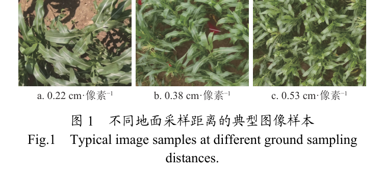

图中依次为 0.22、0.38 和 0.53 cm/像素的田间样本，可以看出 GSD 越大，叶片啃食痕迹的像素占比越小，土壤裸露区等背景干扰相对增多。该 GSD 口径既是数据分组的依据，也是超分辨率重建效果的度量尺度。

### Real-ESRGAN 超分辨率预处理

超分辨率预处理的目标是恢复低分辨率图像中叶片啃食区域的纹理细节，缓解低 GSD 引起的信息损失。早期超分辨率算法多基于插值或浅层模型，重建结果往往过于平滑；ESRGAN 引入生成对抗网络后能生成更具纹理细节的图像，但在模糊、噪声与压缩伪影共存的复杂真实退化下表现受限。本文采用真实增强超分辨率生成对抗网络 Real-ESRGAN 作为重建核心算法，其结合残差密集块（RRDBs）生成器与 U-Net 判别器，在恢复高频细节的同时有效抑制伪影。为合成贴近实际的训练数据，Real-ESRGAN 引入多次模糊、下采样、噪声和 JPEG 压缩构成的高阶退化过程，各步计算式如下（式中分别以 $I_b$、$I_n$、$I_s$、$I_{LR}$ 表示）：

$$I_b = \mathrm{Blur}(I; k, \sigma)$$

$$I_n = \mathrm{Noise}(I_b)$$

$$I_s = \mathrm{Down}(I_n; r_k)$$

$$I_{LR} = \mathrm{JPEG}(I_s; Q)$$

其中，相关符号及其含义如下表所示：

| 符号 | 含义 |
| --- | --- |
| $I$ | 输入图像 |
| $\mathrm{Blur}(I; k, \sigma)$ | 模糊操作，$k$ 为模糊核大小，$\sigma$ 为核参数 |
| $\mathrm{Noise}(\cdot)$ | 添加加性高斯白噪声 |
| $\mathrm{Down}(I_n; r_k)$ | 按比例 $r_k$ 进行下采样 |
| $\mathrm{JPEG}(I_s; Q)$ | 质量因子为 $Q$ 的 JPEG 压缩操作 |

这等价于让生成器学习真实退化的逆过程。Real-ESRGAN 支持 ×2 放大倍率，输入送入主干前先经 Pixel Unshuffle 将空间分辨率降低为原来的 1/2、通道数扩展为 4 倍，使大部分卷积运算在低维特征空间完成，减少显存与计算成本；判别器引入谱归一化约束卷积权重，缓解生成对抗网络训练中常见的过度锐化与振铃伪影问题，整体架构如下图所示：

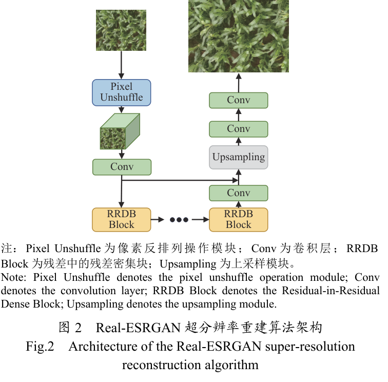

图中生成器由 Pixel Unshuffle 预处理、卷积层与多个 RRDB Block 串联后上采样重建，残差密集块的嵌套设计强化了特征复用与梯度传播效率。对 GSD=0.53 cm/像素图像处理后，尺寸由 800×650 提升至 1600×1300 像素，对应 GSD 减半为 0.26 cm/像素，重建效果如下图所示：

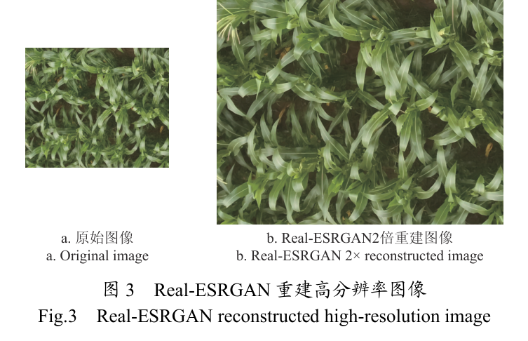

图中左侧为原始图像，右侧为 2 倍重建图像，可以看出重建后叶片边缘与啃食痕迹的纹理更加清晰。重建图像再切分为 800×650 像素子图，经人工核查标注后形成 GSD=0.26 cm/像素的新数据子集，与原始图像一同进入后续训练流程。

### 模型整体结构

CBP-YOLO 以 YOLOv8m 为基础模型，整体由 Backbone、Neck 和 Head 三部分承担特征提取、特征融合与目标检测功能，整体结构如下图所示：

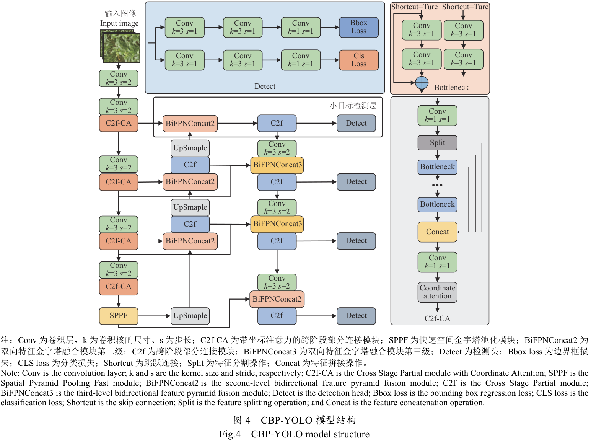

图中 Backbone 的 C2f 模块均重构为带坐标注意力的 C2f-CA，Neck 由 BiFPNConcat2、BiFPNConcat3 双向融合模块逐级传递 P2 至 P5 四层特征，小目标检测层即新增的 P2 检测头。各组件与功能的对应关系如下表所示：

| 组件 | 位置 | 功能 |
| --- | --- | --- |
| C2f-CA | Backbone | 嵌入协调注意力的特征提取 |
| BiFPN | Neck | 加权双向跨尺度特征融合 |
| P2 检测头 | Head | 扩展小尺度目标的特征感知 |
| Bbox Loss / CLS Loss | Head | 边界框回归与分类监督 |

检测头以边界框回归与分类两支损失进行端到端监督，原文未给出损失函数的显式公式（未获取），不再展开。超分辨率预处理结果输入 Backbone，多尺度特征经 BiFPN 融合后送入四个检测头，串起「重建—提取—融合—检测」的完整数据流。

### C2f-CA 坐标信息嵌入

协调注意力 CA 的目标是将通道注意力分解为两个独立的一维特征编码过程，在捕捉长程依赖的同时保留精确位置信息，并嵌入 Backbone 的 C2f 模块形成 C2f-CA 结构。作为对比，挤压与激励模块 SE 经全局平均池化压缩空间维度，细粒度位置信息随之丢失；CBAM 虽结合空间注意力，但主要关注局部关联且依赖全连接层，计算开销显著增加。CA 的第一步为坐标信息嵌入：对尺寸为 $C \times H \times W$ 的输入特征图，分别沿高度和宽度维度进行特征聚合，生成两个独立的上下文描述子，计算公式如下：

$$z_c^h = \frac{1}{W} \sum_{i=0}^{W-1} X_c(h, i)$$

$$z_c^w = \frac{1}{H} \sum_{j=0}^{H-1} X_c(j, w)$$

其中，相关符号及其含义如下表所示：

| 符号 | 含义 |
| --- | --- |
| $X_c(h, i)$、$X_c(j, w)$ | 通道 $c$ 在空间坐标 $(h, i)$ 和 $(j, w)$ 处的取值 |
| $W$、$H$ | 特征图的宽度和高度 |
| $z_c^h$、$z_c^w$ | 沿高度和宽度维度聚合得到的上下文描述子 |

该分解方式使注意力模块在保持空间定位精度的同时获取全局上下文信息，弥补压缩过程导致的空间细节缺失。CA 模块的完整结构如下图所示：

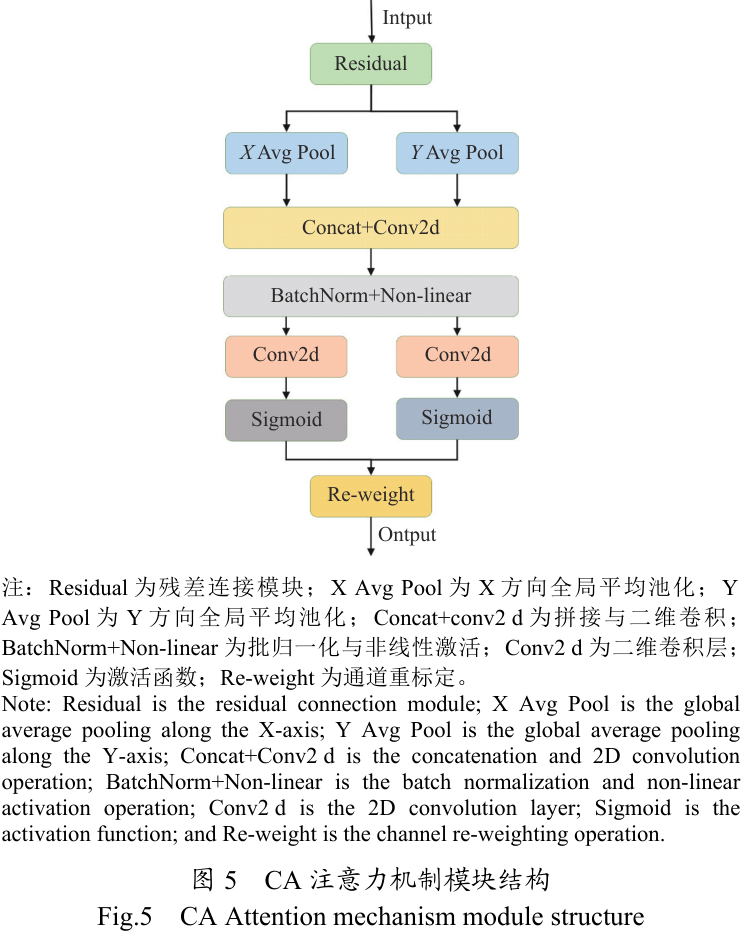

图中输入经残差连接后分两路做 X、Y 方向全局平均池化，拼接后由共享卷积与批归一化变换，再经两个分支生成方向注意力并完成通道重标定。嵌入 C2f 后，输出特征继续经主干层传至 Neck 的 BiFPN。

### 坐标注意力生成与特征重标定

坐标注意力生成的目标是把两个方向的上下文描述子融合为共享的中间表示，再生成方向注意力并对输入特征重标定。聚合后的特征图拼接后输入共享的 1×1 卷积层 $F_1$ 变换，并经非线性激活函数处理，得到中间特征矩阵 $f \in \mathbb{R}^{C/r \times H+W}$，其计算为：

$$f = \delta(F_1([z_h, z_w]))$$

其中 $\delta$ 表示 ReLU 激活函数，$r$ 为压缩比例系数，$z_h$ 和 $z_w$ 分别为高度和宽度方向的特征张量。直观上，两个方向的描述子在此共享同一个中间表示。随后，$f$ 沿空间维度分解为两个张量 $f_h$ 和 $f_w$，分别通过不同的 1×1 卷积变换 $F_h$ 和 $F_w$ 并经 Sigmoid 激活，得到水平与垂直方向的注意力权重，其计算为：

$$g^h = \sigma(F_h(f^h)), \quad g^w = \sigma(F_w(f^w))$$

其中 $\sigma$ 表示 Sigmoid 函数，$F_h$ 与 $F_w$ 为两个不同的 1×1 卷积变换。最后，模块输出对输入特征逐位置重标定：

$$y_c(i, j) = x_c(i, j) \times g_c^h(i) \times g_c^w(j)$$

其中 $y_c(i, j)$ 表示经 CA 加权后输出特征图在 $(i, j)$ 的特征值，$x_c(i, j)$ 表示输入特征图在 $(i, j)$ 处的特征值，$g_c^h(i)$ 和 $g_c^w(j)$ 分别表示高度和宽度方向上第 $i$ 和第 $j$ 个位置的注意力权重。直观上，任一位置的响应同时受两个方向的注意力调制，从而突出叶片损伤痕迹等关键区域并削弱背景噪声，重标定后的特征回到主干特征流传向 Neck。

### BiFPN 加权双向特征融合

BiFPN 的目标是替代原有 PANet，通过加权双向融合机制强化深浅层特征的信息互补。YOLOv8 原用的路径聚合网络 PANet 虽实现了跨尺度信息连接，但主要依赖低层细节与高层语义的简单拼接，融合效果有限。BiFPN 采用双向跨尺度连接，并引入可学习权重对不同尺度特征动态调节，其融合计算过程如下：

$$\hat{P}_i = \frac{\sum_j w_j \cdot P_j}{\sum_j w_j + \epsilon}$$

其中 $\hat{P}_i$ 为第 $i$ 层融合后的特征图，$P_j$ 为第 $j$ 层的输入特征图，$w_j$ 为对应的非负可学习权重，$\epsilon$ 是为避免除零而加入的常数。可学习权重通过归一化 softmax 获得，各输入层的贡献由权重动态调节，高层语义与低层细节借此高效互补。两种特征网络结构的对比如下图所示：

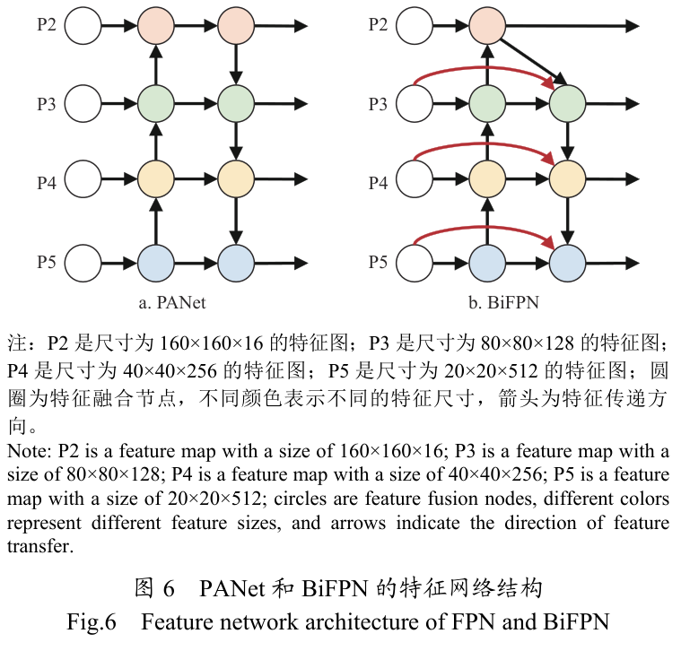

图中左侧 PANet 自下而上再自上而下逐级传递，右侧 BiFPN 增加了跨层捷径连接，融合节点可同时接收相邻两个层级的输入。本文在 Neck 以此构建 4 层特征金字塔，对应 P2（160×160×64）、P3（80×80×128）、P4（40×40×256）和 P5（20×20×512）特征图，输出送入检测头。

### 面向小目标的 P2 检测头扩展

P2 检测头扩展的目标是增强模型对小尺度侵染痕迹的感知能力。原始 YOLOv8 采用 P3、P4、P5 三个检测头，小目标通常缺乏纹理和边界特征，经 Backbone 多次下采样后细节逐渐丢失；浅层特征图具有更高分辨率和更小感受野，更适合小目标检测。为此，本文在 Neck 新增 160×160×64 的 P2 浅层检测头，可检测对应于 640×640 图像中 4×4 像素感受野的小目标，四尺度检测结构如下图所示：

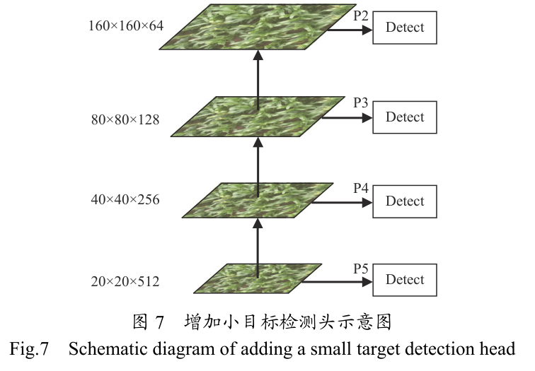

图中四个特征层自深向浅依次为 20×20×512、40×40×256、80×80×128 与 160×160×64，各接一个 Detect 检测头并行输出。模型在 4 个尺度上并行输出检测结果，减少小目标细节丢失，输出对接边界框与分类两支损失完成训练。

## 实验结果

### 实验设置

本文数据于 2024 年 7 月 20 日在山东省烟台市烟台农业科学院采集，每幅图像均匀划分为 4 个不重叠的 800×650 像素子图，由 LabelImg 人工框选标注侵染区域，剔除无标注图像后保留 879 张有效标注图像，按 8:1:1 划分为训练集、验证集和测试集，构成如下表所示：

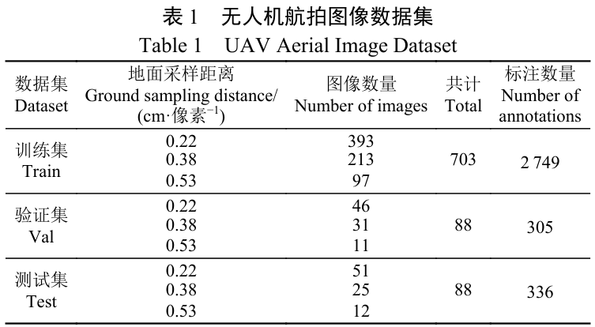

表中训练、验证、测试集分别含 703、88 和 88 张图像，对应 2749、305 和 336 处标注，可以看出三个子集均覆盖 3 种 GSD 且以 0.22 cm/像素样本为主。超分辨率重建得到的 GSD=0.26 cm/像素数据子集单独划分，其统计如下表所示：

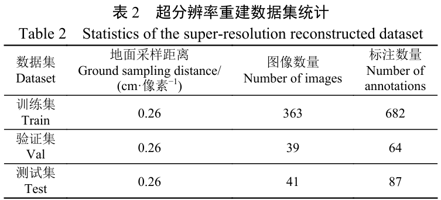

表中重建子集含训练、验证、测试图像 363、39 和 41 张，对应 682、64 和 87 处标注。本文进一步对 1066 张训练图像（703 张原始图像与 363 张重建图像）进行旋转、翻转、亮度与对比度调整、模糊及锐化等增强，将训练集扩展至 12792 张图像。实验平台为 Intel Core i9-13900K CPU、128 GB 内存与 RTX 4090 显卡，采用 PyTorch 2.2.1 结合 cuDNN 12.1 加速，输入 640×640 像素，训练 100 轮，Batch size 为 8，优化器为 AdamW，初始学习率 0.01，动量 0.937，权重衰减系数 0.0005。评价指标为精确率、召回率、AP@0.5、AP@0.5:0.95 与 F1-score，检测框与真实标注框的交并比（IoU）超过阈值时记为正确。

### 不同地面采样距离对比

为评估 GSD 对检测性能的影响，本文在多尺度数据集上统一训练并分档测试，不同 GSD 条件下的检测效果如下图所示：

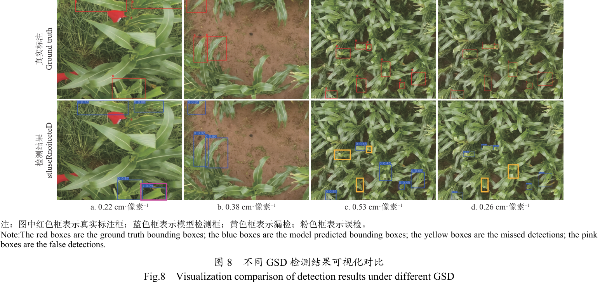

图中上行为真实标注、下行为检测结果，红色框为真实标注框，蓝色框为模型检测框，黄色框标出漏检，粉色框标出误检。可以看出 GSD=0.53 cm/像素一档漏检明显增多，而重建后的 0.26 cm/像素图像上检测框与标注框的重合程度明显改善。各 GSD 水平的总体检测结果如下表所示：

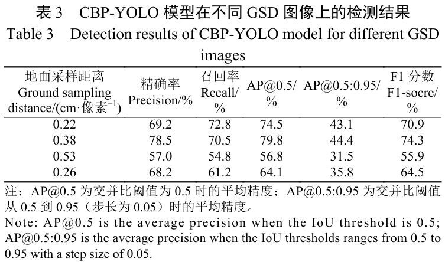

表中 GSD=0.38 cm/像素的 AP@0.5 和 F1-score 分别达到 79.8% 和 74.3%，为四档中最高，可见适中的分辨率在空间覆盖范围与局部细节表达之间取得了有效平衡；GSD=0.22 cm/像素引入更多噪声和无关信息，AP@0.5 降至 74.5%；GSD=0.53 cm/像素细节丢失严重，AP@0.5 仅 56.8%，而经 Real-ESRGAN 重建后 AP@0.5 与 F1-score 分别提高 7.3 和 8.6 个百分点，表明超分辨率重建对纹理与边缘的增强有效提升了啃咬痕迹的检测能力。

### 消融实验

为评估各模块的贡献，本文对 CA、BiFPN 与 P2 进行单独引入与组合消融，结果如下表所示：

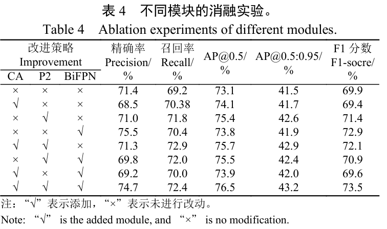

表中单独引入 P2 时提升最大，AP@0.5 由基线的 73.1% 提高到 75.4%，可见更高分辨率的特征图直接增强了对小尺度损伤区域的感知能力；单独引入 CA 或 BiFPN 时 AP@0.5 分别为 74.1% 和 73.8%，表明注意力引导与跨尺度融合各自有效。三模块同时启用时取得最佳综合性能，AP@0.5、AP@0.5:0.95 和 F1 分数较基线分别提升 3.4、1.7 和 3.6 个百分点，验证了多模块协同能够兼顾特征表达与精确率、召回率的平衡。

### 不同模型对比

为检验改进模型的综合性能，本文选取 YOLO 系列与双阶段、单阶段代表模型进行对比，结果如下表所示：

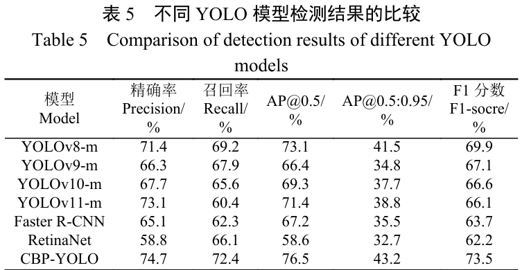

表中 CBP-YOLO 的 AP@0.5 达到 76.5%，较 YOLOv9m、YOLOv10m、YOLOv11m、Faster R-CNN 和 RetinaNet 分别提升 10.1、7.2、5.1、9.3 和 17.9 个百分点，可以看出改进模型在精确率、AP@0.5 与 F1-score 上优势明显。YOLOv11m 的精确率与 YOLOv8m 接近但召回率明显偏低，表明其在精确性与召回率之间尚未实现良好平衡。

### 可视化分析

为直观对比基线与改进模型的检测差异，本文在 4 种 GSD 条件下给出 YOLOv8m 与 CBP-YOLO 的检测效果，如下图所示：

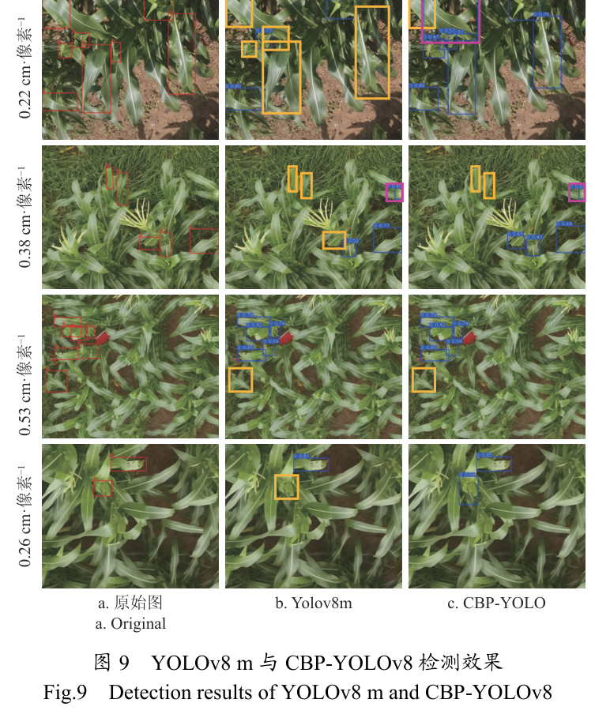

图中各行依次为 GSD 等于 0.22、0.38、0.53 和 0.26 cm/像素的样本，各列依次为原始图、YOLOv8m 与 CBP-YOLO 的检测结果。可以看出 CBP-YOLO 在各尺度下的检测框更完整地覆盖侵染痕迹，误检与漏检数量明显少于基线模型，尤其在 GSD=0.53 的低分辨率条件下仍能保持较稳定的定位效果，与消融、对比实验的定量结论一致。

## 优点和创新点

个人认为，本文有如下一些优点和创新点可供参考学习：

1. 将 Real-ESRGAN 超分辨率重建纳入检测预处理环节，恢复低分辨率图像中啃食区域的纹理细节，使 GSD=0.53 cm/像素图像的 AP@0.5 提升 7.3 个百分点，为航拍图像增强提供了实用方案。
2. 在 C2f 模块中嵌入协调注意力机制，通过沿高度与宽度的两个一维特征编码同时捕捉长程依赖与精确位置信息，兼顾计算开销与细节表达，在复杂农田背景下有效突出了侵染痕迹特征。
3. 用 BiFPN 的加权双向融合替代 PANet 的简单拼接，配合新增的 P2 浅层检测头实现跨尺度特征互补与小目标感知扩展，实验涵盖 GSD 对比、消融、多模型对比与可视化，数据丰富有力，说服力强。
