# 基于 GCMD-YOLO 的轻量化多尺度中药材检测方法

Paper Reading 是从个人角度进行的一些总结分享，受到个人关注点的侧重和实力所限，可能有理解不到位的地方。具体的细节还需要以原文的内容为准，博客中的图表若未另外说明则均来自原文。

| 论文概况 | 详细 |
| --- | --- |
| 标题 | 《基于 GCMD-YOLO 的轻量化多尺度中药材检测方法》 |
| 作者 | 孙鹏，唐永菁，孙传聪 |
| 发表期刊 | 农业工程学报 |
| 期刊等级 | 未获取 |
| 发表年份 | 2026 |
| 论文代码 | 未获取 |

作者单位：

1. 山东药品食品职业学院医疗器械系，威海 264200
2. 威海市妇幼保健院心内神经内科，威海 264200

## 研究动机

中药材的品类辨识与精准检测是中医药质量控制的重要问题，表现为药材种类繁多、形态各异、部分品类类间特征相似性高，导致细微根须、断面纹理等鉴别性特征难以提取，小目标漏检与品类混淆频发，直接影响临床疗效与用药安全。目前的辨识手段里，人工经验鉴别工作量大且主观性强，显微观察与化学检测又受制于检验周期长与样品破坏性。然而，现有的深度学习智能检测方法在边缘端部署时难以兼顾高精度与实时性：一方面，多数研究仅聚焦于模型精度提升，对轻量化优化与推理速度提升重视不足，巨大的计算开销限制移动设备的应用；另一方面，特征融合策略单一，对根须、叶脉等关键纤细特征与微小目标的检测灵敏度较低，传统卷积操作与池化机制易丢失纹理细节。尽管已有研究引入注意力机制或轻量模块改进 YOLO 系列模型，但在动态卷积自适应调整与多粒度特征感知上仍显薄弱。因此，如何在保持轻量级架构的同时引入细粒度特征提取能力，成为当前边缘端检测研究的焦点。

## 文章贡献

针对上述局限，本文提出了面向中药材检测的轻量化多尺度检测方法 GCMD-YOLO。其核心是在 YOLOv11S 基准模型上进行结构重构与特征增强，以 GhostConv 与 Dysample 降低参数冗余，以 C3K2-GL 双路径动态卷积增强纹理捕捉，以 MG-CA 多尺度全局注意力抑制背景干扰。首先构建涵盖 100 种中药材的多源数据集，覆盖根茎类、果实种子类、全草类等类别，经物理仿真增强扩充至 30 480 张图像；接着利用 GhostConv 重构主干与颈部网络并设计 Conv-SPPF 模块替代原有最大池化操作，在降低参数冗余的同时保留边缘与纹理特征；然后将全局-局部双通路动态卷积 GL-ODConv 引入 C3K2 模块，自适应提取多尺度纹理特征；再将 MG-CA 集成于特征融合层，以 1×1、2×2、4×4 三级池化粒度捕获不同尺度空间信息；最终以 Dysample 动态上采样替代固定插值规则，实现精准的尺度转换。实验表明，GCMD-YOLO 在自建数据集上精确率、召回率和 F1 分数分别达到 93%、91% 和 92%，mAP@0.5 为 92.8%，参数量降低 16%，推理速度提升 27%，在 Jetson Nano 边缘设备上的推理速度达到 39 FPS，验证了模型的轻量化优势和边缘部署可行性。

## 本文方法

### 网络整体设计

GCMD-YOLO 的目标是在 YOLOv11S 基线之上完成结构重构与特征增强，同时实现网络轻量化与细粒度特征提取。改进后模型的整体结构如下图所示，主要由轻量化主干、自适应融合颈部与检测头构成。

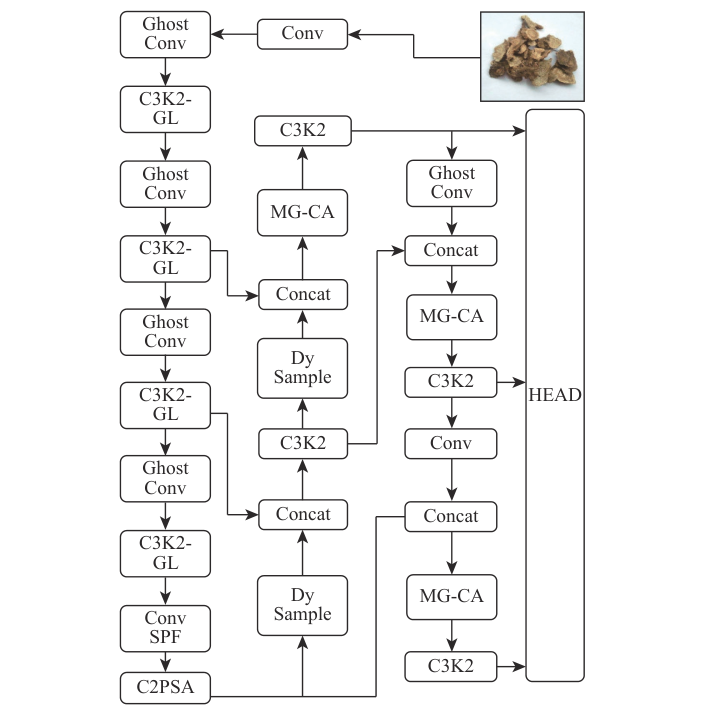

图中主干网络用 GhostConv 替换传统卷积层并以 C3K2-GL 升级 C3K2 模块，末端以 Conv-SPPF 替换原 SPPF；颈部网络用 GhostConv 压缩冗余参数，引入 MG-CA 聚焦鉴别性区域，并以 Dysample 替换固定插值的 upsample。骨干网络在减少计算量的同时增强对药材全局形态与局部细节的提取，颈部网络则高效融合多尺度特征并抑制背景干扰，各模块的输入输出维度与基线保持一致，可直接替换原有组件。输入图像经主干逐级抽取形态与纹理特征后，在颈部完成多尺度融合并送入检测头 HEAD 输出检测结果，下面依次展开各模块。

### GhostConv 轻量化特征提取模块

GhostConv 的目标是通过低成本操作生成冗余特征，减少计算开销与参数规模。其结构如下图所示：一路为标准卷积生成本征特征图，一路对本征特征图做线性变换生成幻影特征图，最后拼接两路输出。

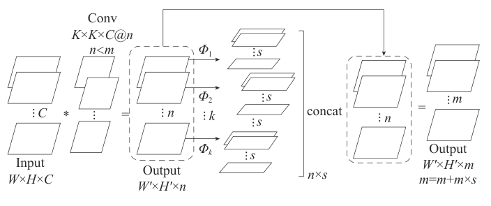

图中输入特征图先经标准卷积输出 $n$ 个通道的本征特征图，再对 $n$ 个通道分别得到 $s$ 个幻影特征图，总计得到 $m = n + n \times s$ 个特征图后拼接输出。标准卷积与 GhostConv 的计算量分别计算如下：

$$
F_1 = H' \times W' \times n \times K^2 \times c
$$

$$
F_2 = H' \times W' \times n \times K^2 \times c + (s-1) \times H' \times W' \times \frac{n}{s} \times b^2
$$

其中，相关符号的含义如下表所示：

| 符号 | 含义 |
| --- | --- |
| $H'$、$W'$ | 输出特征图的行列数 |
| $n$、$c$ | 输出与输入通道数 |
| $K$ | 标准卷积核尺寸 |
| $b$ | 线性变换卷积核尺寸，本文取 3×3 深度卷积 |
| $s$ | 幻影特征图数，近似为参数压缩比 |

直观上，GhostConv 只对 $1/s$ 的特征图做完整卷积，其余特征图由廉价线性变换生成，在 $b \leq K$ 且通道数较大时参数压缩比近似为 $s$，这等价于用一次卷积摊薄全部特征图的生成成本，比传统卷积节省约 $s$ 倍训练时间与参数量。该模块用于替换主干网络与颈部网络中的传统卷积层，输出送入后续 C3K2-GL 等组件继续提取深层特征。

### C3K2-GL 全局局部双通路动态卷积模块

C3K2-GL 的目标是让卷积核形状与感受野随输入自适应变化，以捕捉根须、叶脉等细粒度纹理。其核心是全局-局部双通路动态卷积 GL-ODConv，结构如下图所示：输入特征图双路并行提取，一路经全局平均池化压缩提取通道维度的全局信息，一路经 1×1 卷积提取局部信息，两路拼接后由全连接层调整维度生成动态权重矩阵。

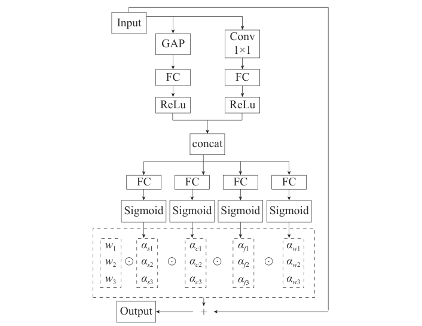

首先，输入经全局特征通路和局部特征通路提取为：

$$
z_g = \mathrm{ReLU}(\mathrm{FC}(\mathrm{GAP}(X))), \quad z_l = \mathrm{GAP}(\mathrm{ReLU}(\mathrm{Conv}_{1\times1}(X)))
$$

两路特征拼接后经全连接层与 Sigmoid 映射为通道注意力权重，并以残差方式得到增强特征图：

$$
z_{fused} = \sigma(\mathrm{FC}([z_g; z_l])) \odot X + X
$$

基于融合特征生成动态卷积权重，多分支卷积按权重加权完成多尺度特征融合：

$$
Y = \sum_{s=1}^{S} \alpha_s \cdot \mathrm{Conv}_s(X, W_d^{(s)})
$$

其中，相关符号的含义如下表所示：

| 符号 | 含义 |
| --- | --- |
| $X$ | 输入特征图 |
| $z_g$、$z_l$ | 全局特征与局部特征 |
| $z_{fused}$ | 残差增强后的特征图，维度与 $X$ 一致 |
| $\alpha_s$ | 第 $s$ 个动态分支的权重，即该分支的贡献度 |
| $W_d^{(s)}$ | 基于 $z_{fused}$ 动态生成的第 $s$ 个卷积核 |
| $Y$ | 多分支特征的加权融合结果 |

直观上，动态卷积核由输入特征自身生成，多分支结构分别适配整体形态、纹理和细节的多尺度特征提取需求，这等价于把定值卷积核替换为随样本变化的卷积核集合。本文用 GL-ODConv 替换 C3K2 中残差分支的标准卷积形成 C3K-GL，再替换 C3K2 浅层的 C3K 模块得到 C3K2-GL，深层 C3K 保持不变，各组件的组装关系如下图所示。

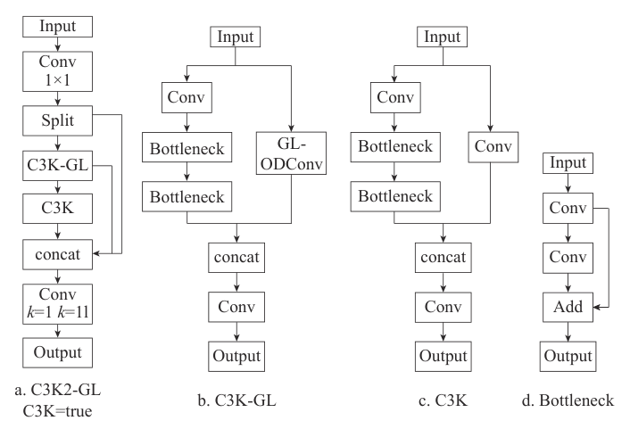

图中 C3K2-GL 先以 1×1 卷积调整维度并把特征拆分为两条路径：主路径先经 C3K-GL 自适应捕捉叶脉、纹理等深层特征，再经 C3K 融合整体特征；辅路径保留浅层特征直接传递，双路径拼接形成输出。该模块接收 GhostConv 输出的特征，输出再流向颈部的特征融合层。

### Conv-SPPF 池化改进模块

Conv-SPPF 的目标是保留 SPPF 的多尺度聚合能力，同时避免浅层最大池化丢失细微纹理。原 SPPF 先以 1×1 卷积压缩通道，再用 5×5、9×9、13×13 的并行最大池化捕捉不同尺度的空间特征；Conv-SPPF 将浅层 MaxPool 替换为 GhostConv，保留原 SPPF 的深层池化框架，其结构如下图所示。

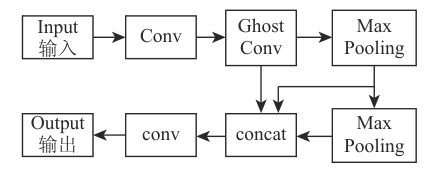

图中卷积操作替代池化操作后，边缘与纹理特征得以密集提取，避免关键鉴别信息在池化中被稀释。该模块位于主干网络末端，接收 C3K2-GL 输出的深层特征，聚合后的特征送入颈部网络参与多尺度融合。

### MG-CA 多尺度全局注意力模块

MG-CA 的目标是在坐标注意力 CA 的架构下按多粒度捕获不同尺度的空间信息，结合全局通道校准抑制复杂背景干扰。其结构如下图所示：输入特征沿宽度和高度方向并行进行三级平均池化，池化粒度分别为 1×1、2×2 与 4×4。

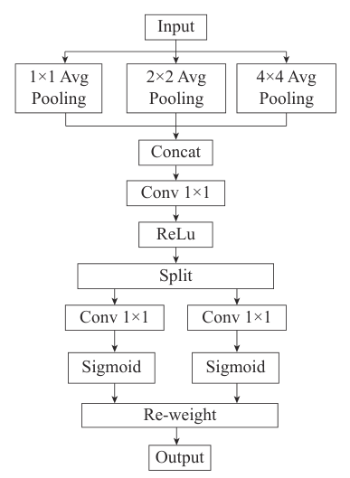

输入特征图 $X \in \mathbb{R}^{C \times H \times W}$ 在粒度级别 $s \in \{1, 2, 4\}$ 下的三级池化输出定义为：

$$
z_h^{(s)} \in \mathbb{R}^{C \times H \times 1}, \quad z_w^{(s)} \in \mathbb{R}^{C \times 1 \times W}
$$

其中 $z_h^{(s)}$、$z_w^{(s)}$ 为粒度 $s$ 下沿高度与宽度方向的池化输出。三级特征拼接后经 1×1 卷积把通道数从 $C$ 压缩至 $C/r$（压缩比 $r$ 本文取 16）并经 ReLU 激活，再拆分回宽高两支、经 Sigmoid 生成空间注意力权重，按逐元素相乘 $\otimes$ 联合作用于输入特征图 $F$，输出特征图为：

$$
F' = F \otimes g_h \otimes g_w
$$

其中 $g_h$、$g_w$ 为高度与宽度方向的空间注意力权重。直观上，$s=1$ 对应全局粒度，捕获人参、黄芪等大尺度目标的整株形态；$s=2$ 对应中尺度粒度，提取当归、白术等切片纹理；$s=4$ 对应局部粒度，定位枸杞、虫草等小目标的颗粒细节，这等价于用三个感受野分别对齐三档目标尺度。该模块集成在颈部的特征融合层，输出的增强特征流向后续的上采样与检测头。

### Dysample 动态上采样模块

Dysample 的目标是用动态权重生成和自适应特征插值替代固定插值规则，在放大特征图的同时保留关键细节。其结构如下图所示：输入特征图经采样点生成器得到采样集，再由网格采样函数按采样位置对输入特征重新插值。

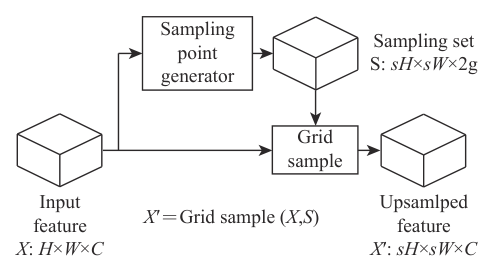

输入特征图 $X$ 经采样点生成器得到采样点坐标集合 $S$ 后，上采样特征的计算定义为：

$$
X' = \mathrm{Grid\_sample}(X, S)
$$

其中 $X'$ 为上采样输出特征图。直观上，采样位置由网络动态预测而非固定网格，这等价于让上采样核随语义内容变化；本文使用带动态范围因子的 LP 模式，经线性投影生成偏移集合匹配目标空间尺寸，由动态权重引导采样过程的加权融合。由于以点采样替代卷积操作，参数量与计算量大幅降低。该模块替换颈部中原有的 upsample，输出与主干特征拼接后进入下一级特征融合。

## 实验结果

### 实验设置

本文构建涵盖 100 种常见中药材的检测数据集，其中根茎类、果实种子类、全草类与叶花皮类分别占 40%、30%、20% 与 10%；数据来源包括甘肃、南京中医药大学的中药标本数据库、爬虫抓取的网络图片以及 Kaggle 的 MedLeaves 开源数据集。原始样本 8 642 张，经亮度、对比度、饱和度调整与旋转、平移、缩放、高斯噪声等物理仿真增强后扩充至 30 480 张，统一缩放至 640×640，并按 7:2:1 划分训练、验证和测试集，同种药材的原图及其增强效果如下图所示。

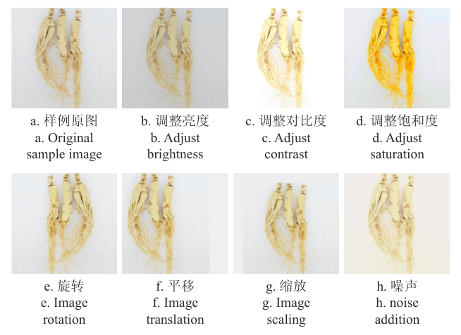

图中给出同一株人参在调整亮度、对比度、饱和度以及旋转、平移、缩放、加噪后的样例，可见增强覆盖了低质量拍摄场景常见的成像变化。训练平台采用 Intel Core i7-12700H 处理器与 NVIDIA GeForce RTX 4060 GPU，学习率 0.001、批处理大小 16、迭代次数 150 轮，评价指标包括精确率、召回率、F1 分数、mAP@0.5、mAP@0.5:0.95、参数量与运算量。训练过程的损失与准确率曲线如下图所示。

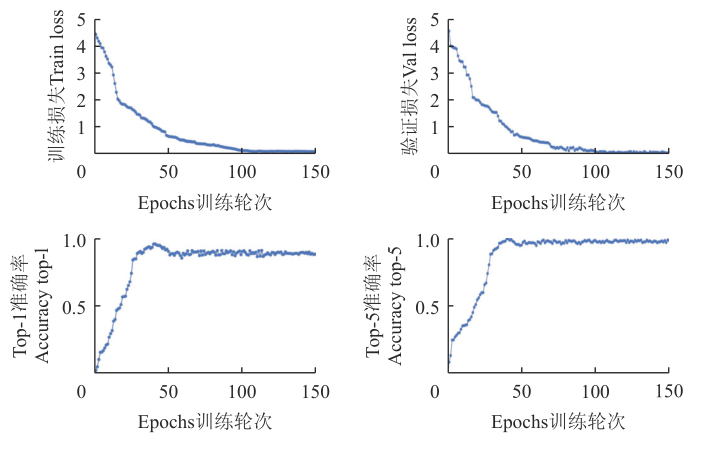

图中训练损失快速下降并稳定在 0.2 以下，验证损失略高但趋势同步、稳定在 0.4 以下，Top-1 准确率最终稳定在 0.92 以上、Top-5 准确率接近 0.97，可见模型收敛平稳，对细粒度相似品类具备较强的区分能力。

### 对比实验

在测试集上将 GCMD-YOLO 与多种代表性模型进行对比试验，结果如下表所示。

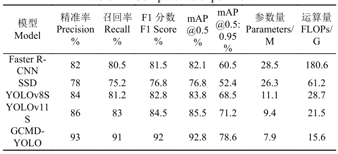

表中 GCMD-YOLO 的精确率、召回率、F1 分数、mAP@0.5 与 mAP@0.5:0.95 分别达到 93%、91%、92%、92.8% 与 78.6%，参数量 7.9M、运算量 15.6G 均为表中最低。Faster R-CNN 精度不低但召回率相对较低，28.5M 参数量与 180.6G 运算量远超其他模型；SSD 的精度与效率指标均已显著落后，YOLOv8S 各项指标不及基线 YOLOv11S。精度与轻量化同时占优，可见细微纹理区分与多尺度目标检测能力的增强并未以计算开销为代价。

### 消融实验

逐模块组合的消融结果如下表所示，其中试验 1 为基线，试验 2 至 6 为单模块改进，试验 7 为全部模块集成。

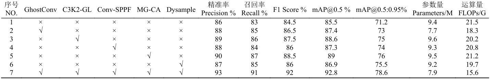

表中试验 2 在参数量降低 18%、运算量减少 15% 的同时精准率、召回率和 mAP@0.5 均获得提升；试验 5 的精准率与召回率分别达 90% 与 87%，为单模块改进的最优数值；试验 7 集成全部模块后精准率、召回率与 mAP@0.5 达到 93%、91% 与 92.8%。各模块单独改进均带来正向增益且组合后进一步叠加，可见轻量化、动态卷积与多尺度注意力从不同环节贡献了精度与效率的协同提升。

### 速度-精度权衡

为检验精度增益能否在边缘设备上兑现，本文在 Jetson Nano 上对比两款模型的部署性能，结果如下表所示。

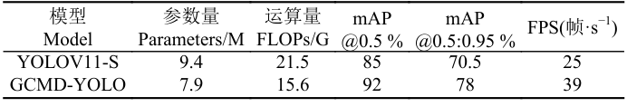

表中 GCMD-YOLO 的参数量与运算量为 7.9M 与 15.6G，低于基线的 9.4M 与 21.5G，FPS 从 25 帧·s⁻¹ 提升至 39 帧·s⁻¹，同时 mAP@0.5 与 mAP@0.5:0.95 达到 92% 与 78%。速度大幅提升而精度不降反升，可见轻量化设计与精度增益在边缘设备上可以兼得。

### 可视化分析

混淆矩阵与类激活映射图 CAM 从类别混淆与空间关注两个视角检验模型行为。测试集上的混淆矩阵如下图所示，坐标数字对应 100 种药材编号。

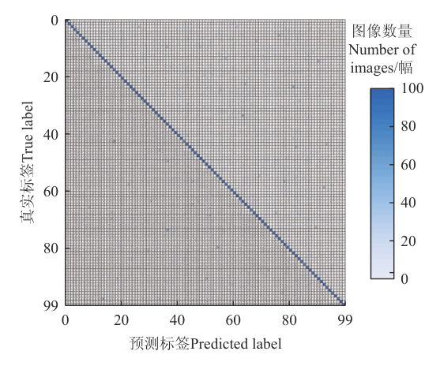

图中主对角线呈现连续高亮分布，非对角线区域颜色暗淡、错误样本分布稀疏，未出现明显的类别混淆聚集；对当归与川芎、党参与西洋参两组易混淆品类，本文模型将平均误判率从基线模型的 12.5% 降低至 4.2%，可见类间相似性导致的误判得到有效缓解。进一步用热力图可视化模型关注区域，类激活映射图的计算公式如下：

$$
\mathrm{CAM}(x, y) = \sum_{k=1}^{K} w_k^c \cdot A_k(x, y)
$$

其中 $w_k^c$ 为通道 $k$ 对类别 $c$ 的权重，$A_k(x, y)$ 为通道 $k$ 在位置 $(x, y)$ 处的特征响应。直观上，该式将各通道特征响应按类别贡献度加权求和，高亮区域即模型做出判断时聚焦的位置。分别选取根茎类的黄芪、叶类的薄荷叶和果实种子类的枸杞进行可视化，基线模型与本文模型的 CAM 对比如下图所示。

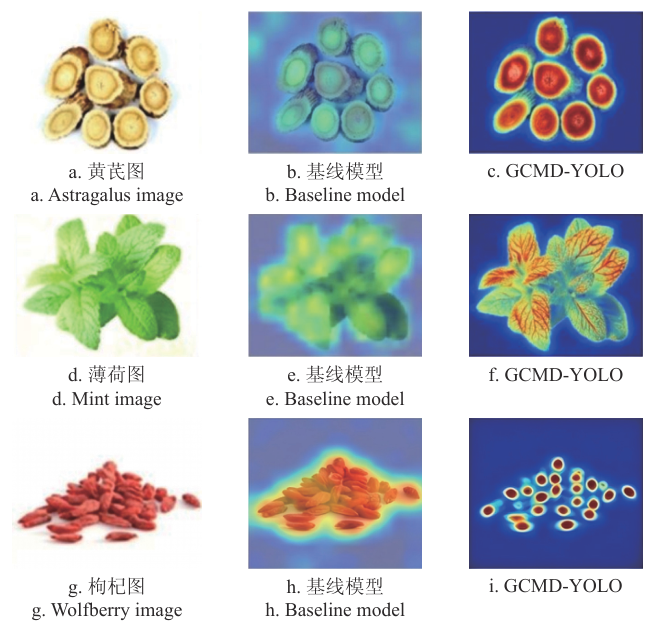

图中 GCMD-YOLO 对黄芪的高亮区域集中于菊花心与环纹，对薄荷叶沿叶脉走向强化叶片轮廓与锯齿边缘，对枸杞则为堆叠的果实生成独立的激活中心并抑制背景阴影；基线模型的响应或弥散至整体轮廓甚至背景，或丢失叶脉与边缘细节。热力图聚焦位置的鲜明对比，表明本文模型对细粒度纹理与形态特征的聚焦能力更强。

### 泛化能力验证

为验证模型对其他来源数据的泛化能力，本文选用百度飞桨 ChinesMedicine-163 中草药数据集开展试验，该数据集涵盖 163 类不同产地与加工状态的样本，且与自建数据集无交集。训练完成的 GCMD-YOLO 不经任何微调直接测试，结果如下表所示。

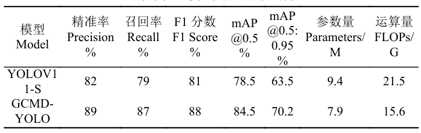

表中 GCMD-YOLO 的精确率、召回率与 F1 分数达到 89%、87% 与 88%，mAP@0.5 与 mAP@0.5:0.95 为 84.5% 与 70.2%，各项指标均高于基线模型，可见所学特征对不同来源的药材图像具有较强的泛化能力，验证了模型应用的鲁棒性。

### 失败案例与边缘部署

以川木香和土木香这组易混淆样本考察典型失败模式，基线模型与本文模型的 CAM 表现如下图所示。

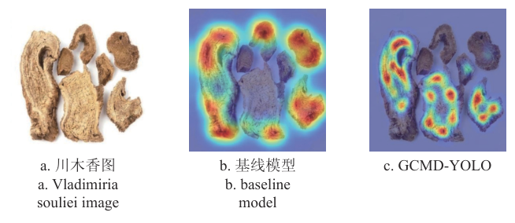

图中基线模型将川木香误判为土木香，激活区域模糊地落在切片边缘与外部残余上，GCMD-YOLO 则成功识别为川木香，热力图精准高亮了药材内部放射状韧皮部束的结构，可见关注区域偏移是此类混淆的诱因，对鉴别性内部结构的聚焦能够纠正误判。部署环节将 PyTorch 权重经 ONNX 工具链导出并由 ONNX-Simplifier 删减冗余层、合并算子，再转换为 TensorRT 引擎，利用层融合与 FP16 量化适配算力，由 Infer 推理库加载执行，39 帧·s⁻¹ 的实测速度验证了边缘部署的可行性。

## 优点和创新点

个人认为，本文有如下一些优点和创新点可供参考学习：

1. 从工程可用性切入，以 GhostConv 与 Dysample 重构主干和颈部网络并设计 Conv-SPPF，参数量降低 16%、运算量减少 27% 而精度不降反升，Jetson Nano 上实测 39 帧·s⁻¹；
2. 提出 C3K2-GL 全局-局部双通路动态卷积，以输入驱动的动态卷积核自适应调整感受野与卷积核形态，多分支结构分别适配形态、纹理与细节特征，兼顾多尺度适应性与细粒度纹理捕捉；
3. 设计 MG-CA 多粒度注意力，用 1×1、2×2、4×4 三级池化粒度分别对应大尺度形态、切片纹理与小目标颗粒细节，集成于特征融合层后将易混淆品类的平均误判率从 12.5% 降至 4.2%；
4. 实验数据丰富有力，涵盖对比、消融、混淆矩阵、CAM 可视化、跨数据集泛化与边缘部署六个方面，定量与定性相互印证，说服力强。
