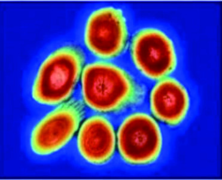

# 基于 GCMD-YOLO 的轻量化多尺度中药材检测方法

Paper Reading 是从个人角度进行的一些总结分享，受到个人关注点的侧重和实力所限，可能有理解不到位的地方。具体的细节还需要以原文的内容为准，博客中的图表若未另外说明则均来自原文。

| 论文概况 | 详细 |
| --- | --- |
| 标题 | 《基于 GCMD-YOLO 的轻量化多尺度中药材检测方法》 |
| 作者 | 孙鹏，唐永菁，孙传聪 |
| 发表期刊 | 农业工程学报 |
| 期刊等级 | 未获取 |
| 发表年份 | 2026 |
| 论文代码 | 未获取 |

作者单位：

1. 山东药品食品职业学院医疗器械系，威海 264200
2. 威海市妇幼保健院心内神经内科，威海 264200

## 研究动机

中药材智能检测是中医药现代化与质量控制的重要问题，表现为药材种类繁多、形态各异、类间相似性高，导致细微根须等特征提取困难、小目标漏检严重、相似品类易混淆，影响临床疗效与用药安全。现有深度学习检测方法在边缘端部署时难以兼顾高精度与实时性的瓶颈：一方面多数研究仅聚焦于模型精度提升，对轻量化优化与推理速度重视不足，巨大的计算开销限制移动设备的应用；另一方面特征融合策略单一，对根须、叶脉等关键纤细特征与微小目标的检测灵敏度较低，传统卷积操作与池化机制易导致纹理细节丢失。尽管已有研究引入注意力机制或轻量模块改进 YOLO 系列模型，但在动态卷积自适应调整、多粒度特征感知与边缘部署效率等方面仍存在不足，特别是在 100 种中药材的高细粒度分类任务中，模型鲁棒性有待提升。然而如何在保持轻量级架构的同时引入细粒度特征提取能力，成为当前边缘端检测研究的焦点。

## 文章贡献

针对上述局限，本文提出了面向中药材检测的 GCMD-YOLO 轻量化多尺度检测方法。其核心是在 YOLOv11s 基准模型上进行结构重构与特征增强，通过 GhostConv 与 Dysample 模块降低参数冗余、C3K2-GL 双路径动态卷积增强纹理捕捉、MG-CA 多尺度全局注意力抑制背景干扰。首先构建涵盖 100 种中药材的多源数据集，包括根茎类、果实种子类、全草类等类别，通过物理仿真增强扩充至 30,480 张图像；接着利用 GhostConv 重构主干与颈部网络，设计 Conv-SPPF 模块替代原有 SPPF 的最大池化操作，在大幅降低参数冗余的同时优化特征重构效率；然后在 C3K2 模块中引入全局 - 局部双通路动态卷积 GL-ODConv，生成动态卷积核自适应提取多尺度纹理特征；再集成 MG-CA 注意力机制到特征融合层，采用 1×1、2×2、4×4 三级池化粒度捕获不同尺度空间信息；最后通过 Dysample 动态上采样替代固定插值规则，实现精准的尺度转换。实验表明，GCMD-YOLO 在自建 100 种中药材数据集上精确率、召回率和 F1 分数分别达到 93%、91% 和 92%，mAP@0.5 为 92.8%，mAP@0.5:0.95 为 78.6%，相较于基线模型分别提升 7.0、8.0、7.5、7.3、7.4 个百分点；参数量降低 16%，推理速度提升 27%；在 Jetson Nano 边缘设备上的推理速度达到 39 FPS，验证了模型的轻量化优势和边缘部署可行性。

## 本文方法

### GhostConv 轻量化特征提取模块

GhostConv 模块是一种轻量化特征提取模块，其核心设计理念是通过低成本操作生成冗余特征以减少计算开销与参数规模。该模块采用标准卷积和廉价变换组成双路径结构，输入特征图 $H \times W \times c$，先经标准卷积 Conv 输出通道为 $n$ 的特征图，对此进行线性变换，对 $n$ 个通道的特征图分别得到 $s$ 个幻影特征图，总计得到 $m = n + n \times s$ 个特征图；然后拼接之前标准卷积的输出，得到最终的特征图。与 YOLOv11 网络中传统的标准卷积相比，GhostConv 既保留了传统卷积的特征提取能力，也减少约 50% 的参数量与计算量。

标准卷积的计算量为：

$$
F_1 = H' \times W' \times n \times K^2 \times c
$$

其中 $H'$ 和 $W'$ 分别为输出特征图的行列数，$n$ 为输出通道数，$K$ 为卷积核尺寸，$c$ 为输入通道数。

GhostConv 的计算量为：

$$
F_2 = H' \times W' \times n \times K^2 \times c + (s-1) \times H' \times W' \times \left(\frac{n}{s}\right) \times b^2
$$

其中 $b$ 为线性变换卷积核尺寸，本文中使用 3×3 深度卷积即 $b=3$，存在 $b \leq K$。网络层通道数 $C$ 值为 64、128、256 等较大数值，参数压缩比近似为 $s$，即 GhostConv 模块比传统卷积大约节省 $s$ 倍训练时间，并减少约 $s$ 倍参数量，即可获取相同数量特征图。该模块被用于替换主干网络和颈部网络中的传统卷积层，在轻量化基础上保留关键形态特征。

### C3K2-GL 全局局部双通路动态卷积模块

本文提出全局 - 局部双通路动态卷积 GL-ODConv 模块，输入特征图进行双路并行特征提取，一路经全局平均池化压缩提取通道维度全局信息，一路经 1×1Conv 提取局部信息，然后两路并行特征进行拼接，通过全连接层调整维度生成动态权重矩阵，有效扩展感受野。

首先，输入经全局特征通路和局部特征通路：

$$
z_g = \text{ReLU}(\text{FC}(\text{GAP}(X))), \quad z_g \in \mathbb{R}^{C/16}
$$

其中 $z_g$ 表示输出全局特征，$\text{GAP}$ 表示全局平均池化，$\text{FC}$ 表示全连接层，$\text{ReLU}$ 表示线性整流激活函数。

$$
z_l = \text{GAP}(\text{ReLU}(\text{Conv}_{1\times1}(X))), \quad z_l \in \mathbb{R}^C
$$

其中 $z_l$ 表示输出局部特征，$\text{Conv}_{1\times1}$ 表示用 1×1 大小的卷积核对输入特征进行卷积。

在两路卷积核并行计算后，按动态权重逐通道加权融合：

$$
[z_g; z_l] = \text{ReLU}(W_g \cdot \text{GAP}(X)) \oplus \text{GAP}(\text{ReLU}(W_l \odot X))
$$

其中 $\oplus$ 表示将全局通路和局部通路的输出按通道逐元素相加，融合两者的特征，$W_g$ 和 $W_l$ 分别表示全局、局部通路的线性变换权重矩阵，$\odot$ 表示用卷积核对输入特征进行局部卷积。

进行多尺度特征融合：

$$
z_{fused} = \sigma(\text{FC}([z_g; z_l])) \odot X + X, \quad z_{fused} \in \mathbb{R}^{C \times H \times W}
$$

其中 $\sigma$ 表示使用 Sigmoid 激活函数将全连接输出的权重映射为通道注意力权重，$\odot$ 表示通道注意力权重与输入特征 $X$ 逐通道、逐像素的相乘，$+X$ 表示残差连接，即加权后的输入特征 $X$ 与原始特征 $X$ 进行逐元素的相加，最后输出的增强特征图 $z_{fused}$ 与输入特征 $X$ 在维度上一致。

各尺度权重由轻量级注意力模块计算：

$$
\alpha_s = \text{Softmax}(\text{MLP}(\text{GAP}(\text{Conv}_s(z_{fused}))))
$$

其中 $\text{MLP}$ 表示分支权重提取，通过对维度先压缩后扩张的方式，提取不同分支特征间的非线性关联，$\text{Softmax}$ 表示对结果进行归一化处理，避免权重爆炸，提升稳定性。

基于融合特征生成动态卷积权重：

$$
W_d = \text{Sigmoid}(\text{FC}_2(\text{ReLU}(\text{FC}_1(z_{fused})))), \quad W_d \in \mathbb{R}^{S \times K \times K}
$$

其中 $\text{FC}_1$ 与 $\text{FC}_2$ 为第一层和第二层的全连接网络，将增强特征图 $z_{fused}$ 展平为一维向量，降低计算量，获取高层抽象特征；$\text{FC}_2$ 通过全连接映射到 $S \times K \times K$ 维，得到 $S$ 个 $K \times K$ 的矩阵，生成动态权重参数，$S$ 表示动态分支的数量。

完成多尺度特征融合：

$$
Y = \sum_{s=1}^{S} \alpha_s \cdot \text{Conv}_s(X, W_d^{(s)})
$$

其中 $\alpha_s$ 表示分支权重，即第 $S$ 个分支对中药材识别的贡献度，$\text{Conv}_s$ 表示第 $S$ 个分支的动态卷积，多分支可分别适配整体形态、纹理和细节的多尺度特征提取需求，$Y$ 表示多分支特征的加权融合结果，特征维度与增强特征图 $z_{fused}$ 一致。本文在 C3K2 模块基础上，用 GL-ODConv 模块替换其中残差分支的标准卷积，形成 C3K-GL 模块，替换 C3K2 的浅层 C3K 模块得到 C3K2-GL 模块，使模型能够自适应调整卷积核形状与感受野，多分支机制实现特征的多维度动态加权，强化关键局部特征的表达能力。

### Conv-SPPF 池化改进模块

SPPF 模块是 YOLO11 网络中用于增强多尺度特征融合的关键组件，通过并行的多尺度池化操作实现特征聚合。该模块先通过 1×1 卷积将输入特征图通道数压缩至原尺寸的 1/2，减少后续计算量；随后设置 3 个并行分支，分别采用 5×5、9×9、13×13 的最大池化核对特征图进行处理，捕捉不同尺度的空间特征；最后将原始特征图与各池化分支输出特征拼接，通过 1×1 卷积恢复通道数。虽然有效提升网络对目标尺度变化的适应性，但浅层最大池化操作易导致中药材细微纹理关键特征的丢失。

针对此问题，本文提出 Conv-SPPF 模块，将其浅层 MaxPool 模块替换为 GhostConv 模块，提取核心特征，保留原 SPPF 的深层池化框架。该设计在维持多尺度特征聚合能力的同时，通过卷积操作而非池化操作保留边缘与纹理特征，避免关键鉴别信息的损失。

### MG-CA 多尺度全局注意力模块

MG-CA 模块在 CA 注意力机制的架构下，采用多尺度特征感知结合全局通道校准的设计。输入特征图 $X \in \mathbb{R}^{C \times H \times W}$，沿宽度 $W$ 和高度 $H$ 方向，并行进行三分支的平均池化。输出特征可表示为：

$$
z_h^{(s)} \in \mathbb{R}^{C \times H \times 1}, \quad z_w^{(s)} \in \mathbb{R}^{C \times 1 \times W}
$$

其中 $s \in \{1, 2, 4\}$ 表示粒度级别：$s=1$ 表示 1×1 网格，对应全局粒度，捕获整株药材形态特征，针对人参、黄芪等大尺度目标；$s=2$ 表示 2×2 网格，对应中尺度粒度，提取切片纹理特征，针对当归、白术等纹理目标；$s=4$ 表示 4×4 网格，对应局部粒度，定位颗粒细节，针对枸杞、虫草等小目标。

将三级特征拼接，再由 1×1 卷积压缩通道，经 ReLU 非线性激活，增强模型的非线性拟合和表达的能力：

$$
f = \delta(\text{Conv}_{1\times1}(\text{Concat}(z_h, z_w))), \quad f \in \mathbb{R}^{C/r \times (H+W)}
$$

其中 $\text{Concat}(z_h, z_w)$ 表示对行、列做特征拼接，拼接后空间维度合并为 $(H+W)$，$\text{Conv}_{1\times1}$ 表示用 1×1 卷积核处理拼接后的特征，将通道数从 $C$ 压缩到 $C/r$，完成通道降维，$r$ 为压缩比，本文设置为 16，$\delta$ 为 ReLU 激活函数，抑制负值，增强非线性特征表达。

再次分开为两并行支路，按照宽高分为：$[C, 1, H]$ 和 $[C, 1, W]$，再转置得到两个特征层 $[C, H, 1]$ 和 $[C, 1, W]$：

$$
f_h, f_w = \text{Split}(f, [H, W], \text{dim}=2)
$$

其中 $f_h$ 和 $f_w$ 分别是融合特征沿高度和宽度方向拆分的特征；利用 1×1 卷积调整通道数后，经 Sigmoid 获得宽、高维度上的注意力情况；$\sigma$ 为 Sigmoid 函数，用于生成空间注意力权重。

$$
g_h = \sigma(\text{Conv}_{1\times1}(f_h)), \quad g_w = \sigma(\text{Conv}_{1\times1}(f_w))
$$

最后，通过逐元素相乘，将行注意力权重 $g_h$ 和列注意力权重 $g_w$ 联合作用于输入特征图 $F$，得到输出特征图 $F'$，实现空间关键区域增强和无关背景抑制：

$$
F' = F \otimes g_h \otimes g_w
$$

其中 $\otimes$ 表示逐元素相乘，将注意力权重与输入特征图进行逐元素相乘，实现对空间关键区域的协同增强。MG-CA 通过三级多粒度池化（1×1、2×2、4×4）扩展传统坐标注意力机制的特征感知能力，对不同尺度的空间信息分别进行捕获，集成在特征融合层，通过抑制复杂背景干扰，提升相似品类的辨识度。

### Dysample 动态上采样模块

YOLOv11 网络的 upsample 采用固定插值规则，易导致关键细节信息丢失，特别是在复杂背景下的小目标检测中表现尤为明显。而 DySample 通过动态权重生成和自适应特征插值，实现精准的尺度转换，解决传统采样对语义特征关注不足的问题；同时，由于采用点采样替代卷积操作，大幅降低参数量与计算。

图中，输入特征图 $X$ 经采样点生成器得到采样集 $S$，利用 Grid_sample 函数使采样集 $S$ 中的位置对假设的双线性插值输入特征进行重新采样，生成上采样特征集 $X'$：

$$
X' = \text{Grid\_sample}(X, S)
$$

其中 $X$ 为尺寸 $H \times W$，有 $C$ 个通道的特征图，$\text{Sampling point generator}$ 为采样点生成器，$\text{Sampling set } S$ 为生成器输出的采样点坐标集合，$s$ 为上采样缩放因子，$sH$ 为目标上采样后的特征图高度，$sW$ 为目标上采样后的特征图宽度，$g$ 为分组数，$\text{Grid sample}$ 为网格采样函数，$X'$ 为经过动态上采样后输出的特征图。本文中使用动态范围因子的 LP 模式，经线性投影生成偏移集合，匹配目标空间尺寸，由动态权重引导采样过程中的加权融合。该模块被用于替换原有的 upsample 模块，自适应调整特征融合尺度。

## 实验结果

### 实验设置

本研究训练模型的硬件配置与参数设置均经过针对性优化，硬件方面，训练平台采用高性能 Intel(R) Core(TM) i7-12700H 处理器，配备 16GB DDR4 运行内存和 NVIDIA GeForce RTX4060 GPU。软件环境基于 Windows11 操作系统；编程语言 Python3.8.20；配置 CUDA12.1 搭配 PyTorch1.11.0 深度学习框架。学习率设置为 0.001，批处理大小 16，迭代次数 150 轮。

数据集方面，本研究构建涵盖 100 种常见中药材的检测数据集，其中人参、当归等根茎类占 40%、枸杞、五味子等果实种子类占 30%、薄荷、蒲公英等全草类占 20%、叶类、花类、皮类等占 10%，数据来源包括甘肃中医药大学、南京中医药大学的中药标本专业数据库，爬虫技术的抓取网络图片补充自然场景和复杂背景，以及 Kaggle 的药用植物 MedLeaves 开源数据集。原始样本量为 8,642 张，通过物理仿真增强（随机调整亮度、对比度、饱和度、进行图像旋转、平移、缩放，添加高斯噪声以模拟低质量拍摄场景），所有图像统一缩放至 640×640，并经人工审核，数据增强后数据集扩充至 30,480 张，按 7:2:1 划分训练、验证和测试集。评价指标包括精确率（Precision）、召回率（Recall）、F1 Score、mAP@0.5、mAP@0.5:0.95、参数量（Parameters）和运算量（FLOPs）。

### 消融实验

表 1 展示了不同模块组合对模型性能的影响：

**图 11 CAM 对比图**

表 1 结果显示，试验 1 与 2 对比可知，在参数量降低 18%、运算量减少 15% 的同时，试验 2 在精准率、召回率和 mAP@0.5 三项关键指标上均获得提升，验证 GhostConv 模块不仅实现网络轻量化，也有效保留并优化基础特征表达能力。试验 3 在未显著增加运算量的情况下，精准率与 mAP@0.5 提升显著，分别达到 89% 和 88.6%，证明其双路径动态卷积机制对细粒度纹理特征的自适应捕捉能力。试验 4 通过将池化替换为卷积，mAP@0.5:0.95 提升至 74%，试验 6 则通过动态上采样优化了特征融合过程，取得 FLOPs 为 19.7G 的最佳运算效率。试验 5 精准率和召回率分别提升至 90% 与 87%，是单模块改进的最优数值，证明多尺度全局注意力机制在聚焦鉴别性关键区域、抑制背景干扰方面的重要作用。试验 7 集成全部改进模块，在参数量与运算量分别较基线降低 16% 与 27% 的轻量化基础上，精准率、召回率与 mAP@0.5 分别大幅提升至 93%、91% 和 92.8%。

### 对比实验

表 2 展示了 GCMD-YOLO 与其他代表性模型的对比结果：

| 模型 | Precision/% | Recall/% | F1 Score/% | mAP@0.5/% | mAP@0.5:0.95/% | Parameters/M | FLOPs/G |
| --- | --- | --- | --- | --- | --- | --- | --- |
| Faster R-CNN | 82 | 80.5 | 81.5 | 82.1 | 60.5 | 28.5 | 180.6 |
| SSD | 78 | 75.2 | 76.8 | 76.8 | 52.4 | 26.3 | 61.2 |
| YOLOv8S | 84 | 81.2 | 82.8 | 83.8 | 68.5 | 11.1 | 28.7 |
| YOLOv11S | 86 | 83 | 84.5 | 85.5 | 71.2 | 9.4 | 21.5 |
| **GCMD-YOLO** | **93** | **91** | **92** | **92.8** | **78.6** | **7.9** | **15.6** |

表 2 结果表明，相较于其他对比模型：两阶段检测器 Faster R-CNN 虽取得较高的精确率与 mAP@0.5，但其召回率相对较低，且模型参数量与计算量远超其他模型，难以满足边缘部署需求；单阶段多尺度检测器 SSD 的各项精度指标与效率指标均已显著落后；YOLOv8S 精度与效率表现均衡，但各项指标不及基线模型 YOLOv11S。GCMD-YOLO 在精度与轻量化等方面相较基线和对比模型均有提升，体现了其在细微纹理区分与多尺度目标检测上的优势。

### 混淆试验

通过混淆矩阵可直观定位易混淆品类的错误模式。从整体来看，主对角线呈现连续高亮分布，表明模型整体识别准确率与训练曲线及消融实验结论一致；非对角线区域则整体颜色暗淡，错误预测样本分布稀疏，未出现明显的类别混淆聚集现象，说明本文模型可有效缓解类间相似性导致的误判问题。对"当归"与"川芎"、"党参"与"西洋参"易混淆品类对进行分析，本文模型将平均误判率从基线模型的 12.5% 显著降低至 4.2%，表明该模型能有效降低相似药材之间的识别混淆。

### 可视化分析

类激活映射图（CAM）通过梯度加权计算模型关注区域，计算公式如下：

$$
\text{CAM}(x, y) = \sum_{k=1}^{K} w_k^c \cdot A_k(x, y)
$$

其中 $K$ 为卷积通道数，$C$ 为目标类别，$w_k^c$ 为 $K$ 通道对类别 $c$ 的权重，$(x, y)$ 为图中位置坐标，$A_k(x, y)$ 为 $K$ 通道在 $(x, y)$ 处的特征响应。

通过热力图可视化模型关注区域，验证模型是否学习到中药材标志性特征，而非背景干扰。分别选择根茎类的黄芪、叶类的薄荷叶和果实种子类的枸杞进行可视化分析。由图 11 可见，GCMD-YOLO 的热力图中，对于黄芪，高亮区域集中于菊花心与环纹，纹理特征被清晰激活；对于薄荷叶，热力图沿叶脉走向分布，叶片轮廓与锯齿边缘被显著强化；对于枸杞，热力图为堆叠的果实生成独立的激活中心，并有效抑制背景阴影。基线模型的热力图中：对黄芪，响应弥散至整体轮廓甚至背景，对核心环纹关注微弱；对薄荷叶，仅能识别大致叶片区域，叶脉与边缘细节丢失；对枸杞，则未清晰区分出个体，易将阴影误判为目标。结果表明，GCMD-YOLO 增强对细粒度纹理与形态特征的提取与聚焦能力，优化对关键鉴别区域的精准感知。

以川木香和土木香这组易混淆样本进行进一步的效果分析。由图 12 可见，基线模型将川木香误判为土木香，其激活区域显示出对样本切片边缘和外部残余的模糊关注，相比之下，GCMD-YOLO 成功将该样本识别为川木香，热力图精准地高亮了药材内部放射状韧皮部束的结构，说明该模型在细粒度相似性混淆问题的提升。

### 泛化能力验证

为验证训练所得模型能否直接应用于其他来源的数据，选用百度飞桨 ChinesMedicine-163 中草药数据集开展试验，该数据集涵盖 163 类中草药样本，图像包含不同产地、加工状态的药材形态，且该数据集与本文的自建数据集数据无交集。训练完成的 GCMD-YOLO 模型不经任何微调，在该数据集直接进行测试，结果如表 3 所示：

| 模型 | Precision/% | Recall/% | F1 Score/% | mAP@0.5/% | mAP@0.5:0.95/% | Parameters/M | FLOPs/G |
| --- | --- | --- | --- | --- | --- | --- | --- |
| YOLOv11-S | 82 | 79 | 81 | 78.5 | 63.5 | 9.4 | 21.5 |
| **GCMD-YOLO** | **89** | **87** | **88** | **84.5** | **70.2** | **7.9** | **15.6** |

在跨数据集泛化测试中，相较基线模型，精确率提升 8.5%，召回率提升 10.1%，F1 分数同步提升 8.6%，mAP@0.5 提升 7.6%，mAP@0.5:0.95 提升 10.5%，结果证明，GCMD-YOLO 学习到的特征具有强泛化能力，验证了模型应用的鲁棒性。

### 边缘部署

为验证改进模型在边缘设备的适配性，基于 Jetson-Nano 进行部署。利用 Infer 推理库搭配 TensorRT 加速器。首先，将改进模型及基线模型的 PyTorch 权重（.pt），经 ONNX 工具链导出为 ONNX 格式，借助 ONNX-Simplifier 优化结构，删减冗余层、合并算子以减少推理冗余。接着，依托 Jetson Nano 的 CUDA 环境，把优化后的 ONNX 模型转换为 TensorRT 推理引擎（.engine），利用其层融合、FP16 量化等特性适配边缘设备算力。最后，通过 Infer 推理库加载 TensorRT 引擎，在 ChinesMedicine-163 数据集试验，对比两款模型部署效果，结果如表 4 所示：

| 模型 | Parameters/M | FLOPs/G | mAP@0.5/% | mAP@0.5:0.95/% | FPS/(帧·s⁻¹) |
| --- | --- | --- | --- | --- | --- |
| YOLOv11-S | 9.4 | 21.5 | 85 | 70.5 | 25 |
| **GCMD-YOLO** | **7.9** | **15.6** | **92** | **78** | **39** |

结果显示，本文模型的 FPS 从 25 提升至 39 帧·s⁻¹，计算效率大幅提升；mAP@0.5 达 92%，mAP@0.5:0.95 达 78%，均优于基准模型，表明模型核心识别精度未受明显影响。

## 优点和创新点

个人认为，本文有如下一些优点和创新点可供参考学习：

1. 构建 GhostConv 与 Dysample 模块重构主干与颈部网络，设计 Conv-SPPF 模块替代原有最大池化操作，在参数量降低 16%、运算量减少 27% 的轻量化基础上实现精度提升，为边缘设备部署提供了可行的技术方案。

2. 提出 C3K2-GL 全局 - 局部双通路动态卷积模块，通过生成动态卷积核自适应调整感受野与卷积核形态，显著增强了对药材细粒度纹理特征的捕捉能力，有效解决了传统定值卷积核难以适应多尺度目标的问题。

3. 设计 MG-CA 多尺度全局注意力机制，采用 1×1、2×2、4×4 三级池化粒度捕获不同尺度空间信息，集成在特征融合层通过抑制复杂背景干扰，提升相似品类的辨识度，将易混淆品类平均误判率从 12.5% 降低至 4.2%。
