# 基于 PSMF-YOLO 的无人机遥感图像枇杷花蕾小目标检测方法

Paper Reading 是从个人角度进行的一些总结分享，受到个人关注点的侧重和实力所限，可能有理解不到位的地方。具体的细节还需要以原文的内容为准，博客中的图表若未另外说明则均来自原文。

| 论文概况 | 详细 |
| --- | --- |
| 标题 | 《基于 PSMF-YOLO 的无人机遥感图像枇杷花蕾小目标检测方法》 |
| 作者 | 徐常塑，柳鑫智，朱瑜琳，陈晨，凤柳燕，李云伍 |
| 发表期刊 | 农业工程学报 |
| 期刊等级 | 未获取 |
| 发表年份 | 2026 |
| 论文代码 | 未获取 |

作者单位：

1. 西南大学工程技术学院，重庆 400715

## 研究动机

枇杷花蕾的精准检测是果树智能化疏花作业中的重要问题，表现为花蕾呈簇状密集生长、单个目标体积小且与背景叶片颜色相近，导致漏检与误检同时高发，影响疏花决策的科学性。然而，现有目标检测方法在无人机遥感视角下面临层层递进的局限：步幅卷积和池化层在特征提取时会不可避免地丢失关键空间信息，小目标赖以辨识的边缘与纹理随之被削弱；YOLOv11 等主流模型的改进多聚焦于单一结构或注意力机制，对复杂果园背景下低对比度小目标的跨层次感知能力不足；边界框回归采用的 CIoU 损失在小目标检测中还同时引入宽高比约束的干扰，对定位偏差与样本分布不均衡问题的缓解有限。上述缺陷相互耦合，使检测精度、定位质量与模型规模难以同时兼顾，在保持轻量化的前提下提升密集簇生小目标的检测能力仍是一个尚未解决的问题。

## 文章贡献

针对上述局限，本文提出了面向无人机遥感图像枇杷花蕾小目标检测的 PSMF-YOLO 模型，其核心是在 YOLOv11n 基础模型上从特征保留、上下文建模与边界框回归三方面协同改进。首先利用无人机采集图像并构建枇杷花蕾数据集，经筛选、标注与增强形成训练样本；接着在原有网络结构上引入 P2 小目标检测层，通过上采样与浅层特征拼接保留高分辨率细节；然后将网络中的非步幅卷积层替换为 SPD-Conv，把空间信息重排至通道维度实现无损下采样；再将多尺度扩张注意力 MSDA 与 C2PSA 模块融合，以不同扩张率并行捕获多尺度上下文；最终以 Focaler-DIoU 损失替换 CIoU 损失，动态调整样本权重并直接优化中心点偏移。试验结果表明，PSMF-YOLO 的 mAP@0.5、精确率与召回率较基础模型分别高 4.9、2.3 与 4.2 个百分点，较表现最好的 YOLOv5s 分别高 0.8、0.1 与 0.6 个百分点，验证了其在复杂场景下的检测鲁棒性。

## 本文方法

### PSMF-YOLO 整体网络架构

PSMF-YOLO 的目标是在 YOLOv11n 骨架上重组特征提取、多尺度融合与检测输出的完整数据流，整体结构如下图所示。

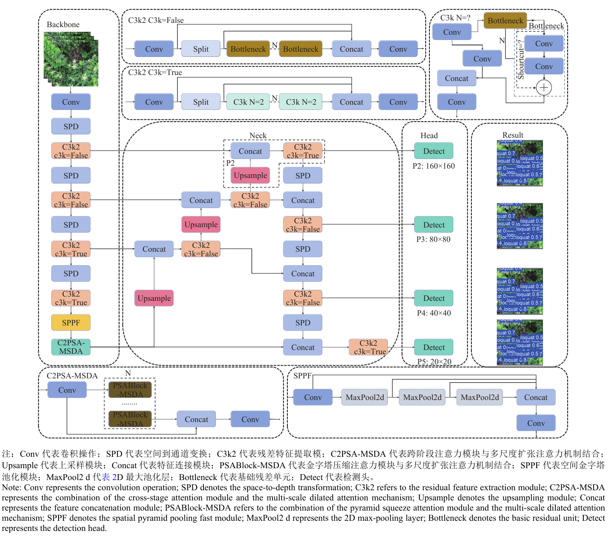

图中按 Backbone、Neck、Head 与 Result 四个区域展示全部组件及其连接关系，并放大给出 C3k2、C2PSA-MSDA 与 SPPF 的内部构成。骨干网络以 SPD-Conv 与带残差连接的 C3k2 模块逐级提取特征，颈部在原有 P3、P4、P5 的基础上新增 P2 分支完成多尺度融合，头部输出 4 个尺度的检测结果。四大组件的对应关系如下表所示。

| 组件 | 位置 | 功能 |
| --- | --- | --- |
| SPD-Conv + C3k2 | 骨干网络 | 无损下采样并逐级提取花蕾的边缘与纹理特征 |
| P2 分支与多尺度融合 | 颈部 | 以上采样和拼接融合 P2—P5 各层特征 |
| Detect 检测头 | 输出端 | 在 4 个尺度上输出花蕾的类别与边界框 |
| Focaler-DIoU | 回归损失 | 约束预测框与真实框的中心点距离并动态加权样本 |

输入图像先经骨干逐级压缩空间尺寸并扩张通道，再由颈部把深层语义与浅层细节融合，最后送入检测头产生预测框，各模块的改进细节在后续小节逐一展开。

### P2 小目标检测层

P2 小目标检测层的目标是为小尺寸花蕾保留高分辨率的检测特征，对应较低下采样倍率的特征层。引入 P2 后模型的多尺度输出如下表所示。

| 检测层 | 输出特征图尺寸 |
| --- | --- |
| P2 | 160×160 |
| P3 | 80×80 |
| P4 | 40×40 |
| P5 | 20×20 |

P2 分支的构建不依赖额外下采样，而是先把高层特征图上采样两倍恢复空间分辨率，再与主干网络中相应尺度的浅层特征图在通道维度上拼接，最终通过带残差连接的 C3k2 模块完成特征融合与增强。浅层特征携带了更丰富的位置与纹理信息，使花蕾的细微边缘得以进入检测分支，减少小目标信息在层层下采样中的流失。该分支接收主干浅层特征与颈部上采样特征，输出 160×160 的特征图交给 P2 检测头，与 P3、P4、P5 共同构成四尺度预测。

### SPD-Conv 空间到深度卷积

SPD-Conv（space-to-depth convolution）的目标是在下采样过程中保留全部空间信息，用于替换网络中的非步幅卷积层，其结构与变换过程如下图所示。

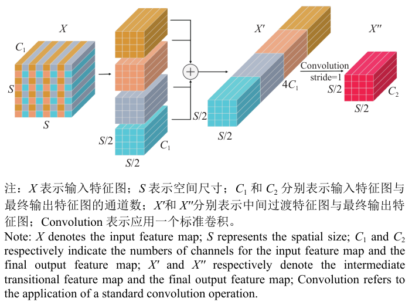

图中给出输入特征图 $X$ 经 SPD 变换拆分为子特征图、在通道维拼接得到 $X'$，再由 stride=1 的标准卷积得到输出 $X''$ 的完整过程。进行 SPD 变换时，原始特征图被划分为 $\text{scale}^2$ 个子特征图，其划分定义如下：

$$
f_{i,j} = X[i:S:\text{scale},\ j:S:\text{scale}]
$$

其中各符号的含义如下表所示。

| 符号 | 含义 |
| --- | --- |
| $X$ | 输入特征图 |
| $S$ | 特征图的空间尺寸 |
| $\text{scale}$ | 缩放因子，本文取 2 |
| $f_{i,j}$ | 按偏移 $(i, j)$ 抽取得到的子特征图 |

直观上，该式按固定间隔抽取像素并重排到通道维度，使空间尺寸缩小的同时信息完整保留。子特征图拼接后的 $X'$ 空间尺寸为 $S/2$、通道数为 $4C_1$，再经 stride=1 的标准卷积输出空间尺寸 $S/2$、通道数 $C_2$ 的 $X''$。本文将整个网络中的 7 个非步幅卷积层替换成 SPD-Conv 层，它接收前级 C3k2 或 Concat 输出的特征，在保证感受野扩展的同时避免冗余信息损失，把无损压缩后的特征交给后级残差模块继续提取。

### 多尺度扩张注意力机制 MSDA

MSDA 的目标是为小目标检测引入可控范围的全局上下文，弥补 C2PSA 模块感受野有限的问题，其结构如下图所示。

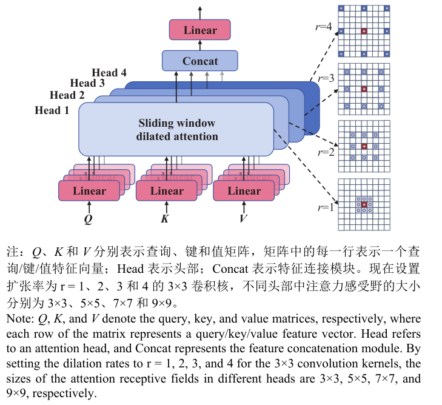

图中展示查询 $Q$、键 $K$、值 $V$ 三组线性映射、多个注意力头、滑动窗口扩张注意力以及扩张率 $r$ 取 1 到 4 时对应的采样网格。输入特征先映射为查询、键和值特征，并在通道维度上划分为多个注意力头，各头仅处理部分通道信息；随后在特征图上以滑动窗口方式遍历空间位置，按预设扩张率对邻域特征采样，把全局注意力转化为局部注意力计算，在控制复杂度的同时扩大有效感受野。不同注意力头采用不同的扩张率，扩张率较小时注意力聚焦目标周围的细粒度纹理与边缘，较大时在更大的有效感受野内建立特征依赖；本文设置扩张率为 $r$ 分别取 1、2、3、4 的 3×3 卷积核，不同头部中注意力感受野的大小分别为 3×3、5×5、7×7 和 9×9。各头输出在通道维度上拼接并映射回原通道空间，MSDA 接收上一层输出的 $H \times W \times C$ 特征图，输出交给 C2PSA-MSDA 与主干特征融合。

### C2PSA-MSDA 跨阶段注意力融合模块

C2PSA-MSDA 的目标是把 MSDA 嵌入 C2PSA 的注意力通路，同时建模局部细节与全局上下文，模块的内部结构如下图所示。

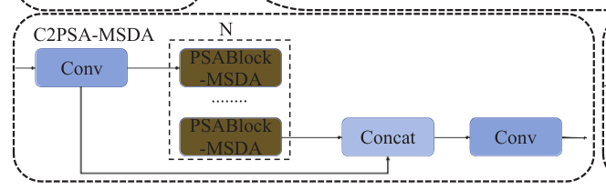

图中展示 Conv、$N$ 个 PSABlock-MSDA 单元、Concat 与输出 Conv 的串联方式以及跨越拼接的直连通路。C2PSA 原本通过对不同空间位置和通道加权提升对关键区域的敏感度，但缺乏通过扩张卷积捕捉远距离依赖的能力；MSDA 的多扩张率并行恰好补上这一环，两者结合后注意力权重可以在多种尺度的邻域范围内动态聚合，同时刻画局部细节与较大范围的上下文语义。该模块位于骨干网络末端、SPPF 之后，接收深层语义特征，把增强后的特征送入颈部参与多尺度融合。

### Focaler-DIoU 损失函数

Focaler-DIoU 的目标是让边界框回归同时关注困难样本与中心点偏移，替换 YOLOv11 原有的 CIoU 损失，其定义由式（2）给出：

$$
\begin{cases}
\text{IoU}^{\text{focaler}} = \begin{cases} 0, & \text{IoU} < d \\ \dfrac{\text{IoU} - d}{u - d}, & d \ll \text{IoU} \ll u \\ 1, & \text{IoU} > u \end{cases} \\[8pt]
L_{\text{Focaler-IoU}} = 1 - \text{IoU}^{\text{focaler}} \\
L_{\text{DIoU}} = 1 - \text{DIoU} \\
\text{DIoU} = \text{IoU} - \dfrac{\rho^2(b, b^{gt})}{c^2} \\
L_{\text{Focaler-DIoU}} = L_{\text{DIoU}} + \text{IoU} - \text{IoU}^{\text{Focaler}}
\end{cases}
$$

其中各符号的含义如下表所示。

| 符号 | 含义 |
| --- | --- |
| $\text{IoU}$、$\text{DIoU}$ | 预测框与真实框交并比及其距离改进版的原始数值 |
| $d$、$u$ | Focaler-IoU 的下限阈值与上限阈值 |
| $\rho^2(b, b^{gt})$ | 预测框与真实框中心点之间的欧几里得距离 |
| $c$ | 包含预测框和真实框的最小矩形的对角线距离 |
| $L_{\text{Focaler-DIoU}}$ | 最终用于边界框回归的损失 |

直观上，Focaler-IoU 按 IoU 所处区间对样本重新赋权：低于下限阈值 $d$ 的回归样本不被重视，高于上限阈值 $u$ 的样本被完全关注，中间区间线性过渡，从而缓解数据分布不均衡并加快收敛；DIoU 直接惩罚两个中心点之间的欧氏距离，相较 CIoU 去掉了宽高比约束带来的额外干扰，梯度更新更为稳定。两项综合后，回归过程会重点校正困难样本的位置误差；该损失接在检测头的回归分支上，与分类损失共同监督训练，输出的定位结果即为最终检测框。

## 实验结果

### 实验设置

本文的枇杷花蕾图像采集于中国重庆市北碚区秀峰枇杷园，由 DJI mini3 无人机在 5～8 m 飞行高度拍摄，共获得 850 张 1920×1080 像素的 RGB 图像，经人工筛选留下 600 张并用 Labelimg 精细标注，再按 7:2:1 划分训练集、验证集和测试集。训练集经翻转、旋转、随机裁剪以及亮度和对比度调整增强后扩充至 3 000 张，模型输入尺寸为 640×640 像素，训练 300 轮，批大小为 32，评价指标包括 mAP@0.5、精确率 P、召回率 R、F1 score 以及 GFLOPs、参数量、FPS 和模型大小。数据增强前后的对照如下图所示。

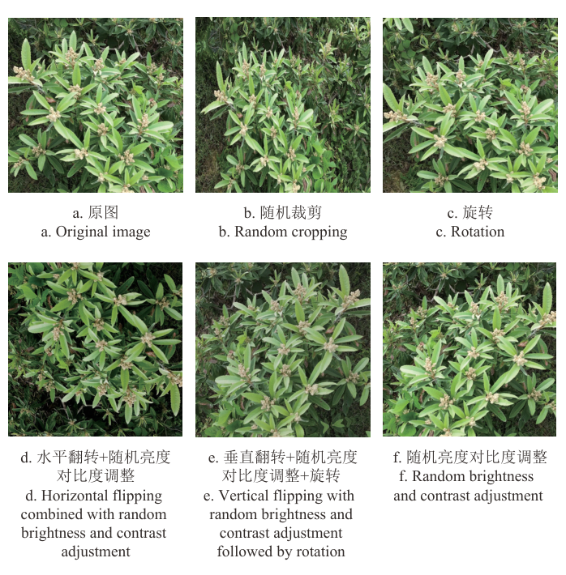

图中给出原图与随机裁剪、旋转、翻转及亮度对比度调整等增强方式的效果对比。可以看出增强样本在视角、构图与明暗上产生了明显差异，表明扩充策略覆盖了田间拍摄常见的成像变化。

### 对比实验

本文先在一张复杂果园场景图像上对 YOLO 系列模型的检测结果进行可视化，效果如下图所示。

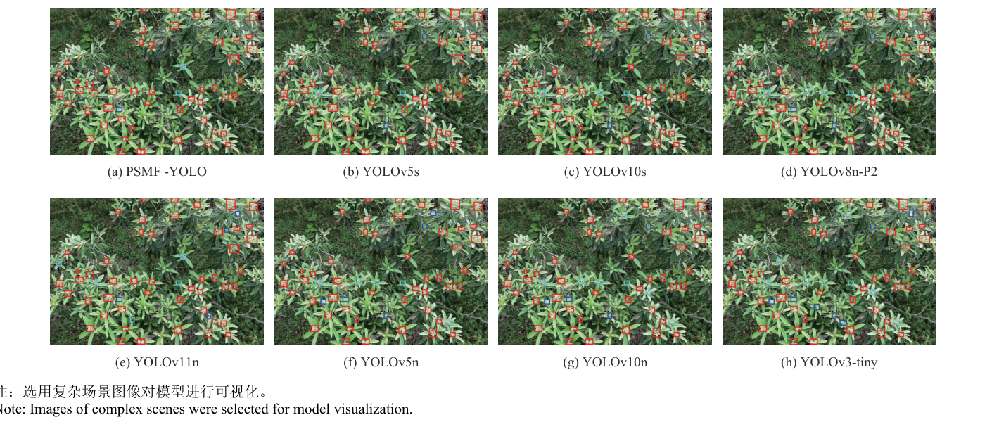

图中展示 PSMF-YOLO 与 YOLOv5s、YOLOv10s、YOLOv8n-P2、YOLOv11n、YOLOv5n、YOLOv10n、YOLOv3-tiny 同图检测的框叠加结果。可以看出在花蕾密集簇生、叶片遮挡明显的区域，各模型的检出完整程度差异清晰，基线 YOLOv11n 与 YOLOv3-tiny 的漏检更多，可见结构改进直接减少了漏检与误检。

上述差异在统一训练的定量指标上得到印证，各模型的完整对比如下表所示。

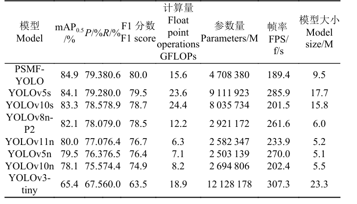

表中给出 8 个模型在精度、计算量、参数量、帧率与模型大小上的结果。PSMF-YOLO 以 84.9% 的 mAP@0.5 位于首位，较基线 YOLOv11n 高 4.9 个百分点，较此前表现最好的 YOLOv5s 仍高 0.8 个百分点，表明精度优势同时覆盖了轻量级与中型模型两档。

本文还选取 Faster R-CNN、SSD、RT-DETR 等经典检测框架进行跨架构对比，结果如下表所示。

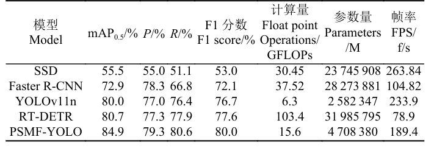

表中包含两阶段、单阶段与 Transformer 类检测器的精度和开销指标。Faster R-CNN 的精确率虽比 YOLOv11n 高 1.3 个百分点，但其 mAP@0.5 仅为 72.9%，PSMF-YOLO 以 84.9% 领先 Faster R-CNN 12.0 个百分点，而 Faster R-CNN 与 RT-DETR 的参数量分别是 PSMF-YOLO 的 6.0 倍和 6.8 倍，可以看出单阶段框架叠加结构改进在精度与部署开销之间取得了更好的平衡。

### 消融实验

为厘清各模块的贡献，本文以 YOLOv11n 为基线逐个添加模块进行消融，完整结果如下表所示。

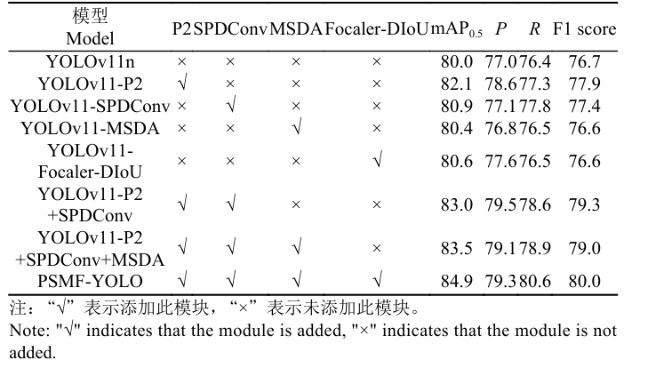

表中列出 8 种模块组合下 mAP@0.5、P、R 与 F1 score 的取值。单独引入 P2 小目标检测层时 mAP@0.5、P 和 R 分别提高 2.1、1.6 和 0.9 个百分点，单独替换 SPDConv 时三项分别提高 0.9、0.1 和 1.4 个百分点，说明浅层细节保留与无损下采样各自独立有效。P2 与 SPDConv 结合后 mAP@0.5 升至 83.0%，加入 MSDA 后进一步升至 83.5%，Focaler-DIoU 单独加入则将 mAP@0.5 由 80.0% 提升到 80.6%；四模块齐备的 PSMF-YOLO 最终取得 84.9% 的 mAP@0.5、79.3% 的精确率与 80.6% 的召回率，较基线分别提高 4.9、2.3 和 4.2 个百分点，表明各模块的增益可以叠加。

将表中 8 个变体的 P-R 曲线绘制在同一图中，结果如下图所示。

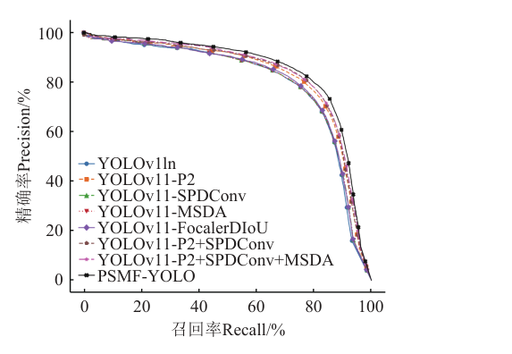

PSMF-YOLO 的曲线下面积大于其余全部变体，也大于基线 YOLOv11n，验证了模块组合带来的整体性能提升。

### 速度-精度权衡

为确认模型规模仍处于轻量范围，本文统计了 YOLOv11 系列各规模模型与 PSMF-YOLO 的参数量，对比如下表所示。

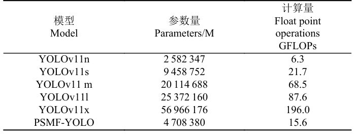

表中列出 YOLOv11n 到 YOLOv11x 五个规模及 PSMF-YOLO 的参数量与计算量。PSMF-YOLO 的参数量高于 YOLOv11n，但明显低于 YOLOv11s、YOLOv11m、YOLOv11l 与 YOLOv11x，说明检测精度提升的同时模型规模仍保持在轻量化部署的可接受范围内。

训练过程中的收敛情况如下图所示，图中对比 YOLOv11n 与 PSMF-YOLO 的训练框损失、训练分类损失、验证框损失和验证分类损失。

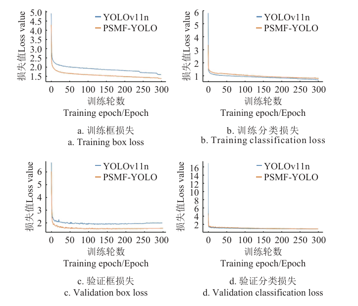

PSMF-YOLO 的损失下降速度明显快于 YOLOv11n，且在较早的训练阶段即趋于平稳，验证集指标在训练后期波动幅度较小，表明模型收敛更快且泛化性能已达到稳定状态。

### 可视化分析

在同一复杂场景下，本文将 PSMF-YOLO 与 SSD、Faster R-CNN、RT-DETR、YOLOv11n 的检测结果并排可视化，效果如下图所示。

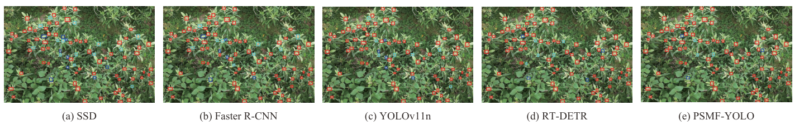

图中展示 5 个检测模型对同一张图像的框叠加结果。YOLOv11n 正确检测到 74 个目标、漏检 7 个、误检 5 个，而 PSMF-YOLO 的正确检出数多 4 个、漏检少 4 个、误检少 2 个，可以看出改进模型在密集花蕾区域的定位更准、覆盖更全，验证了 PSMF-YOLO 在复杂果园场景下的检测鲁棒性。

## 优点和创新点

个人认为，本文有如下一些优点和创新点可供参考学习：

1. 将 P2 小目标检测层与 SPD-Conv 组合成信息保留链路，以空间到深度的无损下采样配合浅层高分辨率特征拼接，使 mAP@0.5 较基线提升 4.9 个百分点，可供小目标检测的特征保留设计参考学习；

2. 设计 C2PSA-MSDA 模块把多尺度扩张注意力嵌入跨阶段注意力结构，用四种扩张率并行的滑动窗口注意力覆盖 3×3 至 9×9 感受野，统一了局部细节与全局上下文的建模；

3. 以 Focaler-DIoU 重构边界框回归损失，将按区间动态加权的样本难度与中心点距离约束相结合，配合逐模块消融、P-R 曲线与多模型检测效果可视化相互印证，实验完整且说服力强。
