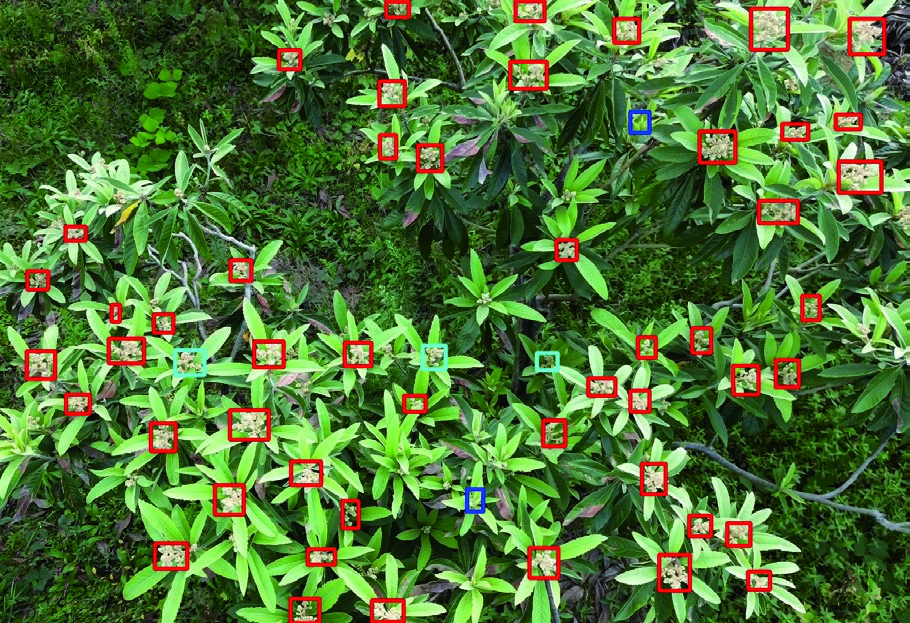
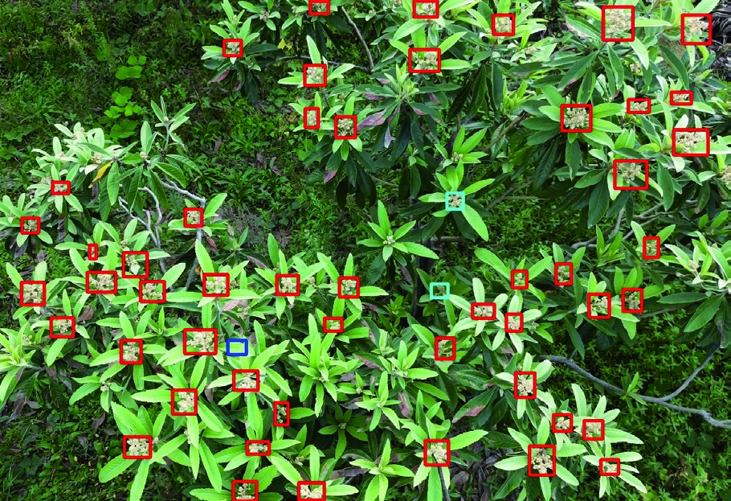

# 基于 PSMF-YOLO 的无人机遥感图像枇杷花蕾小目标检测方法

Paper Reading 是从个人角度进行的一些总结分享，受到个人关注点的侧重和实力所限，可能有理解不到位的地方。具体的细节还需要以原文的内容为准，博客中的图表若未另外说明则均来自原文。

| 论文概况 | 详细 |
| --- | --- |
| 标题 | 《基于 PSMF-YOLO 的无人机遥感图像枇杷花蕾小目标检测方法》 |
| 作者 | 徐常塑，柳鑫智，朱瑜琳，陈晨，凤柳燕，李云伍 |
| 发表期刊 | 农业工程学报 |
| 期刊等级 | 未获取 |
| 发表年份 | 2026 |
| 论文代码 | 未获取 |

作者单位：

1. 西南大学工程技术学院，重庆 400715

## 研究动机

枇杷花蕾精准检测是果树智能化疏花作业与果实品质提升的重要问题，表现为花蕾呈簇状生长、体积小且与背景叶片颜色相近难以被准确识别，导致漏检率高、误检严重，影响疏花决策的科学性与及时性。现有目标检测方法在应对无人机遥感条件下低分辨率输入、小目标密集分布与背景高度相似等因素的协同影响时存在明显局限：传统步幅卷积和池化层在进行特征提取时会不可避免地丢失关键信息，导致网络在检测小目标时性能下降；YOLOv11 等主流模型虽通过结构优化与注意力机制引入实现了精度突破，但多数改进聚焦于单一结构或机制，对复杂果园环境中低对比度小目标的跨层次感知能力不足；边界框回归采用的 CIoU 损失函数在大目标检测中表现优异，但在小目标检测中存在显著不足，难以有效缓解数据分布不均衡问题与定位偏差。尽管已有研究引入轻量化下采样模块或倒置残差块注意力机制等模块实现对梨表面缺陷的高效检测，或在减少参数量的同时增强特征信息以提升对目标的识别能力，但在小目标样本不平衡、边界框回归不精准以及全局场景理解的跨层次感知等方面仍存在不足，特别是在枇杷花蕾这种密集簇生且视觉特征高度相似的检测任务中，模型的鲁棒性有待提升。然而如何在保持整体模型规模可控的前提下，通过结构优化提升对复杂果园环境中小目标的检测能力，实现检测精度与计算开销的合理权衡，仍是当前亟待解决的技术瓶颈。

## 文章贡献

针对上述局限，本文提出了面向无人机遥感图像枇杷花蕾检测的 PSMF-YOLO 模型。其核心是在 YOLOv11n 基础模型上引入 P2 小目标检测层、SPD-Conv 模块、多尺度扩张注意力（MSDA）及 Focaler-DIoU 损失函数，系统提升小目标检测能力与边界框回归精度。首先利用无人机采集图像并构建了枇杷花蕾数据集，采集设备为 DJI mini3 无人机，飞行高度区间设置在 5～8 m，共获得 850 张分辨率为 1920×1080 像素的 RGB 图像数据，筛选后得到 600 张有效图像并通过 OpenCV 工具包进行翻转、旋转以及亮度和对比度调整等操作，最终使训练集图像数量扩充至 3,000 张；接着在原有网络结构基础上引入 P2 检测层，对应于较低下采样倍率的高分辨率特征层，通过对高层特征图进行上采样操作使其空间分辨率提升至原来的两倍，随后将上采样后的特征图与主干网络中相应尺度的浅层特征图在通道维度上进行拼接，并通过带残差连接的 C3k2 模块完成特征融合与特征增强，有效检测输入图像中的小目标，提升检测精度；然后将整个网络中的 7 个非步幅卷积（Conv）层替换成由一个空间至深度（SPD）层和一个非步幅卷积（Conv）层组成的 SPD-Conv 层，通过 SPD 变换将空间信息重新排列至通道维度，在进行下采样的同时保持原始特征图的完整信息，从根本上避免了步幅卷积和池化层带来的信息丢失；再将 C2PSA 注意力机制与多尺度扩张注意力模块（MSDA）结合形成新的 C2PSA-MSDA 模块，通过多尺度扩张卷积与动态特征融合，实现全局场景理解的跨层次感知；最后将边界框损失函数 CIoU 替换成 Focaler-IoU 与 DIoU 结合形成的 Focaler-DIoU 损失函数，通过动态调整损失权重缓解数据分布不均衡问题，提高小目标的定位精度，同时加快模型对样本的收敛速度。试验结果表明，PSMF-YOLO 模型在平均精度均值、准确率、召回率指标上比基础模型分别高 4.9、2.3、4.2 个百分点，较表现最好的 YOLOv5s 基础模型分别高 0.8、0.1、0.6 个百分点，验证了其在复杂场景下的检测鲁棒性。

## 本文方法

### P2 小目标检测层

为提高 PSMF-YOLO 模型对枇杷花蕾的检测性能，本文在原有网络结构基础上引入 P2 检测层。P2 检测层对应于较低下采样倍率的高分辨率特征层，其构建并非通过额外下采样获得，而是通过特征融合方式形成。具体而言，首先对高层特征图进行上采样操作，使其空间分辨率提升至原来的两倍；随后，将上采样后的特征图与主干网络中相应尺度的浅层特征图在通道维度上进行拼接，并通过带残差连接的 C3k2 模块完成特征融合与特征增强，最终生成 P2 检测层输出。模型的输入图像尺寸统一设定为 640×640 像素，最终输出的多尺度特征图尺寸分别为 160×160、80×80、40×40 和 20×20 像素，可以有效检测输入图像中的小目标，提升检测精度。

P2 检测层融合了更多浅层特征，保留了更丰富的位置信息和纹理信息，减少了信息丢失，适用于无人机遥感图像中小目标的精细化检测任务。该检测层通过保留高分辨率特征图，使模型能够捕捉到花蕾的细微边缘与纹理细节，显著提升了小目标的检出率。

### SPD-Conv 空间到深度卷积模块

由于枇杷花蕾在复杂背景下容易受到干扰，且传统目标检测网络中的步幅卷积和池化层在进行特征提取时，会不可避免地丢失关键信息，导致网络在检测小目标时性能下降，因此，本文引入 SPD-Conv（space-to-depth convolution）模块。SPD-Conv 通过 SPD 变换，将空间信息重新排列至通道维度，在进行下采样的同时保持原始特征图的完整信息，从根本上避免了步幅卷积和池化层带来的信息丢失。此外，SPD-Conv 后续的非步幅卷积不仅增强特征提取能力，还能优化通道信息的分配，使得网络能够更精确地学习枇杷花蕾的边缘细节和纹理特征。

当进行 SPD 变换时（图中 scale 即缩放因子=2），原始特征图 $X$ 被划分为 4（scale²）个子特征图 $f_{i,j}$，可以通过式（1）计算，即被划分为 $f_{0,0}$、$f_{1,0}$、$f_{0,1}$、$f_{1,1}$。每个子特征图的大小为 $S/2 \times S/2 \times C_1$。SPD 变换后，子特征图在通道维度上进行拼接，形成新的特征图 $X'$，空间尺寸缩小至 $S/2 \times S/2$（$S/\text{scale} \times S/\text{scale}$），但通道数变为 $4C_1$（$\text{scale}^2 C_1$）。这保证了在降采样过程中信息不丢失，而是被重新编码到通道维度。在 $X'$ 之后，SPD-Conv 应用一个标准卷积（stride=1），得到大小为 $S/2 \times S/2 \times C_2$ 的输出特征图 $X''$：

$$
f_{i,j} = X[i : \text{scale} : \text{scale}, j : \text{scale} : \text{scale}]
$$

其中 $X$ 表示输入特征图，$S$ 表示空间尺寸，$C_1$ 和 $C_2$ 分别表示输入特征图与最终输出特征图的通道数，$X'$ 和 $X''$ 分别表示中间过渡特征图与最终输出特征图。相比于传统的降采样方式，SPD-Conv 在保证感受野扩展的同时有效避免了冗余信息的损失，使得模型在低分辨率小目标检测任务中展现出更优的性能。通过在 YOLOv11n 的多个特征层级应用 SPD-Conv，构建了一种更加适应小目标检测的网络架构，提升对不同尺度目标的学习能力，使枇杷花蕾即便在复杂环境中仍然能够被高精度识别。

### 多尺度扩张注意力机制 MSDA

在 YOLOv11 模型中，C2PSA 模块能够结合空间注意力和通道注意力机制，更有效地捕捉图像中的关键特征。具体而言，它通过对不同空间位置和不同通道的特征加权，来提升模型对重要区域的敏感度。但针对枇杷花蕾这种小目标的检测，C2PSA 模块并不具备足够的能力来捕捉全局上下信息。小目标通常需要更大的感受野来识别其细节，尤其是当目标的尺寸相对较小时，单独的空间和通道注意力可能无法有效提取这些信息。另外，C2PSA 模块虽然能够在局部区域内提升注意力，但它缺乏通过扩张卷积来捕捉远距离依赖的能力，所以引入 MSDA 与 C2PSA 模块融合。

多尺度扩张注意力机制 MSDA 的输入为来自上一层的特征图，其空间维度为 $H \times W$，通道维度为 $C$。首先，输入特征通过线性映射得到查询特征、键特征和值特征，并在通道维度上划分为多个注意力头，使各注意力头仅处理部分通道信息。随后，在特征图上以滑动窗口方式逐步遍历各空间位置，并在每个窗口内部按照预设扩张率对邻域特征进行采样，从而将全局注意力转化为局部注意力计算，在有效控制计算复杂度的同时扩大有效感受野。在上述注意力计算过程中，不同注意力头采用不同的扩张率设置，使得在相同窗口大小下能够覆盖不同尺度的邻域范围。当扩张率较小时，注意力主要聚焦于目标周围的细粒度纹理与边缘信息；当扩张率较大时，窗口内被采样的位置间隔增大，注意力能够在更大的有效感受野范围内建立特征依赖，从而引入更丰富的上下文信息。对于每个注意力头，在其对应的扩张采样网格上计算查询与键的相似度，并对相似度进行归一化，进而对值特征进行加权汇聚，得到该头的注意力输出。最后，将各头输出在通道维度上进行拼接并映射回原通道空间，作为 MSDA 的输出特征，并与主干特征进行融合，从而实现跨尺度上下文信息的动态建模与聚合。通过在多个注意力头中并行引入不同扩张率的局部注意力学习，MSDA 能够同时刻画局部细节信息与较大范围的上下文语义，有助于在复杂背景下提升小目标的可分辨性与定位稳定性。本文设置扩张率为 $r = 1$、$2$、$3$ 和 4 的 3×3 卷积核，不同头部中注意力感受野的大小分别为 3×3、5×5、7×7 和 9×9。

### Focaler-DIoU 损失函数

在 YOLOv11 中，边界框回归使用的是基于 CIoU 的损失函数。尽管该损失函数在大目标检测中表现优异，但在小目标检测中存在显著不足。本文将 YOLOv11 的原边界框损失函数替换成 Focaler-DIoU 损失函数。Focaler-DIoU 结合了 Focaler-IoU 和 DIoU 两种损失的优势，能够有效改进 YOLOv11 在小目标检测中的表现。首先，通过动态调整损失权重，Focaler-IoU 能有效缓解数据分布不均衡的问题，提高小目标的定位精度，同时加快模型对样本的收敛速度。其次，DIoU 损失主要关注预测框和真实框中心点之间的距离，从而直接针对位置偏差进行优化。相较于 CIoU 同时引入宽高比约束，DIoU 的简单性降低了不必要的干扰，使得梯度更新更为稳定，有利于小目标的快速收敛。Focaler-DIoU 通过综合考虑样本难度和边界框的中心点位置，从而在回归过程中重点关注困难样本并优化目标定位，使得 YOLOv11 在处理小目标检测任务中能更精确地校正预测框的位置误差，大大提升了检测精度。Focaler-DIoU 可通过方程（2）计算：

$$
\begin{cases}
\text{IoU}_{\text{focaler}} = 
\begin{cases} 
0, & \text{IoU} < d \\
\frac{\text{IoU} - d}{u - d}, & d \ll \text{IoU} \ll u \\
1, & \text{IoU} > u 
\end{cases} \\
L_{\text{Focaler-IoU}} = 1 - \text{IoU}_{\text{focaler}} \\
L_{\text{DIoU}} = 1 - \text{DIoU} \\
\text{DIoU} = \text{IoU} - \frac{\rho^2(b, b^{gt})}{c^2} \\
L_{\text{Focaler-DIoU}} = L_{\text{DIoU}} + \frac{\text{IoU} - \text{IoU}_{\text{Focaler}}}{}
\end{cases}
$$

其中 $\text{IoU}_{\text{focaler}}$ 表示经过重构后的 Focaler-IoU，$\text{IoU}$ 和 $\text{DIoU}$ 都为各自原始数值，$L_{\text{DIoU}}$ 和 $L_{\text{Focaler-DIoU}}$ 都为针对 DIoU 和 Focaler-DIoU 指标所设计的损失函数的定义。$d$ 表示下限阈值，表示 IoU 值低于 $d$ 时，Focaler-IoU 的值为 0，意味着当 IoU 值非常低时，对应的回归样本不被重视。$u$ 是上限阈值，表示 IoU 值高于 $u$ 时，Focaler-IoU 的值为 1，表示该样本被完全关注。$\rho^2(b, b^{gt})$ 表示预测框与真实框中心点之间的欧几里得距离，$c$ 是包含预测框和真实框的最小矩形的对角线距离。

## 实验结果

### 实验设置

本研究由一台配备 Intel Xeon Platinum 8481C CPU、NVIDIA GeForce RTX 4090D GPU、80G 内存的 ubuntu22.04（64 位）专业计算机作为实验平台。实验代码基于 CUDA 12.1、Python 3.12、PyTorch 2.3.0 的实验环境。提出模型的输入尺寸为 640×640，模型训练的 epoch 为 300，每批次训练样本数为 32，学习率初始值设定为 0.01，权重衰减设置为 0.0005。

数据集方面，枇杷花蕾图像采集于中国重庆市北碚区秀峰枇杷园（东经 29.801°和北纬 106.412°，海拔 304 m）。图像采集设备为 DJI mini3 无人机，该无人机配备 1/1.3 英寸 CMOS 影像传感器，分辨率为 1920×1080 像素，镜头光圈设置为 f/1.7，飞行高度区间设置在 5～8 m，确保足够清晰地拍摄到枇杷花蕾的图像。共获得 850 张分辨率为 1920×1080 像素的 RGB 图像数据。对采集到的 850 张图像进行人工筛选，去除目标数量较少以及图像质量过于模糊的样本，以保证数据集的有效性和标注质量。筛选后得到 600 张图像。使用 Labelimg 图像标注软件，对花蕾进行人工精准标注。为了让模型学习到更多特征，在完成标注后，先将数据集按照 7:2:1 的比例划分为训练集、验证集和测试集。利用 OpenCV 工具包对训练集图像数据进行增强处理，增强方式包括图像翻转、旋转以及亮度和对比度调整等操作，最终使训练集图像数量扩充至 3,000 张。评价指标包括精确率（P）、召回率（R）、F1 score、平均精度（AP）以及平均精度均值（mAP@0.5），还包括浮点运算次数（FLOPs/GFLOPs）、参数量（Parameters/M）、每秒帧数（FPS）和模型大小（Model size/MB）。

### 消融实验

表 1 展示了不同模块组合对模型性能的影响：

**图 7 YOLO 系列模型检测结果的可视化**

表 1 结果显示，单独引入 P2 小目标检测层，mAP@0.5、P 和 R 分别提高 2.1、1.6、0.9 个百分点，说明 P2 能更精准地捕捉到小目标的细节信息。单独采用 SPDConv 轻量级卷积来替代部分标准卷积，mAP@0.5、P 和 R 分别提高 0.9、0.1 和 1.4 个百分点，说明 SPDConv 在 YOLOv11n 上能够增强特征提取能力。两者结合后 mAP@0.5 进一步提升至 83.0%，P、R 和 F1 score 也分别提高到 79.5%、78.6% 和 79.3%。仅加入 MSDA mAP@0.5 和 R 分别提高 0.4 和 0.1 个百分点。虽然 P 和 F1 score 略有下降，但并不影响整体性能。而 Focaler-DIoU 损失函数则通过减少目标框抖动，将 mAP@0.5 由 80.0% 提升至 80.6%。最终，结合全部模块的 PSMF-YOLO 模型整体性能相比 YOLOv11n 取得大幅提升。mAP@0.5 提高至 84.9%，精确率提升至 79.3%，召回率上升到 80.6%，F1 score 提升至 80.0%。具体而言，mAP@0.5、P、R 和 F1 score 分别提高 4.9、2.3、4.2 和 3.3 个百分点。这一改进组合使模型在复杂环境下的枇杷花蕾小目标检测中表现出更高的精度、更强的召回能力和更优的整体检测表现。

将表 1 每个模型的 P-R 曲线放入同一图中（图 5）。PSMF-YOLO 相比于其他改进模型的线下面积更大，尤其是比基线 YOLOv11n 模型的线下面积大，证明 PSMF-YOLO 比 YOLOv11n 有更好的性能。

### YOLO 系列模型比较分析

从图 6 看出，随着训练轮数的增加，两种模型的训练损失整体呈快速下降并逐步趋于较低水平，在训练后期仍存在缓慢下降现象；相比之下，验证集上的损失曲线在训练中后期已基本趋于稳定。进一步地，在模型训练过程中同步监控了验证集上的精确率、召回率以及 mAP@0.5 等检测性能指标，结果表明上述指标在训练后期波动幅度较小，未再出现明显提升，说明模型在验证集上的泛化性能已达到稳定状态，整体已实现有效收敛。在此基础上可以观察到，PSMF-YOLO 的损失下降速度明显快于 YOLOv11n，且在较早训练阶段即可达到稳定水平，表明所提出模型具有更快的收敛速度和更优的整体检测性能，同时有更好的泛化能力。

**图 6 YOLOv11n 和 PSMF-YOLO 的损失曲线**

表 2 展示了 PSMF-YOLO 与 YOLO 系列不同模型的对比结果：

| 模型 | mAP@0.5/% | P/% | R/% | F1 score/% | GFLOPs | Parameters/M | FPS/(f/s) | Model size/MB |
| --- | --- | --- | --- | --- | --- | --- | --- | --- |
| **PSMF-YOLO** | **84.9** | **79.3** | **80.6** | **80.0** | **15.6** | **4.71** | **189.4** | **9.5** |
| YOLOv5s | 84.1 | 79.2 | 80.0 | 79.5 | 23.6 | 9.11 | 285.9 | 17.7 |
| YOLOv10s | 83.3 | 78.5 | 78.9 | 78.7 | 24.4 | 8.04 | 201.5 | 15.8 |
| YOLOv8n-P2 | 82.1 | 78.0 | 79.0 | 78.5 | 12.2 | 2.92 | 261.6 | 6.0 |
| YOLOv11n | 80.0 | 77.0 | 76.4 | 76.7 | 6.3 | 2.58 | 233.9 | 5.2 |
| YOLOv5n | 79.5 | 76.3 | 76.5 | 76.4 | 7.1 | 2.50 | 270.0 | 5.1 |
| YOLOv10n | 78.1 | 75.5 | 74.4 | 74.9 | 8.2 | 2.69 | 202.4 | 5.5 |
| YOLOv3-tiny | 65.4 | 67.5 | 60.0 | 63.5 | 18.9 | 12.13 | 307.3 | 23.3 |

表 2 结果表明，提出模型以 84.9% 的 mAP@0.5 值显著优于主流模型，最高比传统轻量级模型 YOLOv3-tiny 高出 19.5 个百分点。同时在 P、R、F1 score 上均达到最优，表明其在密集分布、低对比度的田间场景中有效减少了漏检与误检。此外，PSMF-YOLO 的 GFLOPs、参数量、FPS、模型大小分别为 15.6、4.71 M、189.4、9.5 MB，较中大型模型 YOLOv5s 和 YOLOv10s 的参数量分别减少 48.3% 和 41.5%，GFLOPs 和模型大小也显著低于 YOLOv5s 和 YOLOv10s。尽管基线模型以及一些轻量级模型如 YOLOv5n 和 YOLOv10n 在推理速度上更具优势，YOLOv5n 和 YOLOv10n 的 FPS 分别快出提出模型 1.43 倍和 1.07 倍，但它们的 mAP@0.5 值明显低于 PSMF-YOLO，验证了所提方法在精度与效率协同优化的有效性。

为进一步说明模型的轻量化特性，表 3 对 YOLOv11 系列不同规模模型的参数量进行了统计对比。结果表明，PSMF-YOLO 的参数量虽高于 YOLOv11n，但仍明显低于 YOLOv11s、YOLOv11 m 和 YOLOv11 l 等中大型模型，说明所提方法在检测精度显著提升的同时，模型规模仍保持在轻量化部署的可接受范围内。

**图 8 不同检测模型结果的可视化**

图 8 展示了不同检测模型结果的可视化。图中 Faster R-CNN、SSD 和 RT-DETR 检测性能均低于 YOLOv11n 和 PSMF-YOLO。YOLOv11n 在图像上正确检测到了 74 个目标，漏检 7 个，误检到 5 个。而 PSMF-YOLO 在同一张图像上比 YOLOv11n 正确检测的目标多了 4 个，漏检的少了 4 个，误检的少了 2 个，表现出更优的小目标检测效果。前文消融实验结果表明，引入 P2 小目标检测层、SPD-Conv 模块、MSDA 机制以及 Focaler-DIoU 损失函数后，提出模型相比于基线模型在 mAP@0.5、精确率和召回率等指标上均获得了显著提升；同时，YOLO 系列模型的对比实验结果进一步验证了 PSMF-YOLO 在检测精度的整体优势。图 8 的可视化结果作为对上述性能提升在复杂果园场景中的具体表现进行了直观展示。由此可见，PSMF-YOLO 的检测性能优于改进前的 YOLOv11n。

### 其他检测模型比较分析

为全面评估 PSMF-YOLO 模型在枇杷花蕾小目标检测任务中的性能表现，现选取多种具有代表性的经典目标检测模型进行对比实验：两阶段高精度网络 Faster R-CNN、单阶段多尺度模型 SSD、轻量级实时应用框架 YOLO 系列，以及基于 Transformer 全局建模的 RT-DETR。通过涵盖不同架构特征的基线对比，能够从检测精度、模型复杂度及实际应用适应性等多个角度，对所提 PSMF-YOLO 模型的性能进行更加全面和客观的评价。

表 4 展示了各种经典检测模型的实验结果。相较于传统两阶段检测框架 Faster R-CNN 与单阶段模型 SSD、RT-DETR，PSMF-YOLO 以 84.9% 的 mAP@0.5 值优于其他模型，充分证实了模型结构优化的有效性。与 YOLOv11n 相比，Faster R-CNN 的精确率虽然比其略高 1.3 个百分点，但是在平均精度、模型参数量以及 FPS 等方面全逊色于 YOLOv11n。同时 RE-DETR 的 mAP@0.5、P、R 虽然也略高于 YOLOv11n，但是在模型参数上，Faster R-CNN 和 RTDETR 分别是 YOLOv11n 的 10.9 倍和 12.4 倍，分别是 PSMF-YOLO 的 6.0 倍和 6.8 倍。尽管提出模型参数量较基础模型增加 82.3%，但相比传统模型的千万级参数量，仍保持轻量化优势。从推理效率角度来看，不同模型在 FPS 指标上虽存在一定差异，但当推理速度达到较高水平后，其在实际农业场景中的实时性差别已相对有限。相比之下，模型在复杂背景下对小目标的检测精度与稳定性对实际应用效果具有更为直接的影响。

## 讨论

本研究提出的 PSMF-YOLO 模型在真实复杂场景下的枇杷花蕾发育阶段实时检测花蕾具有巨大潜力，能够识别低对比度的枇杷花蕾小目标，并展现出较高的稳定性。消融试验表明，各模块增益存在差异：P2 小目标检测层对 mAP@0.5 的提升最为显著，较基线模型高 2.1 个百分点，因其浅层高空间分辨率能有效保留小目标的纹理细节，增强了模型对小目标的敏感性；而 MSDA 引入后 mAP@0.5 小幅提升但 P 值略有下降，这可能与多尺度特征的权重分配失调有关。

从模型对比结果来看，PSMF-YOLO 的 mAP@0.5 优于主流轻量级模型，且在参数量与计算成本上仍保持轻量化优势。尽管 FPS 低于一些模型，但精度提升幅度远超速度损失，体现了精度与效率的协同优化。与两阶段模型 Faster R-CNN 相比，PSMF-YOLO 在 mAP@0.5 上领先 12.0 个百分点，参数量仅为其 16.6%，这得益于单阶段检测框架的高效性与模块化改进的叠加效应。

尽管 PSMF-YOLO 模型表现优异，但在复杂应用场景中仍有待进一步突破。针对当前数据集局限于固定航高与空间分辨率的局限，未来拟开展多维度数据采集策略，系统构建涵盖不同飞行高度与多分辨率的影像数据集，以此量化空间分辨率变化对小目标特征提取能力的影响规律，同时更好地分析航高波动导致的尺度变异对检测精度的影响。面对模型对动态光照变化、天气变化及复杂果园背景噪声等非稳态环境泛化性不足的问题，未来研究可以构建环境泛化增强策略。同时，模型的检测准确率牺牲了模型的内存成本，未来的研究中，在保证检测精度的情况下进一步使模型拥有更加轻量化的架构。

依托 PSMF-YOLO 模型的高效能力，未来可将其部署于搭载相机的自主巡检无人机，结合边缘计算设备实现田间实时监测，动态获取花蕾分布密度与发育阶段的数据，为疏花疏蕾决策提供科学依据，同时也是为特色林果产业的可持续发展注入创新动能。

## 优点和创新点

个人认为，本文有如下一些优点和创新点可供参考学习：

1. 引入 P2 小目标检测层与 SPD-Conv 模块的组合策略，通过高分辨率特征层保留与空间到深度变换的信息无损下采样，使 mAP@0.5 较基线提升 4.9 个百分点，为无人机遥感图像中小目标检测提供了有效的特征保留方案。

2. 设计 C2PSA-MSDA 多尺度扩张注意力模块，通过 1×1、2×2、3×3、4×4 四种扩张率并行捕获不同尺度的感受野（3×3 至 9×9），实现全局场景理解的跨层次感知，显著提升了密集簇生花蕾的可分辨性与定位稳定性。

3. 提出 Focaler-DIoU 损失函数，结合 Focaler-IoU 的动态权重调整与 DIoU 的中心点距离优化，有效缓解小目标样本不平衡问题，将 mAP@0.5 从 80.0% 提升至 80.6%，同时加快模型收敛速度。
